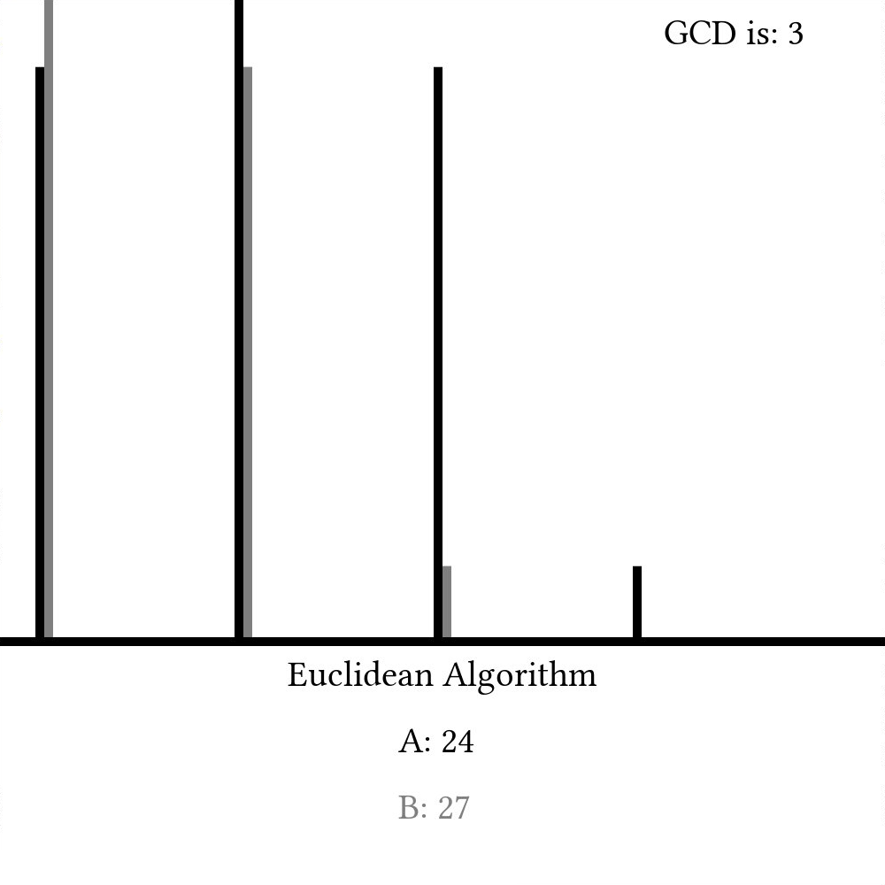

<script>
MathJax.Hub.Queue(["Typeset",MathJax.Hub]);
</script>
$$ 
\newcommand{\d}{\mathrm{d}}
\newcommand{\bff}{\boldsymbol{f}}
\newcommand{\bfg}{\boldsymbol{g}}
\newcommand{\bfp}{\boldsymbol{p}}
\newcommand{\bfq}{\boldsymbol{q}}
\newcommand{\bfx}{\boldsymbol{x}}
\newcommand{\bfu}{\boldsymbol{u}}
\newcommand{\bfv}{\boldsymbol{v}}
\newcommand{\bfA}{\boldsymbol{A}}
\newcommand{\bfB}{\boldsymbol{B}}
\newcommand{\bfC}{\boldsymbol{C}}
\newcommand{\bfM}{\boldsymbol{M}}
\newcommand{\bfJ}{\boldsymbol{J}}
\newcommand{\bfR}{\boldsymbol{R}}
\newcommand{\bfT}{\boldsymbol{T}}
\newcommand{\bfomega}{\boldsymbol{\omega}}
\newcommand{\bftau}{\boldsymbol{\tau}}
$$

# Euclidean Algorithm

Computer science is (almost by definition) a science about computers -- a device first conceptualized in the 1800's. Computers have become so revolutionary, that it is difficult to think of our lives today without them. That said, *algorithms* are much older and have existed in the world for millenia. Incredibly, a few of the algorithms created before the Common Era (AD) are still in use today. One such algorithm was first described in Euclid's *Elements* (~ 300 BC) and has come to be known as the *Euclidean Algorithm*. 

The algorithm is a simple way to find the *greatest common divisor* (GCD) of two numbers, which is useful for a number of different applications (like reducing fractions). The first method (envisioned by Euclid) uses simple subtraction:

```python
function euclid_sub(a::Int64, b::Int64)
    while (a != b)
        if (a > b)
            a = a - b
        else
            b = b - a
        end
    end
end
```

Here, we simply line the two numbers up every step and subtract the lower value from the higher one every timestep. Once the two values are equal, we call that value the greatest common divisor. A graph of `a` and `b` as they change every step would look something like this:


Modern implementations, though, often use the modulus operator (%) like so

```python
function euclid_mod(a::Int64, b::Int64)
    temp = Int64
    while (b != 0)
        temp = b
        b = a%b
        a = temp
    end
end
```

Here, we set `b` to be the remainder of `a%b` and `a` to be whatever `b` was last timestep. Because of how the modulus operator works, this will provide the same information as the subtraction-based implementation, but when we show `a` and `b` as they change with time, we can see that it might take many fewer steps:



The Euclidean Algorithm is truly fundamental to many other algorithms throughout the history of computer science and will definitely be used again later. At least to me, it's amazing how such an ancient algorithm can still have modern use and appeal. That said, there are still other algorithms out there that can find the greatest common divisor of two numbers that are arguably better in certain cases than the Euclidean algorithm, but the fact that we are discussing Euclid two millenia after his death shows how timeless and universal mathematics truly is. I think that's pretty cool.

# Example Code
### C++
```cpp
// originally contributed by James Schloss (Leios)
// restyled by Nicole Mazzuca (ubsan)
#include <iostream>
#include <cmath>

// Euclidean algorithm using modulus
int euclid_mod(int a, int b)
{
    a = std::abs(a);
    b = std::abs(b);
    while (b != 0) {
        int temp = b;
        b = a%b;
        a = temp;
    }

    return a;
}

// Euclidean algorithm with subtraction
int euclid_sub(int a, int b)
{
    a = std::abs(a);
    b = std::abs(b);
    while (a != b) {
        if (a > b) {
            a -= b;
        }
        else {
            b -= a;
        }
    }

    return a;
}

int main()
{
    auto check1 = euclid_mod(64*67, 64*81);
    auto check2 = euclid_sub(128*12, 128*77);

    std::cout << check1 << '\n';
    std::cout << check2 << '\n';
}

```

### C
```c
#include <stdio.h>
#include <math.h>

int euclid_mod(int a, int b)
{
    a = abs(a);
    b = abs(b);

    while (b != 0){
        int temp = b;
        b = a%b;
        a = temp;
    }

    return a;
}

int euclid_sub(int a, int b)
{
    a = abs(a);
    b = abs(b);

    while (a != b) {
        if (a > b) {
            a -= b;
        }
        else {
            b -= a;
        }
    }

    return a;
}

int main()
{
    int check1 = euclid_mod(64*67, 64*81);
    int check2 = euclid_sub(128*12, 128*77);

    printf("%d\n", check1);
    printf("%d\n", check2);
}

```

### JavaScript

```html
<!DOCTYPE html>
<html>
<body>
<script>
function euclid_mod(a, b){
    a = Math.abs(a);
    b = Math.abs(b);

    var temp;
    while (b != 0){
        temp = b;
        b = a%b;
        a = temp;
    }

    return a;
}

function euclid_sub(a, b){
    a = Math.abs(a);
    b = Math.abs(b);

    while (a != b){
        if (a > b){
            a = a - b;
        }
        else{
            b = b - a;
        }
    }

    return a;
}

document.write(euclid_mod(64*67, 64*81) + "<br>");
document.write(euclid_sub(128*12, 128*77) + "<br>");
</script>
</body>
</html>
```

### Python

```python

#  euclidean.py

def euclid_mod(a, b):

    a = abs(a)
    b = abs(b)
    temp = 0

    while b > 0:
        temp = b
        b = a % b
        a = temp

    return a

def euclid_sub(a, b):

    a = abs(a)
    b = abs(b)

    while a != b:
        if a > b:
            a = a - b
        else:
            b = b - a

    return a

print euclid_mod(64 * 67, 64 * 81)
print euclid_sub(128 * 12, 128 * 77)
```

### C#

```cs
// submitted by Julian Schacher
using System;

namespace Euclidean_Algorithm
{
    class Program
    {
        static void Main(string[] args)
        {
            int check = Algorithms.EuclidMod(64 * 67, 64 * 81);
            int check2 = Algorithms.EuclidSub(128 * 12, 128 * 77);

            Console.WriteLine(check);
            Console.WriteLine(check2);
        }
    }

    public static class Algorithms
    {
        public static int EuclidSub(int a, int b)
        {
            // Math.Abs for negative number support
            a = Math.Abs(a);
            b = Math.Abs(b);

            while (a != b)
            {
                if (a > b)
                    a = a - b;
                else
                    b = b - a;
            }

            return a;
        }

        public static int EuclidMod(int a, int b)
        {
            // Math.Abs for negative number support
            a = Math.Abs(a);
            b = Math.Abs(b);

            while (b != 0)
            {
                var temp = b;
                b = a % b;
                a = temp;
            }

            return a;
        }
    }
}
```

### Haskell

```haskell
-- contributed by Nicole Mazzuca (ubsan)

euclidSub :: Integer -> Integer -> Integer
euclidSub a b = inner (abs a) (abs b) where
  inner a b =
    if a == b then
      a
    else if a < b then
      euclidSub a (b - a)
    else
      euclidSub (a - b) b

euclidMod :: Integer -> Integer -> Integer
euclidMod a b = inner (abs a) (abs b) where
  inner a 0 = a
  inner a b = inner b (a `mod` b)

main :: IO ()
main = do
  let chk1 = euclidMod (64 * 67) (64 * 81)
      chk2 = euclidSub (128 * 12) (128 * 77)
  putStrLn (show chk1)
  putStrLn (show chk2)
  return ()
```

### Rust

```rust
// contributed by Nicole Mazzuca (ubsan)

fn euclid_sub(mut a: i64, mut b: i64) -> i64 {
    a = a.abs();
    b = b.abs();
    while a != b {
        if a < b {
            b -= a;
        } else {
            a -= b;
        }
    }

    a
}

fn euclid_rem(mut a: i64, mut b: i64) -> i64 {
    a = a.abs();
    b = b.abs();
    while b != 0 {
        let tmp = b;
        b = a % b;
        a = tmp;
    }

    a
}

fn main() {
    let chk1 = euclid_rem(64 * 67, 64 * 81);
    let chk2 = euclid_sub(128 * 12, 128 * 77);
    println!("{}", chk1);
    println!("{}", chk2);
}
```

### OCaml

```ocaml
(* contributed by Nicole Mazzuca (ubsan) *)

let euclid_mod a b =
  let rec inner a = function
  | 0 -> a
  | b -> inner b (a mod b)
  in (inner (abs a) (abs b))

let euclid_sub a b =
  let rec inner a b =
    if a = b then
      a
    else if a < b then
      inner a (b - a)
    else
      inner (a - b) b
  in (inner (abs a) (abs b))

let chk1 = euclid_mod (64 * 67) (64 * 81)
let chk2 = euclid_sub (128 * 12) (128 * 77)
let () =
  chk1 |> print_int |> print_newline;
  chk2 |> print_int |> print_newline
```

### Java
```java
// sumbitted by lolatomroflsinnlos
public static void main(String[] args) {

    System.out.println(euclidSub(64 * 67, 64 * 81));
    System.out.println(euclidMod(128 * 12, 128 * 77));

}

public static int euclidSub(int a, int b) {
    a = Math.abs(a);
    b = Math.abs(b);

    while (a != b) {
        if (a > b) {
            a -=b;
        } else {
            b -=a;
        }
    }

    return a;
}

public static int euclidMod(int a, int b) {
    a = Math.abs(a);
    b = Math.abs(b);

    while (b != 0){
        int temp = b;
        b = a % b;
        a = temp;
    }

    return a;
}
```
