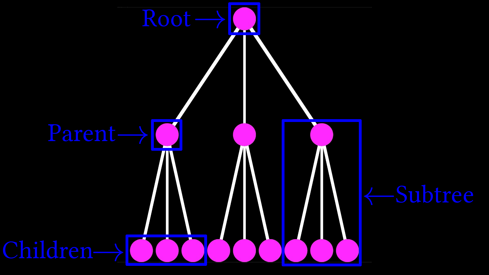
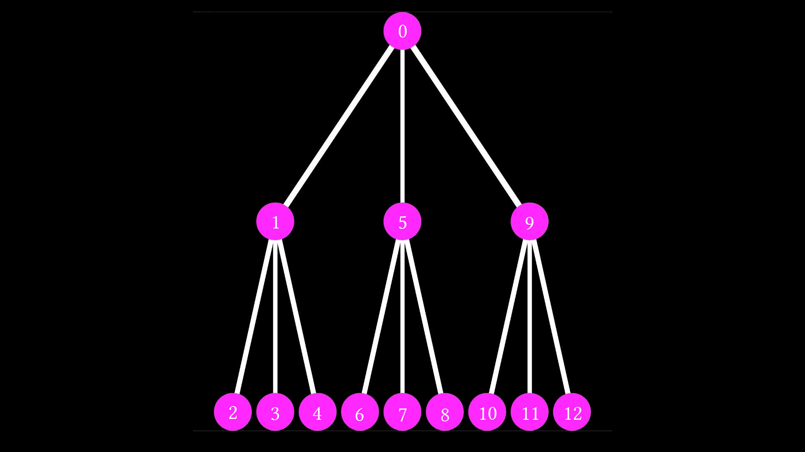
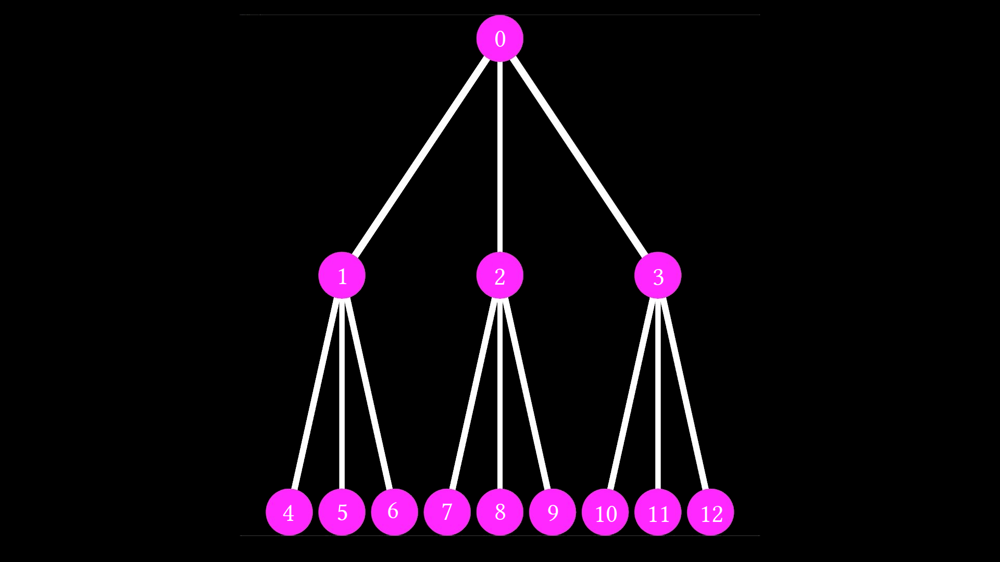

<script>
MathJax.Hub.Queue(["Typeset",MathJax.Hub]);
</script>
$$ 
\newcommand{\d}{\mathrm{d}}
\newcommand{\bff}{\boldsymbol{f}}
\newcommand{\bfg}{\boldsymbol{g}}
\newcommand{\bfp}{\boldsymbol{p}}
\newcommand{\bfq}{\boldsymbol{q}}
\newcommand{\bfx}{\boldsymbol{x}}
\newcommand{\bfu}{\boldsymbol{u}}
\newcommand{\bfv}{\boldsymbol{v}}
\newcommand{\bfA}{\boldsymbol{A}}
\newcommand{\bfB}{\boldsymbol{B}}
\newcommand{\bfC}{\boldsymbol{C}}
\newcommand{\bfM}{\boldsymbol{M}}
\newcommand{\bfJ}{\boldsymbol{J}}
\newcommand{\bfR}{\boldsymbol{R}}
\newcommand{\bfT}{\boldsymbol{T}}
\newcommand{\bfomega}{\boldsymbol{\omega}}
\newcommand{\bftau}{\boldsymbol{\tau}}
$$

# Tree Traversal 

Trees are naturally recursive data structures, and because of this, we cannot access their elements like we might access the elements of a vector or array. Instead, we need to use more interesting methods to work through each element. This is often called *Tree Traversal*, and there are many different ways to do this. For now, we will restrict the discussion to two common and related methods of tree traversal: *Depth-First* and *Breadth-First Search*. First, let's take a look at the tree data structure:



Note that trees vary greatly in shape and size depending on how they are used; however, they are composed primarily of nodes that house other, children nodes, like so:

```cpp
struct node{
    std::vector<node> children;
    int ID;
};
```

Because of this, the most straightforward way to traverse the tree might be recursive. This naturally leads us to the Depth-First Search (DFS) method:

```cpp
void DFS_recursive(const node& n){
    if (n.children.size() == 0){
        return;
    }

    // Here we are doing something...
    std::cout << n.ID << '\n';
    for (int i = 0; i < n.children.size(); ++i){
        DFS_recursive(n.children[i]);
    }
}

```

At least to me, this makes a lot of sense. We fight recursion with recursion! Rather surprisingly, though, we can traverse through our tree in the same order non-recursively by using a stack, which are data structures that hold multiple elements, but only allow you to interact with the very last element you put in. The idea here is simple:

1. Put the root node in the stack
2. Take it out and put in its children
3. Pop the top of the stack and put its children in
4. Repeat 3 until the stack is empty

In code, it looks like this:

```cpp
void DFS_stack(const node& n){
    std::stack<node> s;
    s.push(n);
    node temp;

    while(s.size() > 0){
        std::cout << s.top().ID << '\n';
        temp = s.top();
        s.pop();
        for (int i = 0; i < temp.children.size(); ++i){
            s.push(temp.children[i]);
        }
    }
}
```

To be clear, depth-first search traverses through the nodes in a tree in the following order:



This means that if we have an incredibly long tree, we will spend a lot of time going further and further down a single branch without searching the rest of the data structure. In addition, it is not the natural way humans would order a tree if asked to number all the nodes from top to bottom. I would argue a more natural traversal order would look something like this:



And this is exactly what Breadth-First Search (BFS) does! On top of that, it can be implemented in the same way as the `DFS_stack(...)` function above, simply by swapping the `stack` for a `queue`, which is similar to a stack, exept that it only allows you to interact with the very first element instead of the last. In code, this looks something like:

```cpp
void BFS_queue(const node& n){
    std::queue<node> q;
    q.push(n);
    node temp;

    while(q.size() > 0){
        std::cout << q.front().ID << '\n';
        temp = q.front();
        q.pop();
        for (int i = 0; i < temp.children.size(); ++i){
            q.push(temp.children[i]);
        }
    }
}

```

# Point of Discussion
I have used C++ syntax for this chapter; however, this goes against my policy to keep the Algorithm Archive language-indifferent. On the one had, it's nice to see compilable code in the archive. On the other had, I don't want this to become a C++ book. I think I will try to come up with a clear psudocode scheme and use it throughout this book from now on, but I wanted to hear your thoughts.

Do you think we should be using real code snippets in the main text or stick them at the end?

# Example Code

## C++

```cpp
/*-------------simple_tree_traversal.cpp--------------------------------------//
*
* Purpose: To implement basic tree traversal in C++.
*
*   Notes: -Other languages will be implemented in the Arcane Algorithm Archive
*          -This screen will only be on the video for 1 second...
*          -... So, if you are reading this, great job! You know how to pause!
*          -There's no secret information here. It's just me rambling.
*          -Also: we are using a vector library here. Sorry!
*          -Oh yeah, compile with: g++ simple_tree_traversal.cpp
*
*-----------------------------------------------------------------------------*/

#include <iostream>
#include <vector>
#include <stack>
#include <queue>

// So we heard you liked nodes...
struct node{
    std::vector<node> children;
    int ID;
};

// There are better ways to do this, I'm sure...
void create_tree(node& n, int num_row, int num_child){
    // We'll just set the ID to whatever we want here...
    n.ID = num_row;
    if (num_row == 0){
        return;
    }

    // Creating children
    n.children.reserve(num_child);
    for (int i = 0; i < num_child; ++i){
        node child;
        create_tree(child, num_row - 1, num_child);
        n.children.push_back(child);
    }

}

// Simple recursive scheme for DFS
void DFS_recursive(const node& n){
    if (n.children.size() == 0){
        return;
    }

    // Here we are doing something...
    std::cout << n.ID << '\n';
    for (int i = 0; i < n.children.size(); ++i){
        DFS_recursive(n.children[i]);
    }
}

// Simple non-recursive scheme for DFS
void DFS_stack(const node& n){
    std::stack<node> s;
    s.push(n);
    node temp;

    while(s.size() > 0){
        std::cout << s.top().ID << '\n';
        temp = s.top();
        s.pop();
        for (int i = 0; i < temp.children.size(); ++i){
            s.push(temp.children[i]);
        }
    }
}

// simple non-recursive scheme for BFS 
void BFS_queue(const node& n){
    std::queue<node> q;
    q.push(n);
    node temp;

    while(q.size() > 0){
        std::cout << q.front().ID << '\n';
        temp = q.front();
        q.pop();
        for (int i = 0; i < temp.children.size(); ++i){
            q.push(temp.children[i]);
        }
    }
}

int main(){

    // Creating tree in main
    node root;
    create_tree(root, 3, 3);
    DFS_recursive(root);
    DFS_stack(root);
    BFS_queue(root);
}

```

## Python

```Python

# /*-------------simple_tree_traversal.py--------------------------------------//
# *
# * Purpose: To implement basic tree traversal in Python.
# *
# * Run: python simple_tree_traversal.py
# *
# *-----------------------------------------------------------------------------*/


class Node:

    def __init__(self):
        self.data = None
        self.children = []


def create_tree(node, num_row, num_child):
    node.data = num_row

    if num_row > 0:
        for i in range(num_child):
            child = create_tree(Node(), num_row-1, num_child)
            node.children.append(child)

    return node

def DFS_recursive(node):
    if len(node.children) > 0:
        print node.data

        for child in node.children:
            DFS_recursive(child)

def DFS_stack(node):
    stack = []
    stack.append(node)

    temp = None

    while len(stack) > 0:
        print stack[-1].data
        temp = stack.pop()

        for child in temp.children:
            stack.append(child)

def BFS_queue(node):
    queue = []
    queue.append(node)

    temp = None

    while len(queue) > 0:
        print queue[0].data
        temp = queue.pop(0)

        for child in temp.children:
            queue.append(child)

def main():
    tree = create_tree(Node(), 3, 3)

    print "Recursive:"
    DFS_recursive(tree)

    print "Stack:"
    DFS_stack(tree)

    print "Queue:"
    BFS_queue(tree)

main()
```
