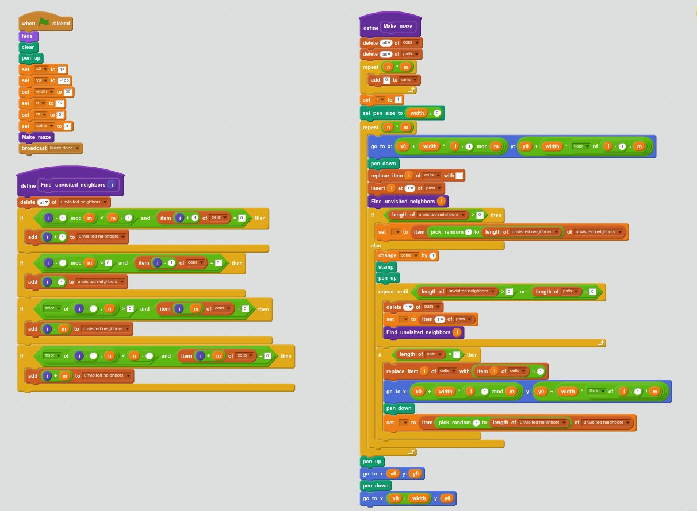

$$ 
\newcommand{\d}{\mathrm{d}}
\newcommand{\bff}{\boldsymbol{f}}
\newcommand{\bfg}{\boldsymbol{g}}
\newcommand{\bfp}{\boldsymbol{p}}
\newcommand{\bfq}{\boldsymbol{q}}
\newcommand{\bfx}{\boldsymbol{x}}
\newcommand{\bfu}{\boldsymbol{u}}
\newcommand{\bfv}{\boldsymbol{v}}
\newcommand{\bfA}{\boldsymbol{A}}
\newcommand{\bfB}{\boldsymbol{B}}
\newcommand{\bfC}{\boldsymbol{C}}
\newcommand{\bfM}{\boldsymbol{M}}
\newcommand{\bfJ}{\boldsymbol{J}}
\newcommand{\bfR}{\boldsymbol{R}}
\newcommand{\bfT}{\boldsymbol{T}}
\newcommand{\bfomega}{\boldsymbol{\omega}}
\newcommand{\bftau}{\boldsymbol{\tau}}
$$

# Tree Traversal 

Trees are naturally recursive data structures, and because of this, we cannot access their elements like we might access the elements of a vector or array. Instead, we need to use more interesting methods to work through each element. This is often called *Tree Traversal*, and there are many different ways to do this. For now, we will restrict the discussion to two common and related methods of tree traversal: *Depth-First* and *Breadth-First Search*. Note that trees vary greatly in shape and size depending on how they are used; however, they are composed primarily of nodes that house other, children nodes, like so:



[import:1-4, unindent:"true", lang:"c_cpp"](code/c++/Tree.cpp)

[import:11-15, unindent:"true", lang:"csharp"](code/cs/TreeMdAdditional.cs)

[import:6-10, unindent:"true", lang:"c_cpp"](code/c/Tree_example.c)

[import:1-5, unindent:"true", lang:"julia"](code/pseudo/Tree.pseudo)

[import:1-5, unindent:"true", lang:"python"](code/python2/Tree_example.py)

[import:5-10, unindent:"true", lang:"python"](code/python3/Tree_example.py)

[import:1-5, unindent:"true", lang:"julia"](code/pseudo/Tree.pseudo)


Because of this, the most straightforward way to traverse the tree might be recursive. This naturally leads us to the Depth-First Search (DFS) method:



[import:6-14, unindent:"true", lang:"c_cpp"](code/c++/Tree.cpp)

[import:48-57, unindent:"true", lang:"csharp"](code/cs/TreeMdAdditional.cs)

[import:81-92, unindent:"true", lang:"c_cpp"](code/c/Tree_example.c)

[import:15-23, unindent:"true", lang:"javascript"](code/javascript/Tree_example.js)

[import:8-16, unindent:"true", lang:"python"](code/python2/Tree_example.py)

[import:7-15, unindent:"true", lang:"julia"](code/pseudo/Tree.pseudo)

[import:7-15, unindent:"true", lang:"julia"](code/pseudo/Tree.pseudo)


At least to me, this makes a lot of sense. We fight recursion with recursion! First, we first output the node we are on and then we call `DFS_recursive(...)` on each of its children nodes. This method of tree traversal does what its name implies: it goes to the depths of the tree first before going through the rest of the branches. In this case, the ordering looks like:

Note that the in the code above, we are missing a crucial step: *checking to see if the node we are using actually exists!* Because we are using a vector to store all the nodes, we will be careful not to run into a case where we call `DFS_recursive(...)` on a node that has yet to be initialized; however, depending on the language we are using, we might need to be careful of this to avoid recursion errors! 

Now, in this case the first element searched through is still the root of the tree. This type of tree traversal is known as *pre-order* DFS. We perform an action (output the ID) *before* searching through the children. If we shift the function around and place the data output at the end of the function, we can modify the order in which we search through the tree to be *post-order* and look something like this:



[import:16-24, unindent:"true", lang:"c_cpp"](code/c++/Tree.cpp)

[import:75-84, unindent:"true", lang:"csharp"](code/cs/TreeMdAdditional.cs)

[import:17-26, unindent:"true", lang:"julia"](code/pseudo/Tree.pseudo)

[import:17-26, unindent:"true", lang:"julia"](code/pseudo/Tree.pseudo)

[import:17-26, unindent:"true", lang:"julia"](code/pseudo/Tree.pseudo)

[import:17-26, unindent:"true", lang:"julia"](code/pseudo/Tree.pseudo)

[import:17-26, unindent:"true", lang:"julia"](code/pseudo/Tree.pseudo)


In this case, the first node visited is at the bottom of the tree and moves up the tree branch by branch. In addition to these two types, binary trees have an *in-order* traversal scheme that looks something like this:



[import:27-44, unindent:"true", lang:"c_cpp"](code/c++/Tree.cpp)

[import:86-104, unindent:"true", lang:"csharp"](code/cs/TreeMdAdditional.cs)

[import:28-45, unindent:"true", lang:"julia"](code/pseudo/Tree.pseudo)

[import:28-45, unindent:"true", lang:"julia"](code/pseudo/Tree.pseudo)

[import:28-45, unindent:"true", lang:"julia"](code/pseudo/Tree.pseudo)

[import:28-45, unindent:"true", lang:"julia"](code/pseudo/Tree.pseudo)

[import:28-45, unindent:"true", lang:"julia"](code/pseudo/Tree.pseudo)


The order here seems to be some mix of the other 2 methods and works through the binary tree from left to right.

Now, at this point, it might seem that the only way to search through a recursive data structure is with recusion, but this is not necessarily the case! Rather surprisingly, we can perform a DFS non-recursively by using a stack, which are data structures that hold multiple elements, but only allow you to interact with the very last element you put in. The idea here is simple:

1. Put the root node in the stack
2. Take it out and put in its children
3. Pop the top of the stack and put its children in
4. Repeat 3 until the stack is empty

In code, it looks like this:



[import:46-59, unindent:"true", lang:"c_cpp"](code/c++/Tree.cpp)

[import:36-52, unindent:"true", lang:"csharp"](code/cs/Tree.cs)

[import:18-20, unindent:"true", lang:"c_cpp"](code/c/Tree_example.c)
[import:37-48, unindent:"true", lang:"c_cpp"](code/c/Tree_example.c)
[import:94-113, unindent:"true", lang:"c_cpp"](code/c/Tree_example.c)

[import:25-40, unindent:"true", lang:"javascript"](code/javascript/Tree_example.js)

[import:25-36, unindent:"true", lang:"python"](code/python2/Tree_example.py)

[import:31-45, unindent:"true", lang:"python"](code/python3/Tree_example.py)

[import:47-61, unindent:"true", lang:"julia"](code/pseudo/Tree.pseudo)


All this said, there are a few details about DFS that might not be idea, depending on the situation. For example, if we use DFS on an incredibly long tree, we will spend a lot of time going further and further down a single branch without searching the rest of the data structure. In addition, it is not the natural way humans would order a tree if asked to number all the nodes from top to bottom. I would argue a more natural traversal order would look something like this:

And this is exactly what Breadth-First Search (BFS) does! On top of that, it can be implemented in the same way as the `DFS_stack(...)` function above, simply by swapping the `stack` for a `queue`, which is similar to a stack, exept that it only allows you to interact with the very first element instead of the last. In code, this looks something like:



[import:61-74, unindent:"true", lang:"c_cpp"](code/c++/Tree.cpp)

[import:54-70, unindent:"true", lang:"csharp"](code/cs/Tree.cs)

[import:115-135, unindent:"true", lang:"c_cpp"](code/c/Tree_example.c)

[import:42-57, unindent:"true", lang:"javascript"](code/javascript/Tree_example.js)

[import:38-49, unindent:"true", lang:"python"](code/python2/Tree_example.py)

[import:48-62, unindent:"true", lang:"python"](code/python3/Tree_example.py)

[import:47-61, unindent:"true", lang:"julia"](code/pseudo/Tree.pseudo)


# Example Code


### C++
[import:3-, unindent:"true", lang:"c_cpp"](code/c++/Tree_example.cpp)

### C# #
[import:2-, unindent:"true", lang:"csharp"](code/cs/Tree.cs)

### C
[import:2-, unindent:"true", lang:"c_cpp"](code/c/Tree_example.c)

### JavaScript
[import:1-, unindent:"true", lang:"javascript"](code/javascript/Tree_example.js)

### Python 2
[import:1-, unindent:"true", lang:"python"](code/python2/Tree_example.py)

### Python 3
[import:1-, unindent:"true", lang:"python"](code/python3/Tree_example.py)

### Scratch


