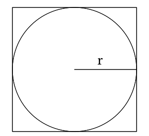

# Monte Carlo Integration

Monte Carlo methods were some of the first methods I ever used for research, and when I learned about them, they seemed like some sort of magic.
Their premise is simple: random numbers can be used to integrate arbitrary shapes embedded into other objects.
Nowadays, "monte carlo" has become a bit of a catch-all term for methods that use random numbers to produce real results, but it all started as a straightforward method to integrate objects.
No matter how you slice it, the idea seems a bit crazy at first.
After all, random numbers are random.
How could they possibly be used to find non-random values?

Well, imagine you have a square.
The area of the square is simple, $$\text{Area}_{\text{square}} = \text{length} \times \text{width}$$.
Since it's a square, the $$\text{length}$$ and $$\text{width}$$ are the same, so the formula is technically just $$\text{Area}_{\text{square}} = \text{length}^2$$.
If we embed a circle into the square with a radius $$r = \text{length}$$ (shown below), then it's area is $$\text{Area}_{\text{circle}}=\pi r^2$$.
For simplicity, we can also say that $$\text{Area}_{\text{square}}=4r^2$$.

    

Now, let's say we want to find the area of the circle without an equation.
As we said before, it's embedded in the square, so we should be able to find some ratio of the area of the square to the area of the circle:

$$
\text{Ratio} = \frac{\text{Area}_{\text{circle}}}{\text{Area}_{\text{square}}}
$$

This means,

$$
\text{Area}_{\text{circle}} = \text{Area}_{\text{square}}\times\text{Ratio} = 4r^2 \times \text{ratio}
$$

So, if we can find the $$\text{Ratio}$$ and we know $$r$$, we should be able to easily find the $$\text{Area}_{\text{circle}}$$.
The question is, "How do we easily find the $$\text{Ratio}$$?"
Well, one way is with *random sampling*.
We basically just pick a bunch of points randomly in the square, and
each point is tested to see whether it's in the circle or not:



[import:2-8, lang:"julia"](code/julia/monte_carlo.jl)

[import:7-9, lang:"c_cpp"](code/c/monte_carlo.c)

[import:7-7, lang:"haskell"](code/haskell/monteCarlo.hs)

[import:7-9, lang:"rust"](code/rust/monte_carlo.rs)

[import:2-5, lang:"d"](code/rust/monte_carlo.d)


If it's in the circle, we increase an internal count by one, and in the end,

$$
\text{Ratio} = \frac{\text{count in circle}}{\text{total number of points used}}
$$

If we use a small number of points, this will only give us a rough approximation, but as we start adding more and more points, the approximation becomes much, much better (as shown below)!

    

The true power of monte carlo comes from the fact that it can be used to integrate literally any object that can be embedded into the square.
As long as you can write some function to tell whether the provided point is inside the shape you want (like `in_circle()` in this case), you can use monte carlo integration!
This is obviously an incredibly powerful tool and has been used time and time again for many different areas of physics and engineering.
I can guarantee that we will see similar methods crop up all over the place in the future!

# Example Code
Monte carlo methods are famous for their simplicity.
It doesn't take too many lines to get something simple going.
Here, we are just integrating a circle, like we described above; however, there is a small twist and trick.
Instead of calculating the area of the circle, we are instead trying to find the value of $$\pi$$, and
rather than integrating the entire circle, we are only integrating the upper right quadrant of the circle from $$0 < x, y < 1$$.
This saves a bit of computation time, but also requires us to multiply our output by $$4$$.

That's all there is to it!
Feel free to submit your version via pull request, and thanks for reading!



### Julia
[import, lang:"julia"](code/julia/monte_carlo.jl)

### C
[import, lang:"c_cpp"](code/c/monte_carlo.c)

### Haskell
[import, lang:"haskell"](code/haskell/monteCarlo.hs)

### Rust
[import, lang:"rust"](code/rust/monte_carlo.rs)
### D

[import, lang:"d"](code/d/monte_carlo.d)


$$
\newcommand{\d}{\mathrm{d}}
\newcommand{\bff}{\boldsymbol{f}}
\newcommand{\bfg}{\boldsymbol{g}}
\newcommand{\bfp}{\boldsymbol{p}}
\newcommand{\bfq}{\boldsymbol{q}}
\newcommand{\bfx}{\boldsymbol{x}}
\newcommand{\bfu}{\boldsymbol{u}}
\newcommand{\bfv}{\boldsymbol{v}}
\newcommand{\bfA}{\boldsymbol{A}}
\newcommand{\bfB}{\boldsymbol{B}}
\newcommand{\bfC}{\boldsymbol{C}}
\newcommand{\bfM}{\boldsymbol{M}}
\newcommand{\bfJ}{\boldsymbol{J}}
\newcommand{\bfR}{\boldsymbol{R}}
\newcommand{\bfT}{\boldsymbol{T}}
\newcommand{\bfomega}{\boldsymbol{\omega}}
\newcommand{\bftau}{\boldsymbol{\tau}}
$$
