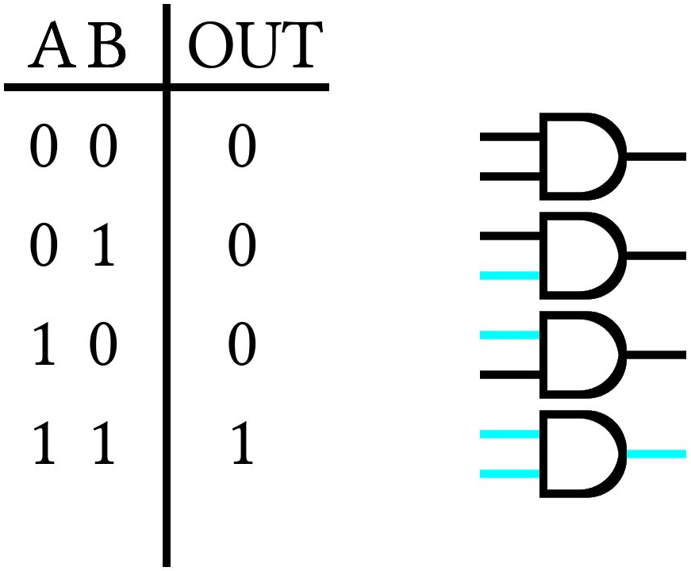
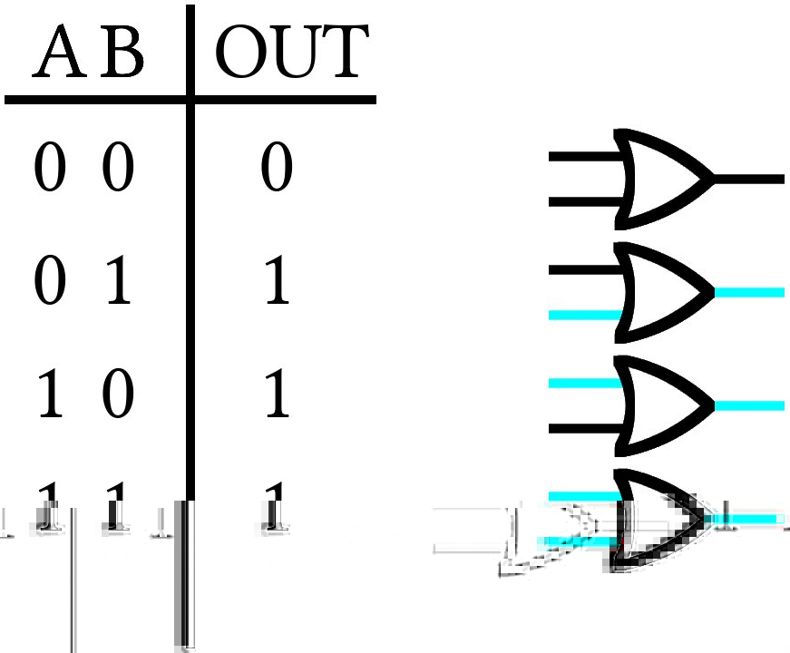
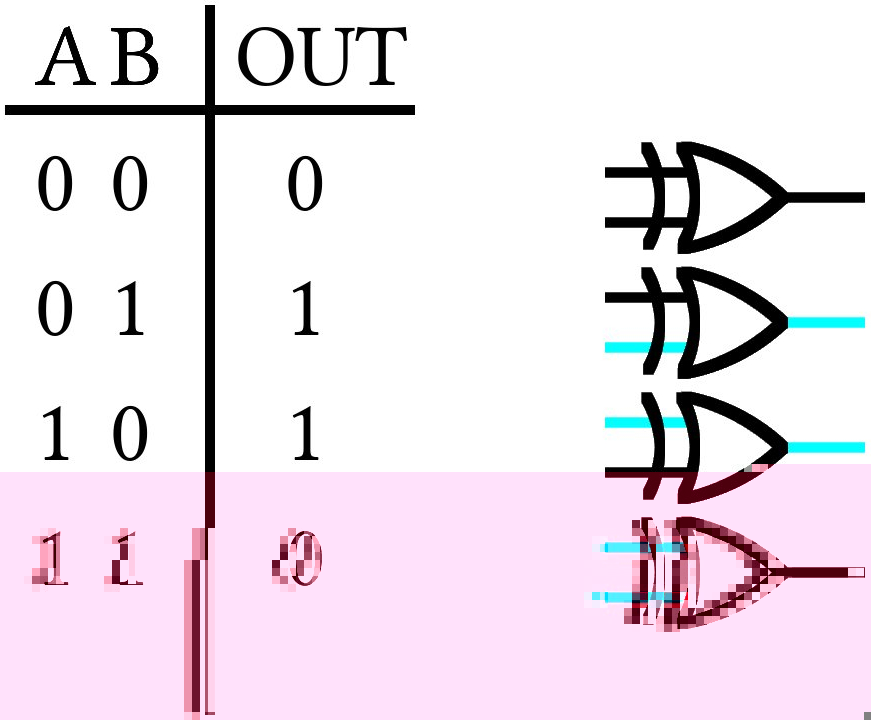
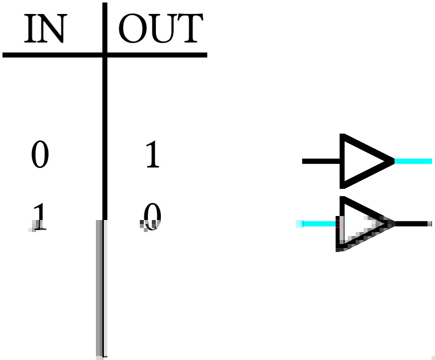
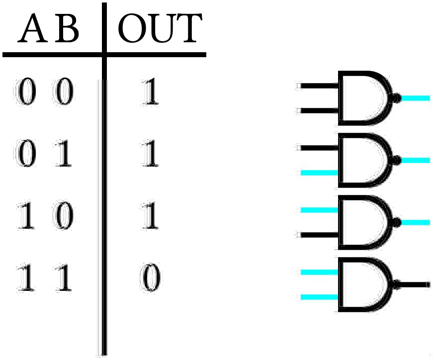

$$ 
\newcommand{\d}{\mathrm{d}}
\newcommand{\bff}{\boldsymbol{f}}
\newcommand{\bfg}{\boldsymbol{g}}
\newcommand{\bfp}{\boldsymbol{p}}
\newcommand{\bfq}{\boldsymbol{q}}
\newcommand{\bfx}{\boldsymbol{x}}
\newcommand{\bfu}{\boldsymbol{u}}
\newcommand{\bfv}{\boldsymbol{v}}
\newcommand{\bfA}{\boldsymbol{A}}
\newcommand{\bfB}{\boldsymbol{B}}
\newcommand{\bfC}{\boldsymbol{C}}
\newcommand{\bfM}{\boldsymbol{M}}
\newcommand{\bfJ}{\boldsymbol{J}}
\newcommand{\bfR}{\boldsymbol{R}}
\newcommand{\bfT}{\boldsymbol{T}}
\newcommand{\bfomega}{\boldsymbol{\omega}}
\newcommand{\bftau}{\boldsymbol{\tau}}
$$

### Bit Logic

We write code in a language that makes a little sense to us, but does not make sense at all to our computer without a compiler to transform the code we write into a language the computer can understand.
In the end, whenever we write code, all of the data structures we write are transformed into binary strings of 1's and 0's to be interpreted by our computer.
That said, it's not always obvious how this happens, so let's start the simple case of integer numbers.

#### Integers
For integer numbers, 0 is still 0 and 1 is still 1; however, for 2, we need to use 2 digits because binary only has 0's and 1's. When we get to 4, we'll need 3 digits and when we get to 8, we'll need 4. Ever time we cross a power of 2, we'll need to add a new digit. Here's a table of the first 10 integers in binary:

| Integer Number | Binary Number |
| -------------- | ------------- |
| 0 | `0000` |
| 1 | `0001` |
| 2 | `0010` |
| 3 | `0011` |
| 4 | `0100` |
| 5 | `0101` |
| 6 | `0110` |
| 7 | `0111` |
| 8 | `1000` |
| 9 | `1001` |

The easiest way to interpret a binary string is to imagine that each digit is a power of 2 and add them together. For example, take the number 13, with a bitstring 1101:

| 1 | 1 | 0 | 1 |
|---|---|---|---|
| $$2^3$$ | $$2^2$$ | $$2^1$$ | $$2^0$$ |
| 8 | 4 | 2 | 1 |

We have 1 $$2^3 = 8$$, 1 $$2^2 = 4$$, 0 $$2^1 = 2$$ and 1 $$2^0 = 1$$, adding together to 13.
Though this might seem straightforward, it is essential to understanding several operations that will be done on bits later.
For now, let's talk about the only trick to integer values: *negative numbers!*

There are a few ways to represent negative numbers.
For example, if we are using 8 bits, we might use the first of the 8 bits to be a **sign** bit, whose only purpose is telling the computer whether the number is positive or negative.

Another method is to "roll over" to negative numbers when the bit count gets too high, for example:

| Integer Number | Binary Number |
| -------------- | ------------- |
| 126 | `01111110` |
| 127 | `01111111` |
| -128 | `10000000` | 
| -127 | `10000001` |

Ultimately, integer numbers are not that difficult to deal with in binary, so let's move onto something more complicated: *floating-point numbers!*

#### Floating-point Numbers
Floats are numbers with a decimal point.
9.125 is a float. 9.000 is a float. 9 is an integer.
Here are a few floats and their integer representations:

| Floating-point Number | Binary Number |
| -------------- | ------------- |
| 9.125 | `1001.001`|
| 10.25 | `1010.01`|
| 1.00 | `1` |

The idea is similar to before: Each digit represents a power of 2; however, this time any digit after the decimal point counts negative.
So for 9.125, we have 1 $$2^3 = 8$$, 1 $$2^0 = 1$$, and 1 $$2^{-3} = \frac{1}{8}$$.

Now, how is this actually implemented on your computer?
Well, one way is with the IEE 754 Floating-point Arithmetic Standard. 
For 32 bits, the first bit is the *sign bit*, the next 8 bits tell us about the number's exponent, and the next 23 are called the *mantissa* and hold the binary string, itself. Now, there are a few points to keep in mind:

1. Because the exponent is being represented in 8 bits, we only have 256 values to play with. This means that the largest exponent we can represent (in single precision) is 128 and the smallest is -127. For this reason, we will add 127 to the power of every floating-point number. So, $$1 = 1 \times 10^{127}$$.

2. We normalize every bitstring to the first 1 available. For example: $$9.125 = 1.001001 \times 10^{130}$$, $$8.25 = 1.00001 \times 10^{130}$$, $$0.5 = 1 \times 10^{126}$$ $$\ldots$$ This means that *there will always be a leading 1 in our bitstring*. This means that the first 1 is redundant and can be removed from the mantissa.

So here are a few floating-point numbers and their corresponding bitstrings:

| Float | Sign | Exponent | Mantissa |
| ----- | ---- | -------- | -------- |
| 9.125 | `0` | `10000010` | `00100100000000000000000`|
| - 5.25 | `1` | `10000001` | `01010000000000000000000`|
| - 4096.625 | `1` | `10001011` | `00000000000010100000000` | 

Now that we know how to represent integers and floating-point numbers, let's move on to operations, starting with *bitshift operators*

#### Bitshift Operators: <<,>>
Bitshift operators do what their name implies: they shift a string of bits one digit to the left (<<) or right (>>). 
This has the somewhat profound effect of multiplying or dividing the value by 2, which makes sense when you consider that each digit represents a power of 2.
Because of the somewhat complicated nature of floating-point numbers, bitshift operators usually only work on integer numbers, like so:

| Operation | Integer | Bitstring |
| --------- | ------- | --------- |
| None      | 10      | `00001010` |
| Bitshift left, << | 20 | `00010100`|
| Bitshift right, >> | 5 | `00000101`|

There are more complicated things that can be done with the bitshift operators; however, we'll leave that discussion for another day!

#### Logic gates
In addition to the bitshift operations, there are a number of logical operations that can be performed on one or two bits together.
These operations are called *gates*, and follow soemwhat straightforward logic. 
The *AND* gate, for example, reads in 2 bits and will only output a 1 value if both inputs are 1. This can be seen in the corresponding truth table:

The *OR* gate will output 1 if either input bits are 1:

The *exclusive OR* or *XOR* gate is the same as the *OR* gate, but will not output 1 if both bits are 1:

The *NOT* gate simply flips the input bit:

By combining the NOT and AND gates, we get the *NAND* gate:

And NOT and OR create *NOR*:

There are a few other gates, but this is enough for most things. We'll add more as the need arises!

That's about it for bitlogic. I realize it was a bit long, but this is absolutely essential to understanding how computers think and how to use programming as an effective tool!
