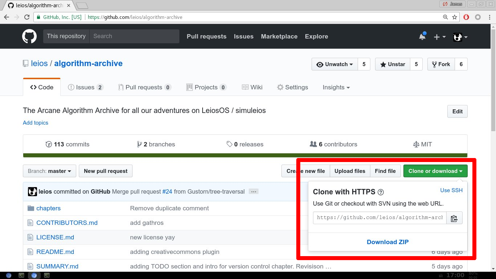

## Git and Version Control

I am a fan of open-source software. It allows users to see the nuts and bolts of code running on their system and mess around with it if they like. 
Unlike proprietary software, any user can learn everything about the software from the ground up, and that's an incredibly exciting prospect! 
More than that, open-source development breeds strong communities of like-minded individuals who work together to solve problems they care about. 
At least in my case, open-source software inspired me to code in my free time. It taught me that programming is more than a simple series of instructions for a computer. 
More than anything, though, open-source software taught me about how to work with others and overcome petty squabbles, because if there's one thing any open-source community is known for, it's petty squabbling. 

It might be because of my appreciation of large-scale software development that I never questioned the utility of version control. 
If there are a couple hundred people all contributing source code to the same place, there has to be some way to control all the different codebases each individual has on their own machine. 
Even if I have no collaborators, version control is a way to make sure my laptop and work machine both have the same code without having to transer a USB stick back and forth. 
That said, at some point in my life, I settled in as a physics researcher. 
This meant that I wrote code to solve physics problems with a small team. The problem was that even though I was using version control, the rest of my team was not. 

This was frustrating.

 I would hear my labmates say things like, "Yeah. I rewrote my code last night and now nothing works, but I already saved over my previous version, so I'll just work with what I have." 
Or, "I'm writing a paper with my boss. We are using Dropbox and upload files with slightly different names after we modify them. Right now, we are on paper_78c."
The point is: version control exists to control different versions of software (and other documents). 
If you are writing code, it exists as a way to quickly save what you have before making largescale modifications. 
It also allows individuals to collaborate on a larger scale by providing necessary tools to merge work created by different individuals into a single, cohesive story.

No matter how you look at it, version control is a useful and necessary tool to collaborate with other programmers and is definitely worth discussing in depth.
Though many version control systems exist, for now we will focus on git, simply because it is incredibly popular and this book is hosted both on github and gitbook.
We hope to discuss other version control methods and strengthen the tutorial on git provided here in the future; however, this book is meant as an archive of algorithms, not as an introduction to version control or best software practices. 
Though discussions like these are useful, we must be careful not to get too far out-of-scope.
For now, this tutorial is simply meant as a quick way to kickstart our community into using git and collaborating more effectively with each other (specifically on this book). 

I feel like this introduction may have been a little too long. Let me know what you think! Regardless, now it's time to talk about git!

### *Git*ting started!

I suppose let's start simply: git manages different versions of code available on different machines. 
When using git, there will be a local copy of a repository of code that may or may not be up-to-date with a copy of the code repository in some remote location. 

Now, there is an easy way, a hard way, and an impossibly complicated way to use git. 
We'll be walking through the easy and hard ways.
We are not trying to impress anyone with git wizardry. We are simply trying to provide the basics with a little undersanding sprinkled in.

As a side note: we will be assuming that you are using git from the terminal. There is a GUI available from github and it works super well for most cases; however, it's also self-explanatory in most cases. 
Put another way: if you can understand the ways of the terminal, the git GUI will be much more straightforward. On the other hand, learning the GUI will not necessarily help you when using the terminal.

So, first things first. Make sure git is installed on your system and set it up with the following commands

```
git config --global user.name name
git config --global user.email name@email.com
```

Obviously, use your own name and e-mail... unless your name is actually *name* and your e-mail is actually *name@email.com*, in which case the above commands are correct.
In the rare case that a user named "name" with the e-mail "name@email.com" is reading this, I apologize for spoiling your anonymity.
For everyone else, remember that git is meant to facilitate collaborative code development, so we need to know who is submitting code so we can communicate more effectively later. 
That said, it is alright to use a username and e-mail address that does not spoil your identity in the real world, so long as you are reachable by the information provided. 

Now we need to find a repository of code to work on. If you are starting your own repository or want to work on an internal network, this will not be too big of an issue.
If you just want to get the feel for how git works, I suggest going to [github.com](https://github.com/) and checking out the code developed there. 
Note that you will not be able to contribute to any directory on github, simply because if anyone could contribute any code they wanted to any repository they wanted, the world would become incredibly chaotic.
Because of this, you may want to create a repository under your own github username or making your own copy of the code by going to any code you want to modify and clicking the *fork* button:


Note that if you have a fork of a particular code repository, you can ask the owner of the original code repository to pull your changes into their version of the code with a *pull request*, but we are getting ahead of ourselves here. 
If you cannot think of what repository to work on and want to collaborate on this project in the future, feel free to fork the [Algorithm Archive](https://github.com/leios/algorithm-archive) and modify that.

Regardless, as long as there is a repository under your username on github, we can continue by linking the remote github location to our local git directory. First, we need to find the url of the github repository, as shown here:



Note that there are 2 provided urls here, one for ssh and another for https. From the user's perspective, the difference between the two is minimal: ssh requires the user to type only a password when interacting with the remote github repository, while https requires both a username and password.
Now, you will probably be interacting with github a lot, so ssh will definitely save time and is preferred for many people who use git a lot; however, [there is some initial set-up](https://help.github.com/articles/connecting-to-github-with-ssh/). 
If you want, we can discuss the set-up in more detail later (just let me know!), but for now, we'll stick with https because it's more familiar to new users.

Once you have the url, there are 2 ways to proceed:

**The easy way:**
```
git clone https://github.com/leios/algorithm-archive
```

**The not-so-easy way:**
```
mkdir algorithm_archive
cd algorithm_archive
git init
git remote add origin https://github.com/leios/algorithm-archive
git fetch
git merge origin/master
```

Here, `git clone` does every step of the *not-so-easy* way in one command, so the two methods are completely identical. Because of this, in most cases, I just use `git clone`; however, the *not-so-easy* way is much more explicit and helps us understand what is going on a little better.
For now, we will breifly describe each of the commands; however, we will definitely be covering them in more depth through this tutorial.
So, here it is, step-by-step:
1. `mkdir algorithm_archive`:make a directory. We can call this directory anything, but we'll call it algorithm_archive for now.
2. `git init`: initialize git
3. `git remote add origin https://github.com/leios/algorithm-archive`: add a remote location (the github url we found just a second ago). Again, we can call this remote location anything, but `git clone` always calls it `origin`, so well stick with that. 
4. `git fetch`: update the local directory with the information from the remote online repository
5. `git merge origin/master`: merge those updates. Right now, the `origin/master` part of this command might seem like a bit of black octocat magic.

No matter how you initialize your git repository, you will link your local directory with a remote location. If you ever want to see these locations, simply type:

```
git remote -v
origin	git@github.com:leios/algorithm-archive.git (fetch)
origin	git@github.com:leios/algorithm-archive.git (push)
```

This provides information on different `remote`s. We'll talk about `fetch` and `push` a bit later. 
Now, you might be asking yourself: If I am only connected to the url I forked earlier, what happens when the owner of the main code repository pushes changes? How will I update my code when this happens?
The solution here is simple: Add another `remote` like so:

```
git remote add upstream https://github.com/leios/algorithm-archive
```

### Committing to git

Now you have the repository linked to another online source. Note that you are not authorized to push changes onto the `upstream` url, but that's alright for now. Let's just stick to modifying `origin`.
At this point, we can make any modification we want! I might suggest doing something simple:

```
echo name >> CONTRIBUTORS.md
```

Nothing crazy, just something so we can get the feeling of git. To see what files have been changed, type:

```
git status
```

This will show that `CONTRIBUTORS.ms` has been modified.
If we want to save our changes, we need to add all of the files with changes to them to a package called a `commit`.
To add the files, simple type:

```
git add CONTRIBUTORS.md
```

Then if we type `git status` again, it will show that the file `CONTRIBUTORS.md` is in a *staging area* awaiting commit. This simply means that git is waiting to make sure there are no other changes we want to package up.
Now we create the `commit` by typing 

```
git commit -m "Adding name to contributors file"
```

Note that if you do not use the `-m` message flag (just `git commit`), git will open your default editor (probably vi) to ask for a message. *Every git commit needs a git message!* Make the messages count. Be as descriptive as possible! 
If you want to see all commits that have ever been made on this repository, simply type

```
git log
```

This will show you the history so far. As a side note, it also shows why good, clean commit messages are essential to managing large, open-source projects. 
If there are hundreds (or thousands) of commits, and one of the features implemented somewhere down the line has a bug, clean commit messages allow us to find when the feature was implemented and possibly when the bug arose. 

Now let's say you want to checkout what the code looked like at a particular commit. To do this, we need to look at the generated unique string (SHA-1 checksum) associated with the commit we want and paste the first few (roughly 5) characters into the following command:

```
git checkout CHARS
```

It's incredibly unlikely that any two commits will share the first *n* characters, so this is unique enough for git to identify which commit we were referring to and send us back there, but here's where the notation get's a little crazy!
See, when we are sent back in time to the chosen commit (with the above command), we will be in a *detached head* state. 
This refers to the term we use to describe the very latest commit, **HEAD**.
If we wanted to checkout the previous commit (for example), we would use `git checkout HEAD~1`, the second-to-last commit would be `HEAD~2`, and so on and so-forth.

When we checkout another commit, we are rolling back the head of our commitment snake back to what it was in the past. 
In the detached head state, we shouldn't really do any development. It's more of a read-only type of thing; however, if we want to develop the code starting at that commit, we could use

```
git checkout -b CHARS
```

But this requires a little explanation!


### Checkout these branches!

Now let's take a step to the side and talk about another fantastic git feature, branches. 
We have code forked under our own username on github. This means that there are at least 2 functioning versions of the code we are working on: our own fork and the original owner's fork. 
That said, within each fork, there is the ability to have multiple lines of development, each one on a different *branch*.

If you are new to software development, this might not seem to useful; however, imagine you are working on a large, open-source project that thousands of people use.
At some point, you want to re-organize a bunch of features in the code. 
As a developer, you are not sure whether all the features you are re-organizing will still work properly after re-organizing them, but you know the code needs to be modified!
The problem is that you have users who may need the features you accidentally break. 
For this reason, you might want to have a "master" branch -- one that is always working for the users, and a "development" branch -- one that is in the middle of creating new features for users.

In truth, there are dozens of reasons why developers might want to work on slightly different versions of the code. 
Rather than spending time outlining all the potential reasons, let's just dive into how branches are made and maintained.

To check which branch you are on, simply type:

```
git branch
```

This will show you your currently active branch. If you haven't switched branches yet, you will probably by on `master`.
To switch branches, use

```
git checkout branch
```

And this will change all of the files on your local directory to match the branch you have swapped to. 
Note that if you have local changes that will be overwritten when changing branches, git will note these changes and tell you to do something about them before switching to a new branch.
If you want to get rid of the changes, you could delete any files that are causing conflicts; however, this is barbaric and should be avoided in civilized society.
Another solution is to use a feature of git called the `stash`.
In many ways, this is much easier to do than deleting files manually. All you need to do is type:

```
git stash
```

This will stash all the local changes and bring the directory back to the latest HEAD. If you want to get your changes back, just use

```
git stash apply
```

Now, here's the problem: because `git stash` is so convenient, I tend to have the habit of stashing local changes quite often. This means that I have multiple modifications stored, all connected to different commits.
Quite frankly, it's a mess. That said, I can list out everything in my stash with 

```
git stash list
```

and apply whichever stash I want with 

```
git apply stash@{i}
```

Where `i` is the value of the stash item I want to apply. 

Now, to be clear: I am not encouraging anyone to use `git stash` to hide away local changes and make branch traversal easier; however, if you are about to delete files, maybe try `git stash` instead?

### Interacting with github

To this point, we have introduced the concept of `remote`s and how to set them up, but we have not discussed how to interact with them.
for the most part, there are only a few commands to keep in mind. the easiest one to explain is 

```
git push
```

After we have made a commit (discussed above), we can push it to github like so

```
git push remote branch
```

for example, if you are pushing the `master` branch to the `origin` remote, it would be

```
git push origin master
```

Now, I personally like being explicit about which branch and remote we are working with, but you can tell git to ignore the `remote` and `branch` specifications by setting an upstream url, which means running

```
git push -u remote branch
```

Once this is run, the remote and branch will be stored for later and you won't need to think about it ever again! (Well, you might need to think about it when working on more complicated things later)

Now, if `push`ing moves changes from your own computer to a repository online, it would make sense that `pull`ing does the opposite and moves changes from an online repository to your machine. Like before, this is straightforward:

```
git pull remote branch
```

However, there's a little more to it than that. In essense, `git pull` is running two separate commands. One updates your git repository with the information found on your remotes. This one is called `git fetch`. the other one finds the changes and merges those changes with the branch found on your local machine. This is called `git merge`. When put together, it might look like:

```
git fetch
git merge origin/master
```

Note here that the `merge` command is incredibly powerful and is also used to merge different branches; however, merging leads to an incredibly complicated topic that is beyond the scope of this discussion: *merge conflicts*.


### Concepts we missed

Unfortunately, this discussion has a scope. It is not meant to give you a deep, meaningful understanding of git. 
Instead, we focused on the basics, with the hope of encouraging our community to start collaborating together.
The more you use git, the easier it will be to use in the future and the more it will start to make sense.
That said, due to the nature of this guide, there were a few things we missed. The two most important of which might be *merge conflicts* and *rebasing*, bot of which are important to discuss at some point in the future.
