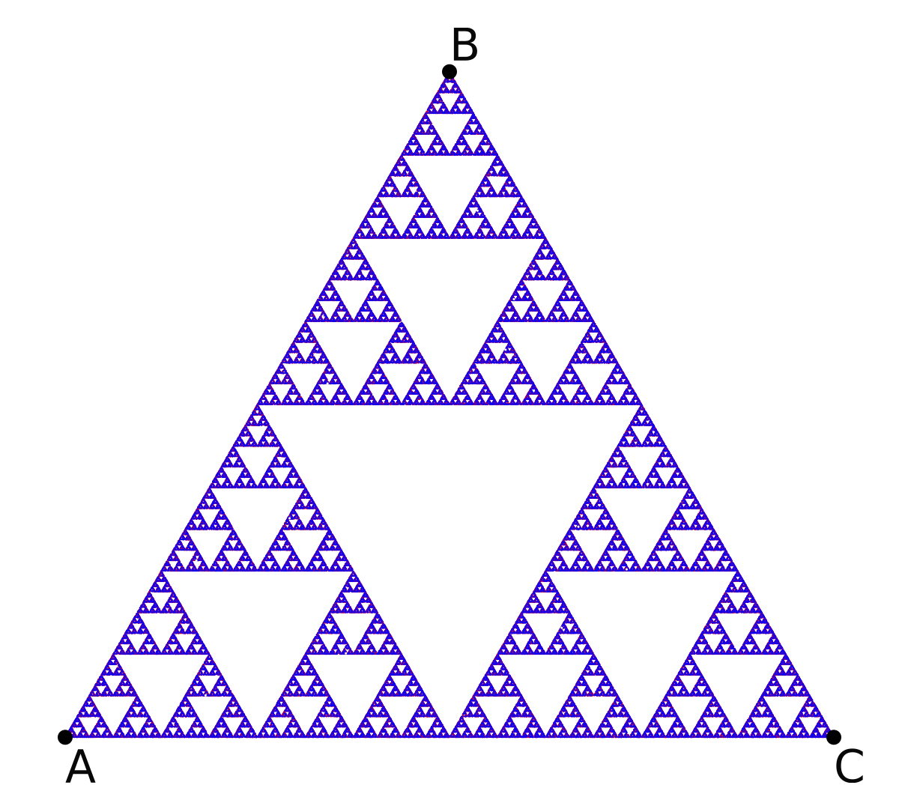
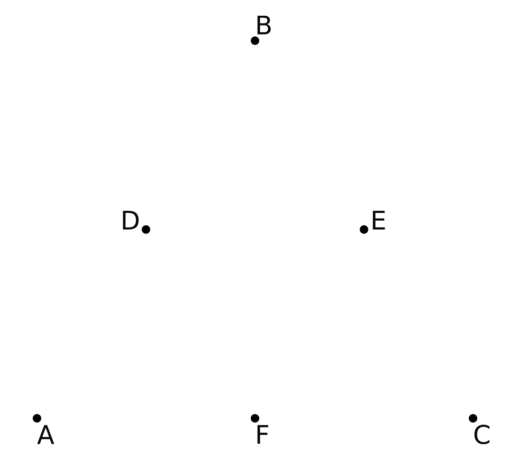
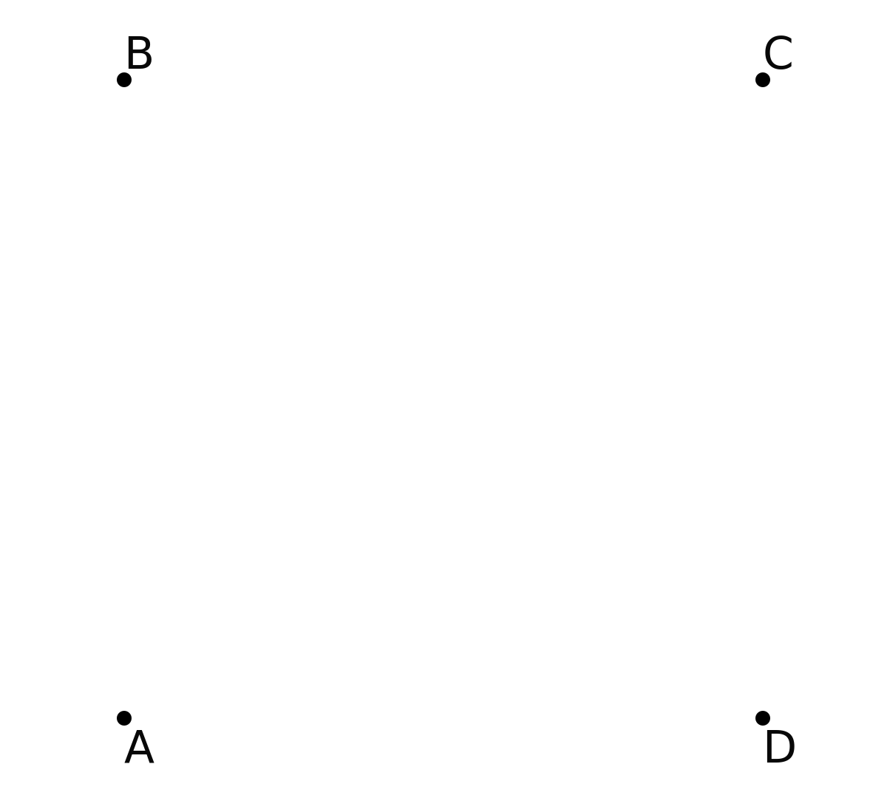

# Iterated Function Systems

A few quick notes before we start:

1. For this chapter, we will be following the methodology set by the [plotting chapter](../plotting/plotting.md).
That is to say that the code presented in this chapter will output another file that can be easily plotted by an external plotter.
If you like to use a plotter provided by your language of choice, please modify the code provided to do so.

2. This chapter is currently a subsection to the plotting chapter, but we may extend the algorithm archive in the future with other fractal generation methods, which would require created a new section on fractals, in particular.
This would include a chapter with more rigorous definitions on fractals, which is largely missing from the following discussion.
Please let us know if you are interested!

In this chapter, we will show you how to make one of the most famous fractals via Iterated Function Systems (IFSs): the Sierpinski triangle.
We will also introduce a number of interesting concepts for further exploration, such as chaos games, Hutchinson operators, and attractors.

## The Sierpinski Triangle

To begin the discussion of Iterated Function Systems (IFSs), we will first discuss what might be one of the most famous fractals currently known, the Sierpinski triangle, shown below:

This image is clearly a set of triangles embedded in a larger triangle in such a way that it can be continually cut into three identical pieces and still retain its internal structure.
This idea is known as self-similarity {{"self-similar" | cite }}, and it is usually the first aspect of fractals that will catch an audience's attention.
In fact, there are plenty of uses of fractals and their mathematical underpinnings, such as estimating the coastline of Britain {{ "mandelbrot1967long" | cite}}, identifying fingerprints {{ "jampour2010new" | cite }}, and image compression {{ "fractal-compression" | cite }}{{ "saupe1994review" | cite }}.
In many more rigorous definitions, a fractal can be described as any system that has a non-integer Hausdorff dimension {{ "3b1bfractal" | cite }}{{ "hausdorff" | cite }}{{ "gneiting2012estimators" | cite }}.
Though this is an incredibly interesting concept, the discussion of this chapter will focus primarily on methods to generate fractal patterns and will refrain from delving into this discussion for now and instead focus on the methods by which fractals can be generated through IFSs.

To start, imagine creating a triangle from three points, $$A$$, $$B$$, and $$C$$.
These points can be arbitrarily chosen, but for this conversation, we will constrict them to the vertices of an equilateral triangle, as shown below:

Now let's create three separate functions that can act on a 2-dimensional space:

$$
\begin{align}
f_1(P) &= \frac{P + A}{2}\\
f_2(P) &= \frac{P + B}{2}\\
f_3(P) &= \frac{P + C}{2}\\
\end{align}
$$

Each function will input a particular location in space (here, $$P \in \mathbb{R}^2$$) and output a new location that is the midpoint between the input location and $$A$$, $$B$$, or $$C$$ for functions 1, 2, and 3 respectively.
The union of all of these functions (the set of all possible functions available for use) is often notated as the _Hutchinson operator_ {{ "hutchinson-operator" | cite }}{{ "hutchinson1981fractals" | cite}}, and for this case it would look like this:

$$
H(P) = \bigcup_{i=1}^3f_i(P)
$$

By iteratively using this operator, we can traverse through all possible movements in the set.
For example, let's generate 3 new points that are halfway between $$A$$ and $$B$$, $$B$$ and $$C$$, and $$A$$ and $$C$$, which will be called $$D$$, $$E$$, and $$F$$ respectively.
This is shown below:

From here, each new point ($$D$$, $$E$$, and $$F$$) will spawn 3 children, and each child will move according to one of the three possible functions in the Hutchinson operator, as shown below:

<video style="width:100%" controls>
  <source src="res/IFS_triangle_vid_1.mp4" type="video/mp4">
  
</video>

Here, all red children come from $$D$$, green children come from $$E$$ and blue children come from $$F$$.
From here, the children will then spawn 3 more children, each of which will move according to a different function.
Those children will then spawn more children, who act accordingly.
As this process continues on and on, we begin to see an interesting pattern form:

<video style="width:100%" controls>
  <source src="res/IFS_triangle_vid_2.mp4" type="video/mp4">
  
</video>

This is the Sierpinski triangle.
At first, it might seem like mathematical magic that a simple set of 3 functions can create such a pattern.
After all, why aren't any of the children migrating to the empty spaces in the structure?
This will require some thought, but the simplest answer is that no function within the Hutchinson operator allows for children to enter those spaces.

## What about a square?

When I learned about this for the first time, I began to wonder about other shapes.
Could we create fractal squares? Hexagons? Circles?
Such shapes _seem_ like natural extensions to the triangular Hutchinson operator provided above, but there's a bit of a hitch...

First, let's take 4 points, $$A$$, $$B$$, $$C$$, and $$D$$, this time located at the four vertices of a square, like so:

In a similar fashion, we'll create 4 functions with $$H(P) = \bigcup_{i=1}^4f_i(P)$$, and $$P \in \mathbb{R}^2$$ such that:

$$
\begin{align}
f_1(P) &= \frac{P + A}{2}\\
f_2(P) &= \frac{P + B}{2}\\
f_3(P) &= \frac{P + C}{2}\\
f_4(P) &= \frac{P + D}{2}\\
\end{align}
$$

If we then create 5 initial points located between all the vertices and allow these points to continually spawn children like before, something peculiar happens:

<video style="width:100%" controls>
  <source src="res/IFS_square_vid_1.mp4" type="video/mp4">
  
</video>

Well, this is essentially a square of squares.
What happened to the self-similar structure we were getting before?
Why isn't this more interesting?

The best answer I have for now is that some Hutchinson operators are interesting and some are not.
On the other hand, this square is a bit more interesting than it first appears, but I think this is easiest to understand when we use the Hutchinson operator in a slightly different way.

## Chaos games and attractors

Until now, we have been using the Hutchinson operator in a computationally costly way.
Every iteration, we generate 3 or 4 new children per child per step of the simulation.
This scales exponentially and means that we will quickly have millions of children to keep track of!

A much more computationally feasible method to use the Hutchinson operator comes in the form of the _chaos game_ {{ "chaos-game" | cite }}{{ "chaos-game-wolf" | cite }}.
Here, instead of tracking children of children, we track a single individual that chooses randomly between the Hutchinson functions, as shown here:



[import:4-17, lang:"julia"](code/julia/IFS.jl)

[import:39-52, lang:"cpp"](code/c++/IFS.cpp)

[import:5-12, lang:"python"](code/python/IFS.py)

[import:18-29, lang:"c"](code/c/IFS.c)

[import:5-13, lang:"lisp"](code/clisp/ifs.lisp)


If we set the initial points to the on the equilateral triangle we saw before, we can see the Sierpinski triangle again after a few thousand iterations, as shown below:

<video style="width:100%" controls>
  <source src="res/chaos_vid_1.mp4" type="video/mp4">
  
</video>

That said, there is something peculiar about the way the chaos game starts.
Essentially, our lone child begins their journey at a random location.
What if that location is off the triangle?
Well, let's test that!

If we start the point at the center of the triangle, it will eventually find its way onto the triangle, and then all subsequent iterations will be on the fractal.
Here, I have plotted the first 20 steps where the wanderer is still looking for the correct shape:

<video style="width:100%" controls>
  <source src="res/chaos_vid_2.mp4" type="video/mp4">
  
</video>

It would seem that the wanderer is _attracted_ to the Sierpinski triangle with this set of functions.
That is actually the case.
The truth is that the word _attractor_ is a very loaded term in the literature, but for the purposes of our discussion here, the _attractor_ is any shape defined by the iteration through Hutchinson operator functions.

So let's go back to the square, which seemed like a somewhat random distribution of points:

Even with the chaos game, this will not change; however, we now know that the random distribution isn't truly random.
Rather, it's an attractive plane where our lone wanderer can exist happily within.
That is to say, the 2-dimensional square is, itself, the attractor for that Hutchinson operator, and if we start our journey person off of the square, they will eventually find themselves within it, similar to the triangle before.

The next obvious question is whether a square can create any more interesting fractally patterns, and the answer is "yes, but only if we restrict the movement a bit."
Which brings us to another topic entirely: restricted chaos games.
Discussing restricted chaos games in more detail is a chapter in its own right, so I will forego the discussion here.
If you are interested, please let me know and I will be more than willing to add the chapter in the future!

## Video Explanation

Here is a video describing iterated function systems:

<iframe width="560" height="315" src="https://www.youtube.com/embed/nIIp-vo8rHg"
 frameborder="0" allow="accelerometer; autoplay; encrypted-media; gyroscope; pic
ture-in-picture" allowfullscreen></iframe>

## Example Code

For the code in this chapter, we have decided to write it specifically for the Chaos game, not the hutchinson animations shown at the start of the chapter.
This is because that animation is slightly tricky to create and distracts from the overall purpose of this chapter.
In addition, we have written the chaos game code to take in a set of points so that it is not hard-coded for the Sierpinski triangle and can be easily extended to other shapes like the square or restricted chaos games, as we mentioned before!



[import, lang:"julia"](code/julia/IFS.jl)

[import, lang:"cpp"](code/c++/IFS.cpp)

[import, lang:"python"](code/python/IFS.py)

[import, lang:"c"](code/c/IFS.c)

[import, lang:"lisp"](code/clisp/ifs.lisp)


### Bibliography

 

## License

##### Code Examples

The code examples are licensed under the MIT license (found in [LICENSE.md](https://github.com/algorithm-archivists/algorithm-archive/blob/master/LICENSE.md)).

##### Text

The text of this chapter was written by [James Schloss](https://github.com/leio) and is licensed under the [Creative Commons Attribution-ShareAlike 4.0 International License](https://creativecommons.org/licenses/by-sa/4.0/legalcode).

[

](https://creativecommons.org/licenses/by-sa/4.0/)

#### Images/Graphics

- The image "[IFS triangle 1](res/IFS_triangle_1.png)" was created by [James Schloss](https://github.com/leios) and is licensed under the [Creative Commons Attribution-ShareAlike 4.0 International License](https://creativecommons.org/licenses/by-sa/4.0/legalcode).
- The image "[IFS triangle 2](res/IFS_triangle_2.png)" was created by [James Schloss](https://github.com/leios) and is licensed under the [Creative Commons Attribution-ShareAlike 4.0 International License](https://creativecommons.org/licenses/by-sa/4.0/legalcode).
- The image "[IFS triangle 3](res/IFS_triangle_3.png)" was created by [James Schloss](https://github.com/leios) and is licensed under the [Creative Commons Attribution-ShareAlike 4.0 International License](https://creativecommons.org/licenses/by-sa/4.0/legalcode).
- The image "[IFS triangle 4](res/IFS_triangle_4.png)" was created by [James Schloss](https://github.com/leios) and is licensed under the [Creative Commons Attribution-ShareAlike 4.0 International License](https://creativecommons.org/licenses/by-sa/4.0/legalcode).
- The image "[IFS triangle 5](res/IFS_triangle_5.png)" was created by [James Schloss](https://github.com/leios) and is licensed under the [Creative Commons Attribution-ShareAlike 4.0 International License](https://creativecommons.org/licenses/by-sa/4.0/legalcode).
- The image "[IFS square 1](res/IFS_square_1.png)" was created by [James Schloss](https://github.com/leios) and is licensed under the [Creative Commons Attribution-ShareAlike 4.0 International License](https://creativecommons.org/licenses/by-sa/4.0/legalcode).
- The image "[IFS square 2](res/IFS_square_2.png)" was created by [James Schloss](https://github.com/leios) and is licensed under the [Creative Commons Attribution-ShareAlike 4.0 International License](https://creativecommons.org/licenses/by-sa/4.0/legalcode).
- The image "[Chaos 1](res/chaos_1.png)" was created by [James Schloss](https://github.com/leios) and is licensed under the [Creative Commons Attribution-ShareAlike 4.0 International License](https://creativecommons.org/licenses/by-sa/4.0/legalcode).
- The image "[Chaos 2](res/chaos_2.png)" was created by [James Schloss](https://github.com/leios) and is licensed under the [Creative Commons Attribution-ShareAlike 4.0 International License](https://creativecommons.org/licenses/by-sa/4.0/legalcode).
- The video "[IFS triangle video 1](res/IFS_triangle_vid_1.mp4)" was created by [James Schloss](https://github.com/leios) and is licensed under the [Creative Commons Attribution-ShareAlike 4.0 International License](https://creativecommons.org/licenses/by-sa/4.0/legalcode).
- The video "[IFS triangle video 2](res/IFS_triangle_vid_2.mp4)" was created by [James Schloss](https://github.com/leios) and is licensed under the [Creative Commons Attribution-ShareAlike 4.0 International License](https://creativecommons.org/licenses/by-sa/4.0/legalcode).
- The video "[IFS square video 1](res/IFS_square_vid_1.mp4)" was created by [James Schloss](https://github.com/leios) and is licensed under the [Creative Commons Attribution-ShareAlike 4.0 International License](https://creativecommons.org/licenses/by-sa/4.0/legalcode).
- The video "[Chaos video 1](res/chaos_vid_1.mp4)" was created by [James Schloss](https://github.com/leios) and is licensed under the [Creative Commons Attribution-ShareAlike 4.0 International License](https://creativecommons.org/licenses/by-sa/4.0/legalcode).
- The video "[Chaos video 2](res/chaos_vid_2.mp4)" was created by [James Schloss](https://github.com/leios) and is licensed under the [Creative Commons Attribution-ShareAlike 4.0 International License](https://creativecommons.org/licenses/by-sa/4.0/legalcode).
