# The Approximate Counting Algorithm

This might seem like a straightforward question, but how high can you count on your fingers?
This depends on how many fingers you have, but in general the answer has to be 10, right?

Well, not exactly, it can actually go much, much higher with a few simple abstractions.

The first strategy is to think of your fingers as binary registers, like so {{ "3b1b_finger_count" | cite }}:

    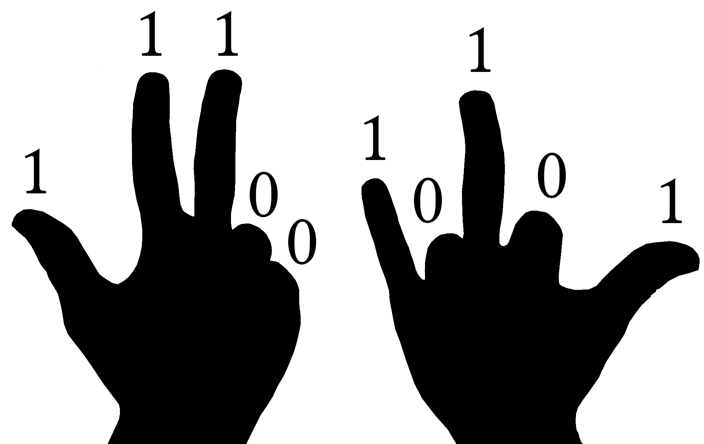

If your fingers are out, they count as a 1 for that register.
If they are not, they count as a 0.
This means that after you have decided on the appropriate finger configuration, you have created a bitstring that can be read from left to right, where each number represents a power of 2.
For this example, we would have a bitstring of 1110010101, which reads to 917:

$$
1 \cdot 2^9 + 1 \cdot 2^8 + 1 \cdot 2^7 + 0 \cdot 2^6 + 0 \cdot 2^5 + 1 \cdot 2^4 + 0 \cdot 2^3 + 1 \cdot 2^2 + 0 \cdot 2^1 + 1 \cdot 2^0
$$
$$
=
$$

$$
512 + 256 + 128 + 16 + 4 + 1 = 917
$$

Because you have 10 fingers and each one represents a power of 2, you can count up to a maximum of $$2^{10}-1$$ or 1023, which is about 100 times higher than simple finger counting!
For those who might be wondering why you can count to $$2^{10}-1$$ instead of $$2^{10}$$ exactly, remember that each finger represents a power of 2.
The right thumb counts as $$2^0 = 1$$ and the left thumb is $$2^9 = 512$$.
With all fingers out, we have  counted to $$\sum_{n=0}^9 2^n = 1023 = 2^{10}-1$$.

So what if we wanted to go beyond 1023?
Well, we could start counting with our fingers as trits where 0 is closed, 1 is half-up, and 2 is fully up.
There are actually a huge variety of different ways we could move our hands about to count in odd ways, but we are interested in a more concrete problem: how high can we count with only 10 bits?

This is almost exactly the problem that Morris encountered in Bell Labs around 1977 {{"morris1978counting" | cite }}.
There, he was given an 8-bit register and asked to count much higher than $$2^8 - 1= 255$$.
His solution was to invent a new method known as the approximate counting algorithm.
With this method, he could count to about $$130,000$$ with a relatively low error (standard deviation, $$\sigma \approx 17,000$$).
Using 10 registers (fingers), he could count to about $$1.1\times 10^{16}$$ with similar parameters, which is undoubtedly impressive!

The approximate counting algorithm is an early predecessor to streaming algorithms where information must be roughly processed in real-time.
As we dive into those methods later, this chapter will certainly be updated.
For now, we will not be showing any proofs (though those might come later as well), but a rigorous mathematical description of this method can be found in a follow-up paper by Philippe Flajolet {{ "flajolet1985approximate" | cite }}.
In addition, there are several blogs and resources online that cover the method to varying degrees of accessibility {{"arpit_counting" | cite }} {{"greggunderson_counting" | cite }}.

Here, we hope to provide a basic understanding of the method, along with code implementations for anyone who might want to try something similar in the future.

## A Simple Example

If we need to count more than 255 items with 8 bits, there is one somewhat simple strategy: count every other item.
This means that we will increment our counter with 2, 4, 6, 8... items, effectively doubling the number of items we can count to 511!
(Note: that "!" is out of excitement and is not a factorial.)
Similarly, if we need to count above 511, we can increment our counter every 3 or 4 items; however, the obvious drawback to this method is that if we only count every other item, there is no way to represent odd numbers.
Similarly, if we count every 3rd or 4th item, we would miss out on any numbers that are not multiples of our increment number.

The most important thing to take away from this line of reasoning is that counting can be done somewhat approximately by splitting the process into two distinct actions: incrementing the counter and storing the count, itself.
For example, every time a sheep walks by, you could lift a finger.
In this case, the act of seeing a sheep is a trigger for incrementing your counter, which is stored on your hand.
As mentioned, you could also lift a finger every time 2 or 3 sheep go by to count higher on your hand.
In code, bits are obviously preferred to hands for long-term storage.

Taking this example a bit further, imagine counting 1,000,000 sheep.
If we wanted to save all of them on 8 bits (maximum size of 255), we could increment our counter every $$\sim 4000$$ sheep.
By counting in this way, we would first need to count around 4000 sheep before incrementing the main counter by 1.
After all the sheep have gone by, we would have counted up to 250 on our counter, and also counted up to $$4000$$ on a separate counter 250 times.
This has a few important consequences:
1. If the final number of sheep is not a multiple of 4000, then we will have an error associated with the total count of up to 4000 (0.4%).
2. There is no way to determine the final number of sheep if it is not a multiple of 4000.
3. We now need some way to count up to 4000 before incrementing the main counter.
This means we need a second counter!

In a sense, 4000 would be a type of "counting resolution" for our system.
Overall,  a 0.4% error is not bad, but it is possible to ensure that the approximate count is more accurate (but potentially less precise) by using randomness to our advantage.

That is to say, instead of incrementing out counter every 4000th sheep, we could instead give each item a $$1/4000 = 0.025\%$$ chance of incrementing our main counter.
This averages out to be roughly 1 count every 4000 sheep, but the expectation value of a large number of counting experiments should be the correct number.
This means that even though we need to count all the sheep multiple times to get the right expectation value, we no longer need to keep a separate counter for the counting resolution of 4000.

Because multiple counting trials are necessary to ensure the correct result, each counting experiment will have some associated error (sometimes much higher than 0.4%).
To quantify this error, let's actually perform multiple the experiment, as shown below:

    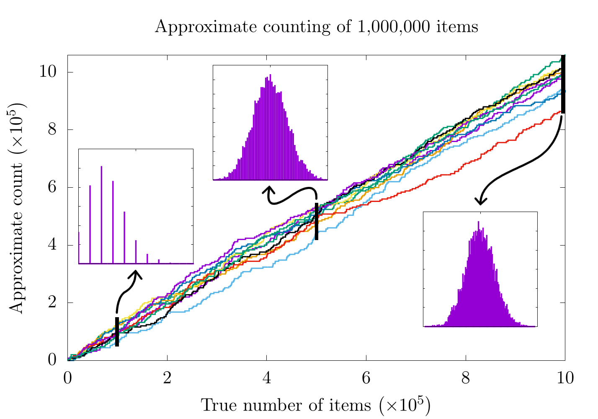

In this image, we have counted 1,000,000 sheep (items) 10,000 different times.
In each run, we have given each item a 0.025% chance to flip our primary counter and have given each increment in our primary counter a weight of 4000 items.
We have plotted 10 of the 10,000 runs (chosen at random), and each upward tick of the lines represents one of the items winning a game of chance and adding 1 to the primary counter and thus adding 4000 to the approximate count.
We have also shaded the maximum and minimum approximate count for each true count of the 10,000 trials in gray, thereby highlighting the range of possible outputs.
On top of the plot, we have shown the distribution of all 10,000 runs for the approximate count at 10,000, 500,000, and 1,000,000 items.

There's a lot to unpack here, so let's start with the upward trending lines.
Here, it seems like the approximate counts are roughly following the line of $$y=x$$ (dotted black line), which would indicate simple counting (without any randomness or approximation).
This makes sense because in a perfect world, the approximate count would always be exactly equal to the true number of items being counted.
Unfortunately, none of the lines shown here exactly follow $$y=x$$.
In fact, it would be impossible for any of the approximations to do so because we are always increasing the approximation in steps of 4000 while the true count increments by 1 with each new item.
That said, the *average* of all these counts together is a really good approximation for the true number of items.

This is where the 3 additional plots come in:

    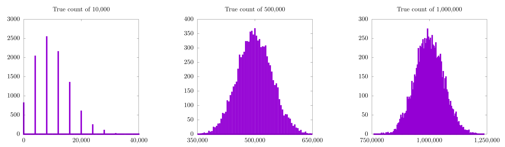

Each of these is a histogram of the approximate count for all 10,000 runs at 10,000 (left), 500,000 (middle), and 1,000,000 (left) items.
All three (especially the approximation for 1,000,000) look Gaussian, and the peak of the Gaussian seems to be the correct count.
In fact, the expectation value for our approximate counting scheme will always be correct.
In practice, this means that we can approximate any count on a small number of bits by doing a large number of counting trials and averaging their results.

There is still a little catch that becomes more evident as we look at the approximation for 10,000 items.
In this case, even though the expectation value for the Gaussian distribution looks correct, it's kinda hard to tell exactly because there are only 8 (or so) possible values for each individual experiment.
Essentially, we are trying to count to 10,000 in steps of 4,000.
Clearly the closest we can get on any individual run is either 8,000 or 12,000, as these are multiples of 4,000.
Simply put: we cannot resolve 10,000 items with this method!

Does this mean that this counting method is less useful for a small number of items?
In a sense, yes.
Here is a table for the true count, approximate count, and percent error for 10,000, 500,000, and 1,000,000 for the case where we do 10,000 counting experiments:

| True Count | Approximate Count | Percent Error |
| ---------- | ----------------- | ------------- |
| 10,000     | 9,958.0           | 0.42          |
| 500,000    | 499,813.2         | 0.037         |
| 1,000,000  | 999,466.0         | 0.053         |

Here, it seems that the percent error is 10 times higher when we count 10,000 items; however,
with these numbers, I could imagine some people reading this are thinking that we are splitting hairs.
A 0.42% error is still really good, right?
Right.
It's definitely not bad, but this was with 10,000 counting experiments.
Here a new table where we only did 10:

| True Count | Approximate Count | Percent Error |
| ---------- | ----------------- | ------------- |
| 10,000     | 8,000.0           | 20.0          |
| 500,000    | 483,200.0         | 3.36          |
| 1,000,000  | 961,600.0         | 3.84          |

This time, there is a 20% error when counting to 10,000.
That's unacceptably high!

To solve this problem, we need to find some way to for the value of each increment on the actual counter to be more meaningful for lower counts.
This is precisely the job for a logarithm, which is what we will be looking at in the next section.
For now, it's important to look at another anomaly: why are the percent errors for the 500,000 and 1,000,000 cases so close?

I gotta be honest, I don't know the correct answer here, but I would guess that it has something to do with the fact that both 500,000 and 1,000,000 are multiples of 4000 so our counting scheme can resolve both of them with roughly equal precision.
On top of that, both values are significantly higher than 4,000 so the counting resolution does not have as significant of an impact on the measured count.
Simply put, 4000 is a big step size when counting to 10,000, but a smaller one when counting to 500,000 or 1,000,000.

As an important note, each approximate count shown in the tables above was the expectation value for a Gaussian probability distribution of different counting experiments all providing a guess at what the count could be.
Because we are no longer counting with integer increments but instead with probability distributions, we now need to quantify our error with the tools of probability, namely standard deviations.

In the next section, we will tackle both issues brought up here:
1. In order to better approximate different scales of counting, it makes sense to use a logarithmic scale.
2. Because we are counting by using the expectation value of a Gaussian probability distribution from a set of counting experiments, it makes sense to quantify error with the tools we learned from probability and statistics.

So I guess we should hop to it!

## Adding a logarithm

At this stage, I feel it's important to use terminology that more closely matches Morris's original paper {{"morris1978counting" | cite}}, so we will begin to talk about events, which are a general abstraction to the previous item / sheep analogy.
We will also introduce three different values:

* $$n$$: the number of events that have occurred.
* $$v$$: the number we have stored in our bitstring.
* $$n_v$$: the approximate number of events that have occurred.

It's important to stop here and think about what's actually going on.
We have a certain number of events ($$n$$) that have occurred and have stored that number on a binary register as $$v$$.
Traditionally, the number stored on the binary register would be exactly equal to the number of events, but because we do not have enough space on the register, we end up settling for an approximation of the number of events, $$n_v$$.
This is precisely what we did in the previous example, where $$v = \frac{n}{4000}$$ and $$n_v = 4000*v$$.

As mentioned, using a constant scaling value (4000) for our approximate counting scheme means that the approximation is not ideal for a smaller number of events.
For this reason, it might be more appropriate to create a new method of storing the number of events by using a logarithmic scale, such that

$$
v = \log_2(1+n),
$$

which would mean that the approximate count would be

$$
n_v = 2^v-1.
$$

In this case, we are adding 1 to the argument of the logarithm for $$v$$ because $$\log_2(1) = 0$$ and we start counting at 1; therefore, we need some way to represent the value of 0.
Also, for this we can use any base logarithm (like $$e$$), but because we are dealing with bits, it makes sense to use base 2.
We'll talk about different bases next.
To be clear, here is a table of several values that could be stored in a bitstring along with their corresponding approximate counts:

| $$v(n)$$           | $$n_v$$                 |
| ------------------ | ----------------------- |
| $$00000000 = 0$$   | 0                       |
| $$00000001 = 1$$   | $$1$$                   |
| $$00000010 = 2$$   | $$3$$                   |
| $$00000100 = 4$$   | $$15$$                  |
| $$00010000 = 16$$  | $$65535$$               |
| $$01000000 = 64$$  | $$1.85 \times 10^{19}$$ |
| $$10000000 = 128$$ | $$3.40 \times 10^{38}$$ |
| $$11111111 = 255$$ | $$5.79 \times 10^{76}$$ |

This means that we can hold from $$0$$ to $$2^{255} - 1 \approx 5.79 \times 10^{76}$$ with 8 bits using this new method.

So let's now think about what happens every time a new event occurs.
To do this, Morris calculated a new value:

$$
\Delta = \frac{1}{n_{v+1} - n_{v}}
$$

where $$n_{v+1}$$ is the approximate count for the next possible value $$v$$ stored in the register.
In this case, $$\Delta$$ will always be between 0 and 1, so we can consider it to be the probability of whether we should increment our stored count or not.
For example, if we have a stored value of 2 ($$v=2$$), then

$$
\Delta = \frac{1}{n_3 - n_2} = \frac{1}{(2^3-1)-(2^2-1)} \approx \frac{1}{7-3} \approx 0.25.
$$

This indicates that there will be a 25% chance to increment $$v$$ from 2 to 3.
In practice, this means that we need to create another random variable $$r$$ and set our counter such that

$$
\begin{align}
\text{if } & r < \Delta, \qquad v = v + 1 \\
\text{if } & r > \Delta, \qquad v = v.
\end{align}
$$

Again, $$\Delta$$ is essentially the probability that we will increment our counter with each object, and as we count higher, the probability decreases exponentially.

    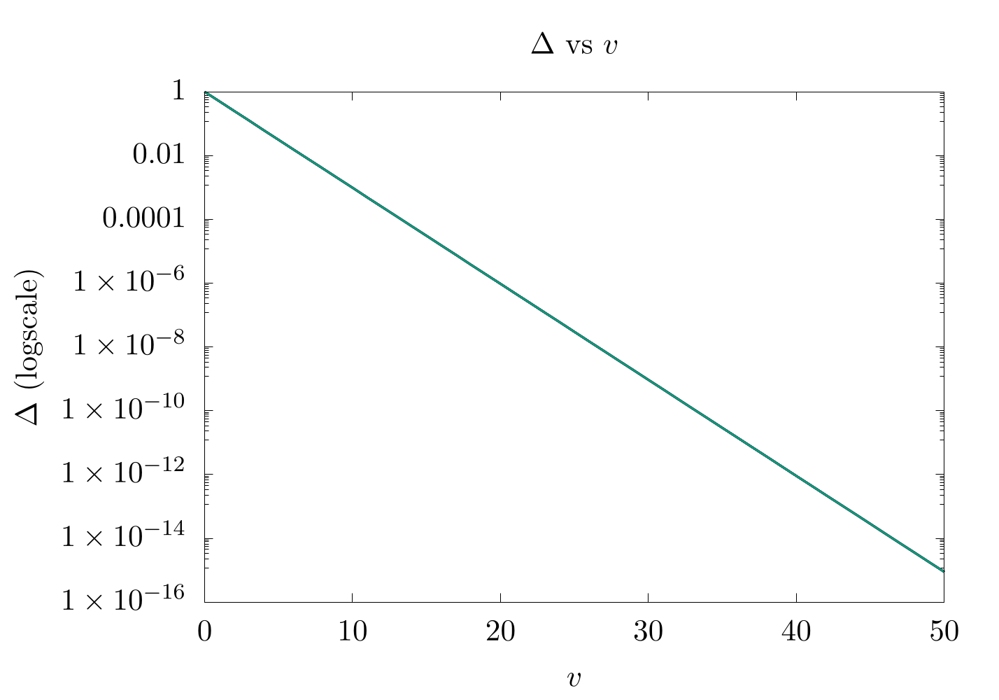

Note: the $$y$$-axis to this figure is in logscale, which is why it looks like a straight line.

Before leaving this section, it's important to note that the highest anyone can count with this method in base 2 using an 8-bit register is $$5.79 \times 10^{76}$$.
That's great!
Way, way better than 255, but we can still go higher with a different base of logarithm.
For example, if we use $$e$$ as our base, we can get up to $$e^{255}-1 = 5.56 \times 10^{110}$$.
In addition, by choosing smaller bases, we can also find a more accurate approximate count for lower values.
In practice, we want to select a base that allows us to count to a value of the same order (or one order higher) than the number of events we are expected to have.

In the next section, we will consider how to generalize this logarithmic method to take arbitrary bases into account.

## A slightly more general logarithm

Let's start by considering the differences between base $$2$$ and base $$e$$.
For base $$e$$,

$$
\begin{align}
n_v &= e^v - 1 \\
v &= \log_e(1+n).
\end{align}
$$

If we were to update our count and wanted to keep the value in the counter as accurate as possible, then the new value in the register with every new event would be

$$
v = \log_e(1+e^v).
$$

This is generally not an integer value, but $$v$$ *must* be an integer value (unless we want to try and store floating-point values (which we definitely don't have space for)), so what do we do in this situation?

Well, let's look at the very first event where we need to increment our count from 0 to 1.
With base $$e$$, there would only be a 58% chance of counting the first event ($$\Delta = \frac{1}{1.72-0} = 0.58$$), and if the event is counted, the value in the register would be $$\approx 1.71 \neq 1$$.
Again, the expectation value for a bunch of trials is correct, but we did not have this issue with base 2, because

$$
v = \frac{\log_e(n+1)}{\log_e(2)} = 1
$$

when $$n=1$$.
As a reminder, the above formula is a way to convert any logarithm from a given base (in this case $$e$$) to another base (in this case 2).

Going one step further, we need to chose a specific base to a logarithm that will at least ensure that the first count is correct, and for this reason, Morris studied a specific solution:

$$
\begin{align}
    v &= \frac{\log(1+n/a)}{\log(1+1/a)}. \\
    n_v &= a\left(\left(1+\frac{1}{a}\right)^v-1\right).
\end{align}
$$

Here, $$a$$ is an effective tuning parameter and sets the maximum count allowed by the bitstring and the expected error.
The expression $$1+1/a$$ acts as a base for the logarithm and exponents and ensures that the first count of $$n=1$$ will also set the value $$v=1$$.
As an example, if the bitstring can be a maximum of 255 (for 8 bits) and we arbitrarily set
$$a=30$$, then the highest possible count with this approach will be $$\approx 130,000$$, which was the number reported in Morris's paper.
If we perform a few counting experiments, we find that this formula more closely tracks smaller numbers than before (when we were not using the logarithm):

    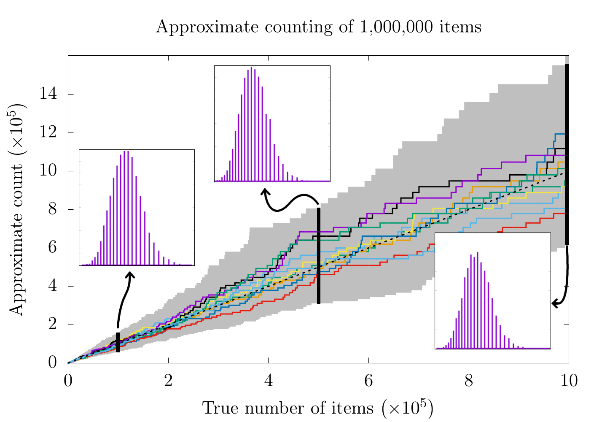

Now, let's pause for a second and look back at the case where our counting resolution was a constant 4000:

    

It would seem that for higher counts, the previous method (with a constant counting resolution) is actually better!
Remember that in the case of a constant counting resolution, the step size is really small for higher counts, so we get a higher resolution probability distribution for when we count 500,000 and 1,000,000 items.
With the logarithmic scale, this is not the case, as the counting resolution now changes with the count, itself.
This is also why all three probability distributions for the logarithmic scaling have a similar distance between each bar.
In fact, it is probably worthwhile to look at each case more specifically:

| Constant Counting Resolution | Logarithmic Counting Resolution |
| ---------------------------- | ------------------------------- |
| 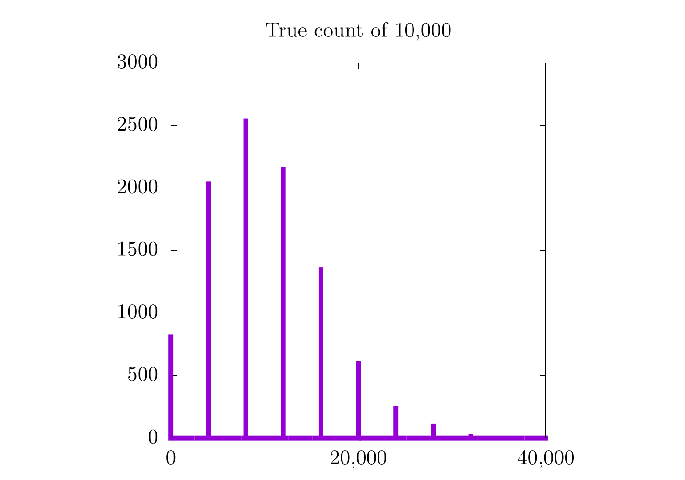 | 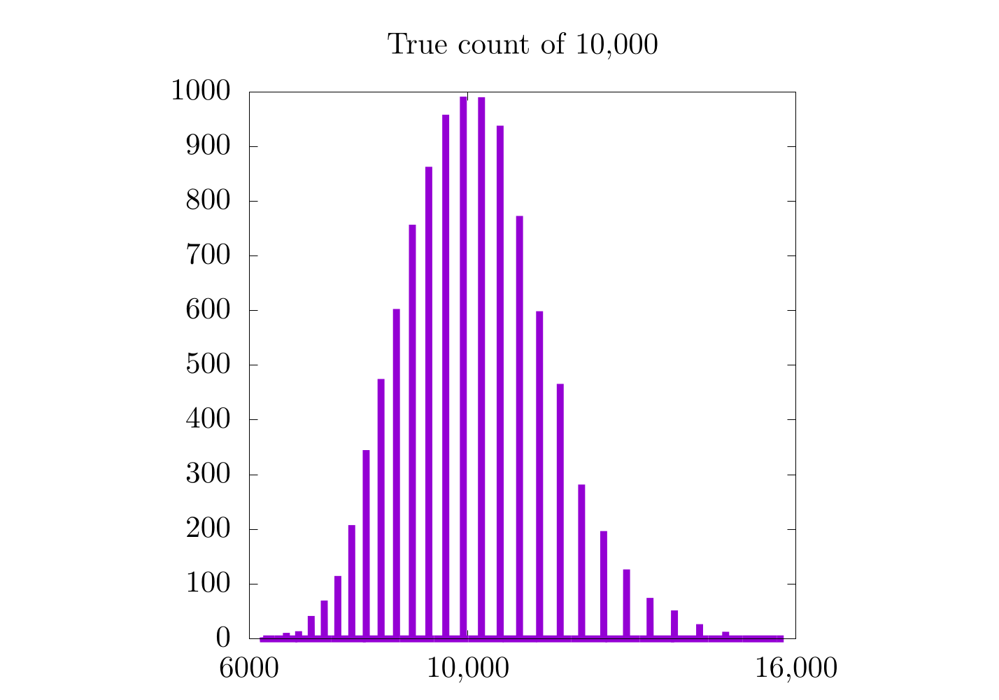 |
| 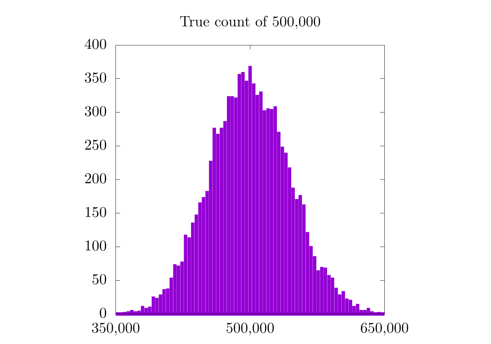 | 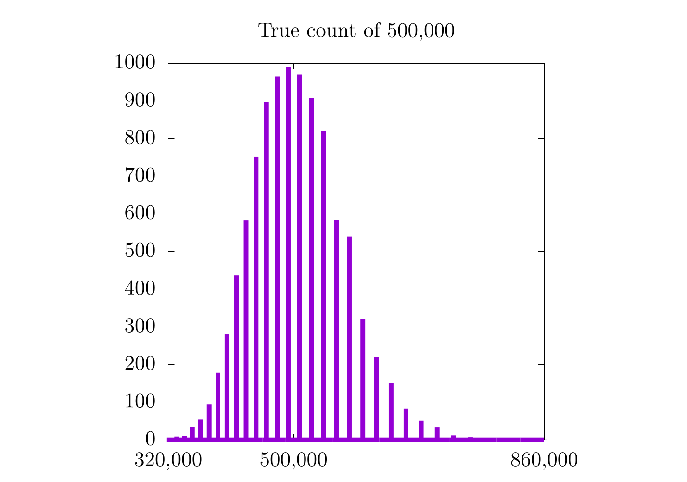 |
| 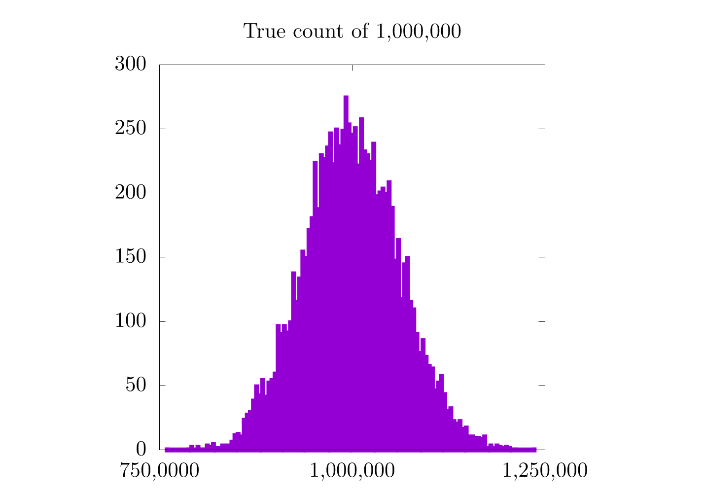 | 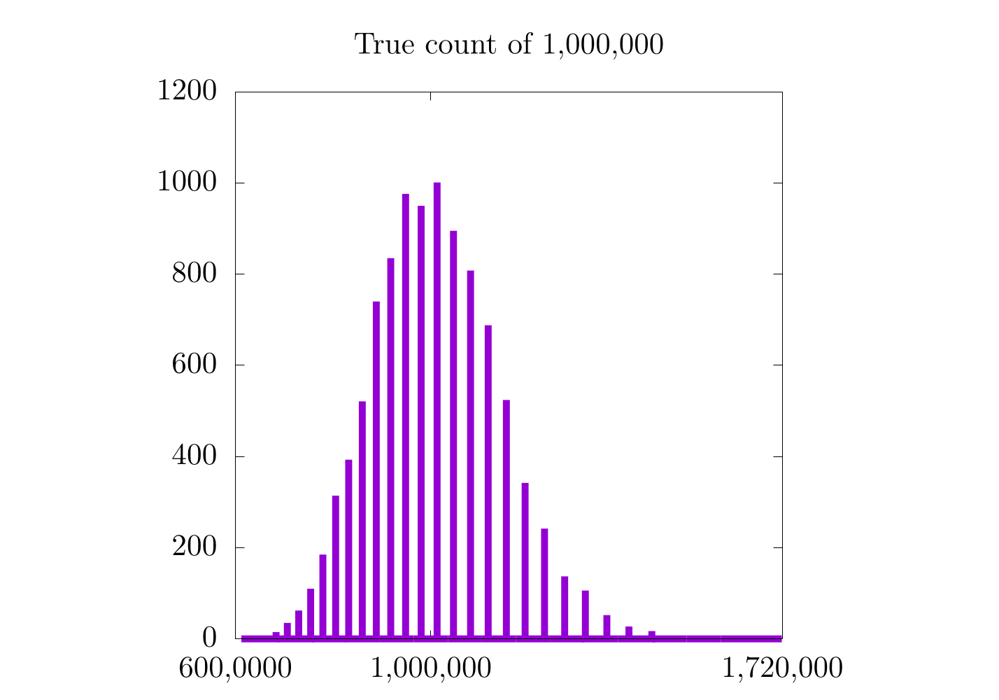 |

In the case where we count only to 10,000, we see a moderate increase in the resolution of the probability distribution, but in the 500,000 and 1,000,000 cases, we do not.
It's also important to notice that the logarithmic plots are a bit skewed to the left and are only Gaussian on logarithmic scales along $$x$$.
On the one hand, the logarithmic plots are nice in that they have the same relative error for all scales, but on the other hand, the error is relatively high.

How do we fix this?
Well, by modifying the base of the logarithm with the variable $$a$$:

    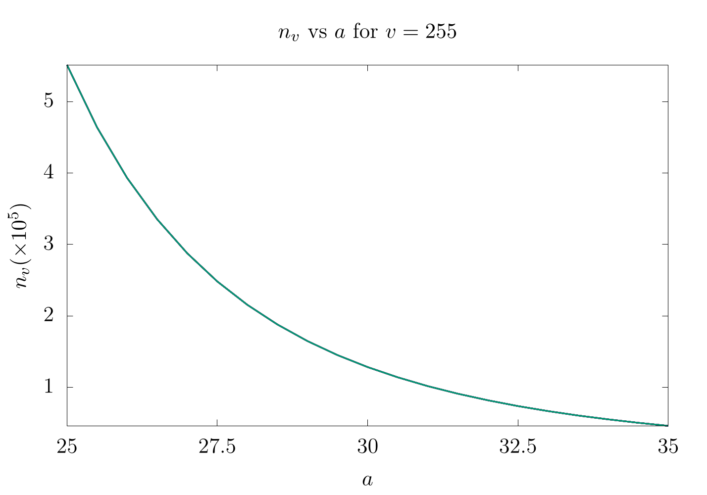

Here, we show the differences in $$n_v$$ for $$25 \leq a \leq 35$$ when $$v=255$$.
It is important to twiddle $$a$$ based on what the maximum count is expected for
 each experiment.
As an important note, the expected error estimate (variance) for each count will
 be

$$
\sigma(n,a)^2 = \frac{n(n-1)}{2a}.
$$

Finally, before ending the paper, Morris mentioned that it is possible to pre-compute all values $$\Delta_j = (a/(a+1))^j$$ for all $$j \in [1,N]$$ where $$N$$ is the largest value possible integer with that bitstring (as an example, 255 for 8 bits).
This was probably more useful in 1978 than it is now, but it's still nice to keep in mind if you find yourself working on a machine with compute constrictions.

## Video Explanation

Here is a video describing the Approximate Counting Algorithm:

<iframe width="560" height="315" src="https://www.youtube-nocookie.com/embed/c4RJhPsc14s"
 frameborder="0" allow="accelerometer; autoplay; encrypted-media; gyroscope; pic
ture-in-picture" allowfullscreen></iframe>

## Example Code

For this example, we have returned to the question asked above: how high can someone count on their fingers using the approximate counting algorithm?
We know from the formula that with $$a=30$$ and 10 bits, we should be able to count to $$1.1\times 10^{16}$$, but what happens when we perform the actual experiment?

As we do not have any objects to count, we will instead simulate the counting with a `while` loop that keeps going until out bitstring is 1023 ($$2^{10}$$).



[import, lang:"julia"](code/julia/approximate_counting.jl)

[import, lang:"c"](code/c/approximate_counting.c)

[import, lang:"cpp"](code/cpp/approximate_counting.cpp)

[import, lang:"python"](code/python/approximate_counting.py)

[import, lang:"rust"](code/rust/approximate_counting.rs)

[import, lang:"java"](code/java/ApproximateCounting.java)


### Bibliography

 

## License

##### Code Examples

The code examples are licensed under the MIT license (found in [LICENSE.md](https://github.com/algorithm-archivists/algorithm-archive/blob/main/LICENSE.md)).

##### Text

The text of this chapter was written by [James Schloss](https://github.com/leios) and is licensed under the [Creative Commons Attribution-ShareAlike 4.0 International License](https://creativecommons.org/licenses/by-sa/4.0/legalcode).

[

](https://creativecommons.org/licenses/by-sa/4.0/)

#### Images/Graphics

- The image "[Finger Counting](../approximate_counting/res/hands.png)" was created by [James Schloss](https://github.com/leios) and is licensed under the [Creative Commons Attribution-ShareAlike 4.0 International License](https://creativecommons.org/licenses/by-sa/4.0/legalcode).
- The image "[Approximate trials](../approximate_counting/res/approximations.png)" was created by [James Schloss](https://github.com/leios) and is licensed under the [Creative Commons Attribution-ShareAlike 4.0 International License](https://creativecommons.org/licenses/by-sa/4.0/legalcode).
- The image "[Histograms](../approximate_counting/res/histograms.png)" was created by [James Schloss](https://github.com/leios) and is licensed under the [Creative Commons Attribution-ShareAlike 4.0 International License](https://creativecommons.org/licenses/by-sa/4.0/legalcode).
- The image "[Delta v v](../approximate_counting/res/deltas.png)" was created by [James Schloss](https://github.com/leios) and is licensed under the [Creative Commons Attribution-ShareAlike 4.0 International License](https://creativecommons.org/licenses/by-sa/4.0/legalcode).
- The image "[Approximate trials Logarithm](../approximate_counting/res/approximationsexp.png)" was created by [James Schloss](https://github.com/leios) and is licensed under the [Creative Commons Attribution-ShareAlike 4.0 International License](https://creativecommons.org/licenses/by-sa/4.0/legalcode).
- The image "[Histograms 10,000](../approximate_counting/res/hist_1.png)" was created by [James Schloss](https://github.com/leios) and is licensed under the [Creative Commons Attribution-ShareAlike 4.0 International License](https://creativecommons.org/licenses/by-sa/4.0/legalcode).
- The image "[Histograms exp 10,000](../approximate_counting/res/histexp_1.png)" was created by [James Schloss](https://github.com/leios) and is licensed under the [Creative Commons Attribution-ShareAlike 4.0 International License](https://creativecommons.org/licenses/by-sa/4.0/legalcode).
- The image "[Histograms 500,000](../approximate_counting/res/hist_2.png)" was created by [James Schloss](https://github.com/leios) and is licensed under the [Creative Commons Attribution-ShareAlike 4.0 International License](https://creativecommons.org/licenses/by-sa/4.0/legalcode).
- The image "[Histograms exp 500,000](../approximate_counting/res/histexp_2.png)" was created by [James Schloss](https://github.com/leios) and is licensed under the [Creative Commons Attribution-ShareAlike 4.0 International License](https://creativecommons.org/licenses/by-sa/4.0/legalcode).
- The image "[Histograms 1,000,000](../approximate_counting/res/hist_3.png)" was created by [James Schloss](https://github.com/leios) and is licensed under the [Creative Commons Attribution-ShareAlike 4.0 International License](https://creativecommons.org/licenses/by-sa/4.0/legalcode).
- The image "[Histograms exp 1,000,000](../approximate_counting/res/histexp_3.png)" was created by [James Schloss](https://github.com/leios) and is licensed under the [Creative Commons Attribution-ShareAlike 4.0 International License](https://creativecommons.org/licenses/by-sa/4.0/legalcode).
- The image "[A from 25 to 35](../approximate_counting/res/a_change.png)" was created by [James Schloss](https://github.com/leios) and is licensed under the [Creative Commons Attribution-ShareAlike 4.0 International License](https://creativecommons.org/licenses/by-sa/4.0/legalcode).
