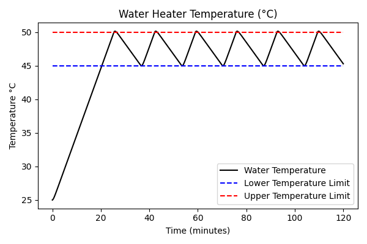
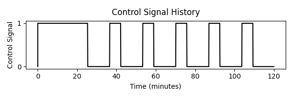
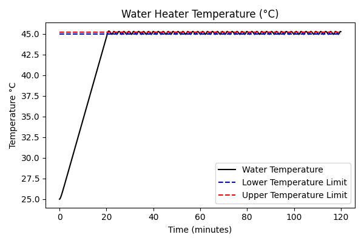
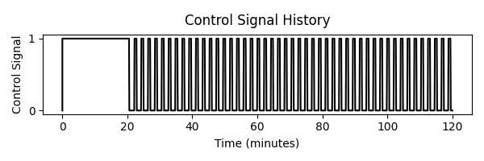

# Bang-Bang Control

A bang-bang controller is one of the simplest forms of feedback controller, used in systems where a simple on/off control signal is used to regulate some aspect of the system (temperature, for example). The controller compares the measured system state with user-defined min/max limits, and toggles the input between on/off states as needed to keep the system within the specified range. Common everyday examples include water heaters and air conditioning controllers. 

##### Simple Example: Water Heater Control
Imagine a water heater that needs to regulate temperature, keeping within an allowable range of 45 to 50°C. The heater only has binary on/off control, with no in-between states. In order to regulate the system temperature, the heater must cycle between on/off states to keep the temperature in spec. A basic bang-bang controller would implement the following logic:

| System State | Action |
| -------------- | ------------- |
| Temperature is below desired range (<45°C) | Turn heater ON |
| Temperature exceeds desired range (>50°C) | Turn heater OFF |

Implementing just these two rules will keep the system temperature within the desired range, with a side effect that the system oscillates between the two limits as the heater turns on and off: 

    

    

An important factor to consider when designing a bang-bang controller is the frequency at which a given controller will toggle the system state. In the example above, with a wide allowable temperature band of 45-50°C, the heater would be powered every ~18 minutes to maintain the overall system. If tighter control over the output were desired (for example, keeping temperature within a narrow range of 45 - 45.2°C), a bang-bang controller could still be used to regulate the system, but the heater would have to toggle on/off much more frequently to keep temperature in the narrower allowable range. Depending on the system being controlled, this rapid on/off cycling may be undesirable:

    

    

##### Pros:
1. Very simple to implement.
2. Can be used to control a system that has only binary on/off states.

##### Cons:
1. The system is not controlled to a *specific* target value; it instead oscillates between specified upper and lower limits.
2. Requiring tight min/max limits on the system output may require the controller to toggle on/off very frequently to maintain the correct output. This may be undesirable depending on the system being controlled.

##### More Reading:
Bang-bang controllers are only meant for systems controlled with binary on/off inputs. For systems with a continously variable input signal (for example, cruise control in a car), try [PID Control](https://www.algorithm-archive.org/contents/PID/PID.html).

## License
The text of this chapter was written by [wca747](https://github.com/wca747) and is licensed under the [Creative Commons Attribution-ShareAlike 4.0 International License](https://creativecommons.org/licenses/by-sa/4.0/legalcode).

[

](https://creativecommons.org/licenses/by-sa/4.0/)