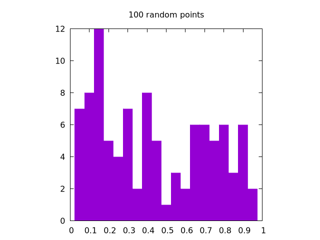

# The Box&mdash;Muller Transform

The Box&mdash;Muller transform holds a special place in my heart as it was the first method I ever had to implement for my own research.

The purpose of this transformation is simple.
It takes a uniform (probably random) distribution and turns it into a Gaussian one.

    

That's it.

It was originally developed by George Box (yes, Box is his last name) and Mervin Muller in 1958 and is one of the most common methods to create a random, Gaussian distribution of points {{ "box1958" | cite }}.
It's particularly useful when initializing a set of particles for a physical, N-body simulation.
This chapter will be divided into a few subsections:

1. How to initialize the Box&mdash;Muller transform
2. How to use the Box&mdash;Muller transform in Cartesian coordinates {{ "box_muller_wiki" | cite }}.
3. How to use the Box&mdash;Muller transform in Polar Coordinates, also called the Marsaglia transform {{ "marsaglia_wiki" | cite }}.

Of course, there will be full code examples at the bottom.
So, let's get to it!

## How to initialize the Box&mdash;Muller transform

The main thing to mention here is that the Box&mdash;Muller transform requires some form of uniform distribution as its input.
One obvious way to initialize a random distribution of points is to start with a grid, like so:



[import:3-32, lang:"julia"](code/julia/box_muller.jl)


This will create the following set of points for $$n=100$$:

    

To be honest, there are a bunch of ways to generate this exact same distribution.
Here, we simply walked backwards half of the grid size, determined the step size, and then placed a particle at each step.
Note that there is an inherent limitation with this method in that it only works for a square numbers.
Because of this, we decided to round $$n$$ up to the nearest square to make a nice grid.
It's not the cleanest implementation, but the grid will mainly be used for debugging anyway, so it's OK to be a *little* messy here.

The real star of the show is the uniform random distribution, which can be generated like this:



[import:34-37, lang:"julia"](code/julia/box_muller.jl)


This will create the following set of points for $$n=100$$:

    

OK, but how do we know this is uniform?
Good question!

The easiest way is to plot a histogram of a super large number of points.
If the random distribution is uniform, then all the bins should be roughly the same value.
The more points we have, the smaller the percent difference between the bins will be.
Here is a set of images generated by `rand()` for $$n=100$$, $$1,000$$, and $$10,000$$ all in one dimension:

| $$100$$ | $$1,000$$ | $$10,000$$ |
|---------|-----------|------------|
||||

It is clear that the $$10,000$$ case looks the most uniform.
Note that for two dimensions, the same logic applies, but we need to create separate histograms for the $$x$$ and $$y$$ coordinates.

Once this test is complete, we can be fairly sure that the function we are using to generate the initial distribution is uniform and ready for the next step of the process: actually using the Box&mdash;Muller transform!

## How to use the Box&mdash;Muller transform in Cartesian coordinates

The two dimensional Cartesian version of the Box&mdash;Muller transform starts with two random input values ($$u_1$$ and $$u_2$$), both of which come from their own uniform distributions that are between $$0$$ and $$1$$.
It then creates two output points ($$z_1$$ and $$z_2$$).
For this, $$u_1$$ is used to create a Gaussian distribution along some radial value $$r$$, and $$u_2$$ is used to spin that around a circle with some angular component $$\theta$$, such that 

$$
\begin{align}
r &= \sqrt{-2\ln(u_1)} \\
\theta &= 2\pi u_2.
\end{align}
$$

Looking at these equations, $$\theta$$ seems to make a decent amount of sense.
After all, angles typically vary from $$0 \rightarrow 2\pi$$, and our input distribution varies from $$0 \rightarrow 1$$, so we can get some value between $$0$$ and $$2\pi$$ by multiplying $$2\pi$$ by one of our input values.

So what about $$r$$?
Well, remember that if we want $$u$$ to be in a Gaussian form, then we might say something like, $$u = e^{-\frac{r^2}{2}}$$, so if we solve this for $$r$$, we get $$r=\sqrt{-2\ln(u)}$$.

From these values, we can calculate our new $$x,y$$ points as,

$$
\begin{align}
x &= r\cos(\theta) \\
y &= r\sin(\theta).
\end{align}
$$

Finally, in order to specify the size and shape of the generated Gaussian distribution, we can use the standard deviation, $$\sigma$$, and the mean, $$\mu$$, like so:

$$
\begin{align}
z_1 &= x\sigma + \mu \\
z_2 &= y\sigma + \mu.
\end{align}
$$

In general, this can be written in code like so:



[import:41-49, lang:"julia"](code/julia/box_muller.jl)


Which produces the following output

    
    

Note that we have written the code to work on a single set of input values, but it could also be written to read in the entire distribution of points all at once.
As this particular technique is usually implemented in parallel, it's up to you to decided which is the fastest for your own individual use-case.

At this stage, we have a good idea of how the transform works, but some people shy away from the Cartesian method in practice and instead opt for the polar form, which will be discussed next!

## How to use the Box&mdash;Muller transform in polar coordinates

The Cartesian form of the Box&mdash;Muller transform is relatively intuitive.
The polar method is essentially the same, but without the costly $$\sin$$ and $$\cos$$ operations.
In this case, we use the input values to create an initial radial point (to be scaled later):

$$
r_0 = \sqrt{u_1^2 + u_2^2}.
$$

This means that we are essentially trying to transform our set of $$u$$ values into a new input value $$r_0$$.
To do this, we need to start with a uniformly distributed *circle*, so we must reject any values for $$u_1$$ and $$u_2$$ where $$r$$ is either $$0$$ or $$\gt 1$$.
This also means that the initial distributions of $$u_1$$ and $$u_2$$ must range from $$-1 \rightarrow +1$$.

From here, we can use basic trigonometric identities to redefine the $$\sin$$ and $$\cos$$ to be

$$
\begin{align}
\cos(\theta) &= u_1/\sqrt{r_0} \\
\sin(\theta) &= u_2/\sqrt{r_0}.
\end{align}
$$

This changes the output equations to be

$$
\begin{align}
x &= r\cos(\theta) = \sqrt{-2\ln(r_0)}\left(\frac{u_1}{\sqrt{r_0}}\right) = u_1 \sqrt{\frac{-2\ln(r_0)}{r_0}} \\
y &= r\sin(\theta) = \sqrt{-2\ln(r_0)}\left(\frac{u_2}{\sqrt{r_0}}\right) = u_2 \sqrt{\frac{-2\ln(r_0)}{r_0}}.
\end{align}
$$

Again, the final values are:

$$
\begin{align}
z_1 &= \sigma x + \mu \\
z_2 &= \sigma y + \mu.
\end{align}
$$

In code, it might look like this:



[import:52-63, lang:"julia"](code/julia/box_muller.jl)


This will produce the following output:

    
    

Again, this is ultimately the same as the Cartesian method, except that it:
1. Rejects points in the initial distribution that are outside of the unit circle (also called rejection sampling)
2. Avoids costly $$\sin$$ and $$\cos$$ operations

Point 2 means that the polar method *should be* way faster than the Cartesian one, but rejection sampling is somewhat interesting in it's own right, which we have discussed in a [separate chapter](box_muller_rejection.md)

## Example Code

The example code here is straightforward: we start with a uniform distribution of points (both on a grid and a uniform random distribution) and then we preform the Box&mdash;Muller transform to see how far off it is from the Gaussian we expect.



[import, lang:"julia"](code/julia/box_muller.jl)


### Bibliography

 

## License

##### Code Examples

The code examples are licensed under the MIT license (found in [LICENSE.md](https://github.com/algorithm-archivists/algorithm-archive/blob/main/LICENSE.md)).

##### Text

The text of this chapter was written by [James Schloss](https://github.com/leios) and is licensed under the [Creative Commons Attribution-ShareAlike 4.0 International License](https://creativecommons.org/licenses/by-sa/4.0/legalcode).

[

](https://creativecommons.org/licenses/by-sa/4.0/)

#### Images/Graphics

- The image "[IFS triangle 1](../IFS/res/IFS_triangle_1.png)" was created by [James Schloss](https://github.com/leios) and is licensed under the [Creative Commons Attribution-ShareAlike 4.0 International License](https://creativecommons.org/licenses/by-sa/4.0/legalcode).
- The image "[IFS square 3](../IFS/res/IFS_square_3.png)" was created by [James Schloss](https://github.com/leios) and is licensed under the [Creative Commons Attribution-ShareAlike 4.0 International License](https://creativecommons.org/licenses/by-sa/4.0/legalcode).
- The image "[Simple Barnsley fern](res/full_fern.png)" was created by [James Schloss](https://github.com/leios) and is licensed under the [Creative Commons Attribution-ShareAlike 4.0 International License](https://creativecommons.org/licenses/by-sa/4.0/legalcode).
- The video "[Affine random transform 0](res/affine_rnd_0.mp4)" was created by [James Schloss](https://github.com/leios) and is licensed under the [Creative Commons Attribution-ShareAlike 4.0 International License](https://creativecommons.org/licenses/by-sa/4.0/legalcode).
- The video "[Affine random transform 1](res/affine_rnd_1.mp4)" was created by [James Schloss](https://github.com/leios) and is licensed under the [Creative Commons Attribution-ShareAlike 4.0 International License](https://creativecommons.org/licenses/by-sa/4.0/legalcode).
- The video "[Affine random transform 2](res/affine_rnd_2.mp4)" was created by [James Schloss](https://github.com/leios) and is licensed under the [Creative Commons Attribution-ShareAlike 4.0 International License](https://creativecommons.org/licenses/by-sa/4.0/legalcode).
- The video "[Affine random transform 3](res/affine_rnd_3.mp4)" was created by [James Schloss](https://github.com/leios) and is licensed under the [Creative Commons Attribution-ShareAlike 4.0 International License](https://creativecommons.org/licenses/by-sa/4.0/legalcode).
- The video "[Affine fern transform 0](res/affine_fern_0.mp4)" was created by [James Schloss](https://github.com/leios) and is licensed under the [Creative Commons Attribution-ShareAlike 4.0 International License](https://creativecommons.org/licenses/by-sa/4.0/legalcode).
- The video "[Affine fern transform 1](res/affine_fern_1.mp4)" was created by [James Schloss](https://github.com/leios) and is licensed under the [Creative Commons Attribution-ShareAlike 4.0 International License](https://creativecommons.org/licenses/by-sa/4.0/legalcode).
- The video "[Affine fern transform 2](res/affine_fern_2.mp4)" was created by [James Schloss](https://github.com/leios) and is licensed under the [Creative Commons Attribution-ShareAlike 4.0 International License](https://creativecommons.org/licenses/by-sa/4.0/legalcode).
- The video "[Affine fern transform 3](res/affine_fern_3.mp4)" was created by [James Schloss](https://github.com/leios) and is licensed under the [Creative Commons Attribution-ShareAlike 4.0 International License](https://creativecommons.org/licenses/by-sa/4.0/legalcode).
- The video "[Fern twiddle 0](res/fern_twiddle_0.mp4)" was created by [James Schloss](https://github.com/leios) and is licensed under the [Creative Commons Attribution-ShareAlike 4.0 International License](https://creativecommons.org/licenses/by-sa/4.0/legalcode).
- The video "[Fern twiddle 1](res/fern_twiddle_1.mp4)" was created by [James Schloss](https://github.com/leios) and is licensed under the [Creative Commons Attribution-ShareAlike 4.0 International License](https://creativecommons.org/licenses/by-sa/4.0/legalcode).
- The video "[Fern twiddle 2](res/fern_twiddle_2.mp4)" was created by [James Schloss](https://github.com/leios) and is licensed under the [Creative Commons Attribution-ShareAlike 4.0 International License](https://creativecommons.org/licenses/by-sa/4.0/legalcode).
- The video "[Fern twiddle 3](res/fern_twiddle_3.mp4)" was created by [James Schloss](https://github.com/leios) and is licensed under the [Creative Commons Attribution-ShareAlike 4.0 International License](https://creativecommons.org/licenses/by-sa/4.0/legalcode).
