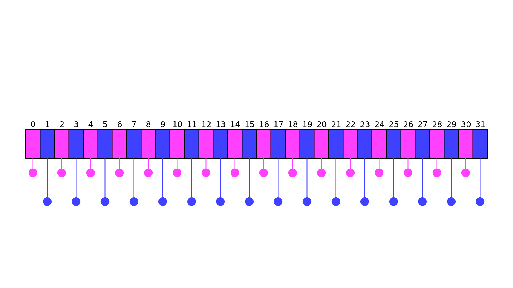

# Just how costly is rejection sampling anyway?

Let's imagine we want to have a final Gaussian distribution with $$n$$ particles in it.
With the Cartesian Box&mdash;Muller method, this is easy: start the initial distribution(s) with $$n$$ particles and then do the transform.
Things *can* be just as easy with the Polar Box&mdash;Muller method as well, so long as we start with a uniformly distributed *circle* instead of a uniformly distributed *square*.
That is to say, so long as we do the rejection sampling before-hand, the Polar Box&mdash;Muller method will always be more efficient.
To be fair, there are methods to generate a uniform distribution of points within a circle without rejection sampling, but let's assume that we require rejection sampling for this example

This means that someone somehow needs to do the rejection sampling for the Polar method, which is sometimes a painful process.
This also means that the Box&mdash;Muller method can be used to teach some of the fundamentals of General-Purpose GPU computing.
Note that because of the specificity of this problem, all the code in this subsection will be in Julia and using the package KernelAbstractions.jl, which allows us to execute the same kernels on either CPU or GPU hardware depending on how we configure things.

Let's first consider the case where we do the rejection sampling as a part of the polar Box&mdash;Muller kernel instead of as a pre-processing step.
In this case, we can imagine 2 separate ways of writing our kernel:
1. With replacement: In this case, we *absolutely require* the final number of points in our Gaussian distribution to be $$n$$, so if we find a point outside of the unit circle while running the kernel, we will "re-roll" again for a new point that *is* within the circle.
2. Without replacement: This means that we will start with a uniform distribution of $$n$$ points, but end with a Gaussian of $$m < n$$ points. In this case, if we find a point outside of the unit circle while running the kernel, we just ignore it by setting the output values to NaNs (or something similar).

OK, so first with replacement:

[import:70-84, lang:"julia"](code/julia/performance.jl)

This is an awful idea for a number of reasons.
Here are a few:
1. If we find a point outside of the unit circle, we have to continually look for new points until we *do* find one inside of the circle. Because we are running this program in parallel, where each thread transforms one point at a time, some threads might take literally forever to find a new point (if we are really unlucky).
2. To generate new points, we need to re-generate a uniform distribution, but what if our uniform distribution is not random? What if it's a grid (or something similar) instead? In this case, we really shouldn't look for a new point on the inside of the circle as all those points have already been accounted for.
3. The `rand()` function is kinda tricky on some parallel platforms (like GPUs) and might not work out of the box. In fact, the implementation shown above can only be run on the CPU.

OK, fine.
I don't think anyone expected a kernel with a `while` loop inside of it to be fast.
So what about a method without replacement?
Surely there is no problem if we just ignore the `while` loop altogether!
Well, the problem with this approach is a bit less straightforward, but first, code:

[import:53-68, lang:"julia"](code/julia/performance.jl)

To start discussing why a polar kernel without replacement is *also* a bad idea, let's go back to the [Monte Carlo chapter](../monte_carlo/monte_carlo.md), where we calculated the value of $$\pi$$ by embedding it into a circle.
There, we found that the probability of a randomly chosen point falling within the unit circle to be $$\frac{\pi r^2}{(2r)^2} = \frac{pi}{4} \sim 78.54\%$$, shown in the visual below:

    

This means that a uniform distribution of points within a circle will reject $$\sim 21.46\%$$ of points on the square.
This also means that if we have a specific $$n$$ value we want for the final distribution, we will need $$\frac{1}{0.7853} \sim 1.273 \times$$ more input values on average!

No problem!
In this hypothetical case, we don't need *exactly* $$n$$ points, so we can just start the initial distributions with $$1.273 \times n$$ points, right?

Right.
That will work well on parallel CPU hardware, but on the GPU this will still have an issue.

On the GPU, computation is all done in parallel, but there is a minimum unit of parallelism called a *warp*.
The warp is the smallest number of threads that can execute something in parallel and is usually about 32.
This means that if an operation is queued, all 32 threads will do it at the same time.
If 16 threads need to execute something and the other 16 threads need to execute something else, this will lead to *warp divergence* where 2 actions need to be performed instead of 1:

    

In this image, every odd thread needs to perform the pink action, while the even threads need to perform the blue action.
This means that 2 separate parallel tasks will be performed, one for the even threads, another for the odd threads.
This means that if $$\ell$$ separate operations are queued, it could take $$\ell\times$$ as long for all the threads to do their work!
This is why `if` statements in a kernel can be dangerous!
If used improperly, they can cause certain threads in a warp to do different things!

So let's imagine that the above image is part of a larger array of values, such that there are a bunch of warps with the same divergence issue.
In this case, we could sort the array before-hand so that all even elements come before all odd elements.
This would mean that the warps will almost certainly not diverge because the elements queued will all be of the same type and require the same operations.
Unfortunately, this comes at the cost of a sorting operation which is prohibitively expensive.

If we look at the above kernel, we are essentially asking $$21.47\%$$ of our threads to do something different than everyone else, and because we are usually inputting a uniform random distribution, this means that *most* warps will have to queue up 2 parallel actions instead of 1.

Essentially, we need to pick our poison:
* Slow $$\sin$$ and $$\cos$$ operations with the Cartesian method
* Warp divergence with the Polar method

The only way to know which is better is to perform benchmarks, which we will show in a bit, but there is one final scenario we should consider: what about doing the rejection sampling as a pre-processing step?
This would mean that we pre-initialize the polar kernel with a uniform distribution of points in the unit circle.
This means no warp divergence, so we can get the best of both worlds, right?

Well, not exactly.
The polar Box&mdash;Muller method will definitely be faster, but again: someone somewhere needed to do rejection sampling and if we include that step into the process, things become complicated again.
The truth is that this pre-processing step is difficult to get right, so it might require a chapter in it's own right.

In many cases, it's worth spending a little time before-hand to make sure subsequent operations are fast, but in this case, we only have a single operation, not a set of operations.
The Box&mdash;Muller method will usually only be used once at the start of the simulation, which means that the pre-processing step of rejection sampling might end up being overkill.

No matter the case, benchmarks will show the true nature of what we are dealing with here:

| Method                    | CPU                    | GPU                    |
| ------------------------- | ---------------------- | ---------------------- |
| Cartesian                 | $$385.819 \pm 1.9$$ms  | $$19.347 \pm 0.618$$ms |
| Polar without replacement | $$273.308 \pm 2.81$$ms | $$26.712 \pm 0.592$$ms |
| Polar with replacement    | $$433.644 \pm 2.64$$ms | NA                     |

These were run with an Nvidia GTX 970 GPU and a Ryzen 3700X 16 core CPU.
For those interested, the code can be found below.
For these benchmarks, we used Julia's inbuilt benchmarking suite from `BenchmarkTools`, making sure to sync the GPU kernels with `CUDA.@sync`.
We also ran with $$4096^2$$ input points.

Here, we see an interesting divergence in the results.
On the CPU, the polar method is *always* faster, but on the GPU, both methods are comparable.
I believe this is the most important lesson to be learned from the Box&mdash;Muller method: sometimes, no matter how hard you try to optimize your code, different hardware can provide radically different results!
It's incredibly important to benchmark code to make sure it is actually is as performant as you think it is!

## Full Script

[import, lang:"julia"](code/julia/performance.jl)

## License

##### Code Examples

The code examples are licensed under the MIT license (found in [LICENSE.md](https://github.com/algorithm-archivists/algorithm-archive/blob/main/LICENSE.md)).

##### Text

The text of this chapter was written by [James Schloss](https://github.com/leios) and is licensed under the [Creative Commons Attribution-ShareAlike 4.0 International License](https://creativecommons.org/licenses/by-sa/4.0/legalcode).

[

](https://creativecommons.org/licenses/by-sa/4.0/)

