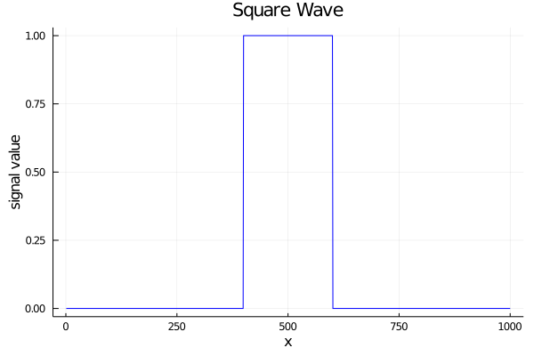
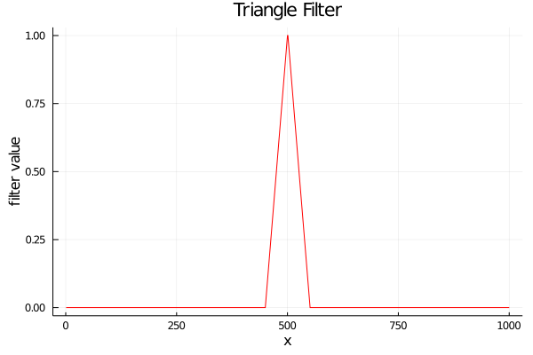
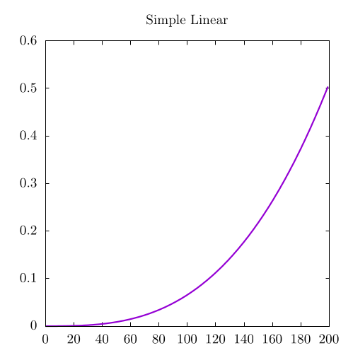
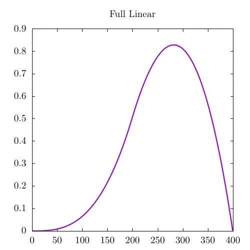
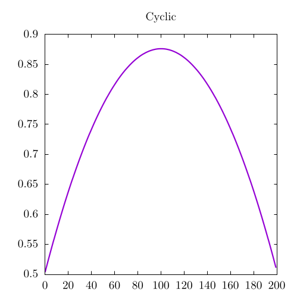

# Convolutions in 1D
As mentioned in the [introductory section for convolutions](../convolutions.md), convolutions allow mathematicians to "blend" two seemingly unrelated functions; however, this definition is not very rigorous, so it might be better to think of a convolution as a method to apply a filter to a signal or image.
This, of course, brings up more questions: what is a filter? What is a signal? How is this all related to images?

For this, we will start with some predefined signal.
It does not matter too much what it is, so we will pick a square wave where everything is set to zero except for a few elements at the center, which will be set to one.
This signal can be treated as an array, or a black and white, one-dimensional image where everything is black except for a white strip at the center.
We will also introduce a filter, which will be a simple triangle wave that goes to 1.
Both of these are shown below:

    
    

So now we have a signal and a filter.
How do we apply the filter to the signal?
The easiest way to do this is to iterate through every point in the signal and blend it with neighboring elements, where each neighboring element is weighted based on the filter value.
So in the case where the triangle wave is only 3 elements (`[0.5, 1, 0.5]`), the output at each point would be

$$
C_n = \frac{A_{n-1}}{2} + A_{n} + \frac{A_{n+1}}{2},
$$

where $$C$$ is the output value, $$A$$ is the input array (a signal or image), and $$n$$ is an iterable element through that signal.
In this way, the "application of a filter," is simply a multiplication of the triangle wave centered around each point of the input array, followed by in integral or sum of the output.
In some sense, this means we will shift the filter, then multiply and sum every step.
This can be seen in the following animation:

<video style="width:90%" controls loop>
  <source src="../res/triangle_square_conv.mp4" type="video/mp4">
Your browser does not support the video tag.
</video>

Here, the purple, dashed line is the output convolution $$C$$, the vertical line is the iteration $$n$$, the blue line is the original signal, the red line is the filter, and the green area is the signal multiplied by the filter at that location.
The convolution at each point is the integral (sum) of the green area for each point.

If we extend this concept into the entirety of discrete space, it might look like this:

$$(f*g)[n] = \sum_{m = -\infty}^{\infty}f[m]g[n-m] = \sum_{m = -\infty}^{\infty}f[n-m]g[m]$$

Where `f[n]` and `g[n]` are arrays of some form.
This means that the convolution can calculated by shifting either the filter along the signal or the signal along the filter.
This can be read as we said before: every step, we shift the filter, multiply, and sum.
There is, of course, a small caveat here.
Why are we subtracting $$m$$?
Certainly, if we wanted to "shift the filter along the signal," we could also do so by *adding* $$m$$ instead, but that is actually an entirely separate operation known as a *correlation*, which will be discussed at a later time.

The simplest interpretation for this equation is the same as the animation: we reverse the second array, and move it through the first array one step at a time, performing a simple element-wise multiplication and summation at each step.
With this in mind, we can almost directly transcribe the discrete equation into code like so:



[import:27-46, lang:"julia"](code/julia/1d_convolution.jl)

[import:63-84, lang:"csharp"](code/csharp/1DConvolution.cs)

[import:20-31, lang:"python"](code/python/1d_convolution.py)


The easiest way to reason about this code is to read it as you might read a textbook.
For each element in the output domain, we are summing a certain subsets of elements from `i-length(filter)` to `i` after multiplying it by the reversed filter (`filter[i-j]`).
In this way, it is precisely the same as the mathematical notation mentioned before.

In contrast to the animation, where the filter continuously reappears on the left edge of the screen, the code we have written for this part of the chapter requires the user to specify what they expect the output array length to be.
Determining what should happen at the edges of the convolution is a somewhat hotly debated topic and differs depending on what the user actually wants, so we will be discussing this in greater detail later in this chapter.

As an important note, if we were to extend the convolution into continuous space, we might write something like:

$$(f*g)(x) = \int_{-\infty}^{\infty}f(\xi)g(x-\xi)d\xi = \int_{-\infty}^{\infty}f(x-\xi)g(\xi)d\xi$$

Note that in this case, $$x$$ and $$\xi$$ are not necessarily spatial elements, but the interpretation is otherwise the same as before.

At this stage, the mathematics and code might still be a little opaque, so it is a good idea to play around a bit and think about how this operation might be used in practice with a few different filters.

## Playing with filters

Honestly, the best way to learn how convolutions work is by using them for a number of different signals and filters, so
let us extend the previous triangle filter a bit further by convolving a square wave with a relatively sharp Gaussian, which can be seen in the following animation:

<video style="width:90%" controls loop>
  <source src="../res/1d_gaussian.mp4" type="video/mp4">
Your browser does not support the video tag.
</video>

In practice, the convolutional output here is very similar to the triangle wave we showed before.
The final convolved image looks a lot like the square, except that its boundaries have been smoothed out or "blurred."
In practice whenever a Gaussian filter is used, it will always blur the other convolved signal, which is why a convolution with a Gaussian is also called a *blurring operation*.
This operation is used very often when dealing with two-dimensional images, and we will discuss common kernels found in the wild in [the next section](../2d/2d.md).
Still, it is interesting to see the blurring operation in action by convolving a random distribution with a larger Gaussian filter:

<video style="width:90%" controls loop>
  <source src="../res/1d_rand_gaussian_cyclic.mp4" type="video/mp4">
Your browser does not support the video tag.
</video>

In this animation, the final convolution is so blurred that it does not seem related to the random input signal at all!
In fact, this animation seems to blend much more when compared to the previous Gaussian and the triangle wave animations.
This is because the Gaussian is wider than the previous to filters.
In general, the wider the filter, the stronger the blurring effect.

So what happens if we convolve a Gaussian with another Gaussian?
Well, that is shown below:

<video style="width:90%" controls loop>
  <source src="../res/double_gaussian.mp4" type="video/mp4">
Your browser does not support the video tag.
</video>

As one might expect, the output is a blurrier Gaussian, which is essentially just wider.
If you were paying particularly close attention to the visualization, you might have noticed that the green area inside this visualization does not properly line up with the overlap of the two arrays.
Don't worry!
This is exactly what should happen!
Remember that the convolution requires a *multiplication* of the signal and filter, which was the same as the overlap when the signal was a square wave; however, in the case of two distinct signals, we should expect the multiplied output to look somewhat distinct.

Let us extend this concept to one final example of a square wave convolved with a triangular, sawtooth function that looks like this:

  

This is the first non-symmetric filter of this chapter, and its convolution would look like this:

<video style="width:90%" controls loop>
  <source src="../res/1d_sawtooth.mp4" type="video/mp4">
Your browser does not support the video tag.
</video>

Non-symmetric filters are useful for testing convolutions to ensure that the output is correct, so it might be worthwhile to linger on this animation for a bit longer.
Notice how the convolution has an accelerating, positive slope when the reversed sawtooth function interacts with the square.
This makes sense as the smallest part of the triangle interacts first.
Similarly, there is a negatively accelerating slope when the sawtooth function leaves the square.

## Dealing with boundaries

In all of the animations, we have shown the filter constantly reappearing on the left edge of the screen, which is not always the best thing to do at the boundaries.
In fact, these boundary conditions are somewhat non-trivial to code, so for this section, we will start with relatively simple boundary conditions that were introduced in the previous code example.

### Simple boundaries

In general, if a user wants to see a full convolution between two signals, the output size must be the size of the two signals put together, otherwise, we cannot iterate through the entire convolutional output domain.
For example, here is random noise again convolved with a Gaussian function, but with non-periodic boundaries:

<video style="width:90%" controls>
  <source src="../res/1d_rand_gaussian_full.mp4" type="video/mp4">
Your browser does not support the video tag.
</video>

This shows the full, unbounded convolution of the two signals, where
we clearly see a "ramp up" and "ramp down" phase at the start and end of the animation.
That said, there are many applications where the user actually needs to specify the output domain to be another length, such as the size of one of the input signals.

In this case, the simplest boundary would be to assume that whenever the filter hits the end of the image, it simply disappears.
Another way to think about this is that the signal only exists for the domain we specify it over, and is all 0s outside of this domain; therefore, the filter does not sum any signal from elements beyond its scope.
As an example, let's take the same example as before:

<video style="width:90%" controls>
  <source src="../res/1d_rand_gaussian_simple.mp4" type="video/mp4">
Your browser does not support the video tag.
</video>

Similar to the case without boundary conditions, this convolution needs to "ramp up," but it does not need to "ramp down."
This is because the convolution output no longer extends past the bounds of the original signal so the bounded convolution is a subset of the full convolution.
More than that, the convolution does not go all the way to 0 on the right side.
This means that we are actually ignoring a rather important part of the convolution!

This is 100% true; however, if the signal is large and the filter is small (as is the case with most of image processing), we do not really care that much about the bits of the convolution we missed.
In addition, there is a way to center the convolution by modifying the location where the filter starts.
For example, we could have half of the filter already existing and overlapping with the signal for the very first computed point of the convolution.
For this reason, simple bounds are used frequently when performing convolutions on an image.

In the previous code snippet, we were able to perform both a bounded and unbounded convolution.
Here it is again for clarity:



[import:27-46, lang:"julia"](code/julia/1d_convolution.jl)

[import:63-84, lang:"csharp"](code/csharp/1DConvolution.cs)

[import:20-31, lang:"python"](code/python/1d_convolution.py)


Here, the main difference between the bounded and unbounded versions is that the output array size is smaller in the bounded case.
For an unbounded convolution, the function would be called with a the output array size specified to be the size of both signals put together:



[import:58-59, lang:"julia"](code/julia/1d_convolution.jl)

[import:96-97, lang:"csharp"](code/csharp/1DConvolution.cs)

[import:41-42, lang:"python"](code/python/1d_convolution.py)


On the other hand, the bounded call would set the output array size to simply be the length of the signal



[import:61-62, lang:"julia"](code/julia/1d_convolution.jl)

[import:98-99, lang:"csharp"](code/csharp/1DConvolution.cs)

[import:44-45, lang:"python"](code/python/1d_convolution.py)


Finally, as we mentioned before, it is possible to center bounded convolutions by changing the location where we calculate the each point along the filter.
This can be done by modifying the following line:



[import:35-35, lang:"julia"](code/julia/1d_convolution.jl)

[import:71-71, lang:"csharp"](code/csharp/1DConvolution.cs)

[import:25-25, lang:"python"](code/python/1d_convolution.py)


Here, `j` counts from `i-length(filter)` to `i`.
To center the convolution, it would need to count from `i-(length(filter)/2)` to `i+(length(filter)/2)` instead.

I think this is a good place to stop discussions on simple boundary conditions.
Now let us talk a bit more in detail about the case where we want the filter to continuously reappear every loop.
This case is known as the "periodic boundary condition" and was used for the visualizations at the start of this chapter.

### Periodic boundary conditions

Though periodic boundary conditions are more complicated that those mentioned in the previous section, they are still *relatively* straightforward to implement.
With these conditions, the filter will wrap itself around to the other end of the signal whenever it hits a boundary.
In this way, the signal is periodic, with an identical copy of itself acting as left and right neighbors.
Those neighbors then have other neighbors, and those then have more neighbors, creating a sea of signals extending to infinity and beyond in both directions.
For us, this means that when the filter leaves one edge of the domain, it simply appears on the other, opposite edge.

This particular convolution is known as a *cyclic* convolution and is also the most common output of convolutions that work via the [convolutional theorem](../convolutional_theorem/convolutional_theorem.md), which will be discussed in another section.
For clarity: here is the same cyclic visualization we showed above with a random distribution and a Gaussian signal.

<video style="width:90%" controls loop>
  <source src="../res/1d_rand_gaussian_cyclic.mp4" type="video/mp4">
Your browser does not support the video tag.
</video>

In code, this typically amounts to using some form of modulus operation, as shown here:



[import:4-25, lang:"julia"](code/julia/1d_convolution.jl)

[import:38-61, lang:"csharp"](code/csharp/1DConvolution.cs)

[import:5-17, lang:"python"](code/python/1d_convolution.py)


This is essentially the same as before, except for the modulus operations, which allow us to work on a periodic domain.

As a final note before continuing: dealing with boundaries is tricky business and can dramatically change the behavior of the output convolution.
For this reason, it is important to think about what types of boundaries will work best for what you, the programmer, actually need.
The selection of boundary conditions will be a common trope for a large portion of computer graphics and physics algorithms where researchers often need to present and simulate data on an array of some sort.

## Example Code

For the code associated with this chapter, we have used the convolution to generate a few files for the full convolution, along with the periodic and simple boundary conditions discussed in this chapter.



[import, lang:"julia"](code/julia/1d_convolution.jl)

[import, lang:"csharp"](code/csharp/1DConvolution.cs)

[import, lang:"python"](code/python/1d_convolution.py)


At a test case, we have chosen to use two sawtooth functions, which should produce the following images:

| Description | Image |
| ----------- | ----- |
| Simple Boundaries |  |
| Full |  |
| Cyclic |  |

As a sanity check, make sure that the bounded convolution is a subset of the full convolution.
In this example, the bounded convolution is the start of the full convolution, but it is entirely possible it could be the middle or somewhere else entirely depending on how you counted within the inner, summation loop for the convolution.

## License

##### Code Examples

The code examples are licensed under the MIT license (found in [LICENSE.md](https://github.com/algorithm-archivists/algorithm-archive/blob/main/LICENSE.md)).

##### Images/Graphics
- The image "[Square Wave](../res/square_wave.png)" was created by [James Schloss](https://github.com/leios) and is licensed under the [Creative Commons Attribution-ShareAlike 4.0 International License](https://creativecommons.org/licenses/by-sa/4.0/legalcode).
- The image "[Triangle Wave](../res/triangle_wave.png)" was created by [James Schloss](https://github.com/leios) and is licensed under the [Creative Commons Attribution-ShareAlike 4.0 International License](https://creativecommons.org/licenses/by-sa/4.0/legalcode).
- The video "[Triangle Square Convolution](../res/triangle_square_conv.mp4)" was created by [James Schloss](https://github.com/leios) and is licensed under the [Creative Commons Attribution-ShareAlike 4.0 International License](https://creativecommons.org/licenses/by-sa/4.0/legalcode).
- The video "[Gaussian Square Convolution](../res/1d_gaussian.mp4)" was created by [James Schloss](https://github.com/leios) and is licensed under the [Creative Commons Attribution-ShareAlike 4.0 International License](https://creativecommons.org/licenses/by-sa/4.0/legalcode).
- The video "[Gaussian Random Convolution](../res/1d_rand_gaussian_cyclic.mp4)" was created by [James Schloss](https://github.com/leios) and is licensed under the [Creative Commons Attribution-ShareAlike 4.0 International License](https://creativecommons.org/licenses/by-sa/4.0/legalcode).
- The video "[Double Convolution](../res/double_gaussian.mp4)" was created by [James Schloss](https://github.com/leios) and is licensed under the [Creative Commons Attribution-ShareAlike 4.0 International License](https://creativecommons.org/licenses/by-sa/4.0/legalcode).
- The image "[Sawtooth Wave](../res/sawtooth.png)" was created by [James Schloss](https://github.com/leios) and is licensed under the [Creative Commons Attribution-ShareAlike 4.0 International License](https://creativecommons.org/licenses/by-sa/4.0/legalcode).
- The video "[Sawtooth Square Convolution](../res/1d_sawtooth.mp4)" was created by [James Schloss](https://github.com/leios) and is licensed under the [Creative Commons Attribution-ShareAlike 4.0 International License](https://creativecommons.org/licenses/by-sa/4.0/legalcode).
- The video "[Full Random Convolution](../res/1d_rand_gaussian_full.mp4)" was created by [James Schloss](https://github.com/leios) and is licensed under the [Creative Commons Attribution-ShareAlike 4.0 International License](https://creativecommons.org/licenses/by-sa/4.0/legalcode).
- The video "[Simple Random Convolution](../res/1d_rand_gaussian_simple.mp4)" was created by [James Schloss](https://github.com/leios) and is licensed under the [Creative Commons Attribution-ShareAlike 4.0 International License](https://creativecommons.org/licenses/by-sa/4.0/legalcode).
- The image "[Simple Linear](../res/simple_linear.png)" was created by [James Schloss](https://github.com/leios) and is licensed under the [Creative Commons Attribution-ShareAlike 4.0 International License](https://creativecommons.org/licenses/by-sa/4.0/legalcode).
- The image "[Full Linear](../res/full_linear.png)" was created by [James Schloss](https://github.com/leios) and is licensed under the [Creative Commons Attribution-ShareAlike 4.0 International License](https://creativecommons.org/licenses/by-sa/4.0/legalcode).
- The image "[Cyclic](../res/cyclic.png)" was created by [James Schloss](https://github.com/leios) and is licensed under the [Creative Commons Attribution-ShareAlike 4.0 International License](https://creativecommons.org/licenses/by-sa/4.0/legalcode).

##### Text

The text of this chapter was written by [James Schloss](https://github.com/leios) and is licensed under the [Creative Commons Attribution-ShareAlike 4.0 International License](https://creativecommons.org/licenses/by-sa/4.0/legalcode).

[

](https://creativecommons.org/licenses/by-sa/4.0/)

##### Pull Requests

After initial licensing ([#560](https://github.com/algorithm-archivists/algorithm-archive/pull/560)), the following pull requests have modified the text or graphics of this chapter:
- none

