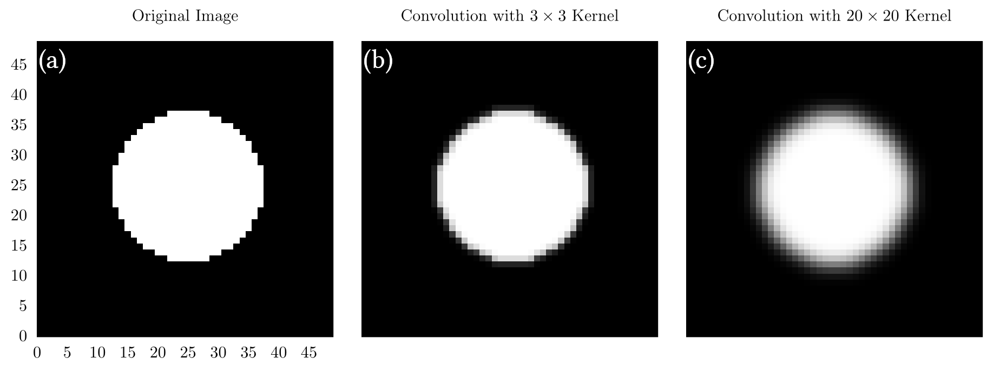

# Convolutions on Images

For this section, we will no longer be focusing on signals, but instead images (arrays filled with elements of red, green, and blue values).
That said, for the code examples, greyscale images may be used such that each array element is composed of some floating-point value instead of color.
In addition, we will not be discussing boundary conditions too much in this chapter and will instead be using the simple boundaries introduced in the section on [one-dimensional convolutions](../1d/1d.md).

The extension of one-dimensional convolutions to two dimensions requires a little thought about indexing and the like, but is ultimately the same operation.
Here is an animation of a convolution for a two-dimensional image:

<video style="width:90%" controls loop>
  <source src="../res/2d.mp4" type="video/mp4">
Your browser does not support the video tag.
</video>

In this case, we convolved the image with a 3x3 square filter, all filled with values of $$\frac{1}{9}$$.
This created a simple blurring effect, which is somewhat expected from the discussion in the previous section.
In code, a two-dimensional convolution might look like this:



[import:4-28, lang:"julia"](code/julia/2d_convolution.jl)

[import:5-19, lang:"python"](code/python/2d_convolution.py)


This is very similar to what we have shown in previous sections; however, it essentially requires four iterable dimensions because we need to iterate through each axis of the output domain *and* the filter.

At this stage, it is worth highlighting common filters used for convolutions of images.
In particular, we will further discuss the Gaussian filter introduced in the [previous section](../1d/1d.md), and then introduce another set of kernels known as Sobel operators, which are used for naïve edge detection or image derivatives.

## The Gaussian kernel

The Gaussian kernel serves as an effective *blurring* operation for images.
As a reminder, the formula for any Gaussian distribution is

$$
g(x,y) = \frac{1}{2\pi\sigma^2}e^{-\frac{x^2+y^2}{2\sigma^2}},
$$

where $$\sigma$$ is the standard deviation and is a measure of the width of the Gaussian.
A larger $$\sigma$$ means a larger Gaussian; however, remember that the Gaussian must fit onto the filter, otherwise it will be cut off!
For example, if you are using a $$3\times 3$$ filter, you should not be using $$\sigma = 10$$.
Some definitions of $$\sigma$$ allow users to have a separate deviation in $$x$$ and $$y$$ to create an ellipsoid Gaussian, but for the purposes of this chapter, we will assume $$\sigma_x = \sigma_y$$.
As a general rule of thumb, the larger the filter and standard deviation, the more "smeared" the final convolution will be.

At this stage, it is important to write some code, so we will generate a simple function that returns a Gaussian kernel with a specified standard deviation and filter size.



[import:30-47, lang:"julia"](code/julia/2d_convolution.jl)

[import:21-33, lang:"python"](code/python/2d_convolution.py)


Though it is entirely possible to create a Gaussian kernel whose standard deviation is independent on the kernel size, we have decided to enforce a relation between the two in this chapter.
As always, we encourage you to play with the code and create your own Gaussian kernels any way you want!
As a note, all the kernels will be scaled (normalized) at the end by the sum of all internal elements.
This ensures that the output of the convolution will not have an obnoxious scale factor associated with it.

Below are a few images generated by applying a kernel generated with the code above to a black and white image of a circle.

  

In (a), we show the original image, which is just a white circle at the center of a $$50\times 50$$ grid.
In (b), we show the image after convolution with a $$3\times 3$$ kernel.
In (c), we show the image after convolution with a $$20\times 20$$ kernel.
Here, we see that (c) is significantly fuzzier than (b), which is a direct consequence of the kernel size.

There is a lot more that we could talk about, but now is a good time to move on to a slightly more complicated convolutional method: the Sobel operator.

## The Sobel operator

The Sobel operator effectively performs a gradient operation on an image by highlighting areas where a large change has been made.
In essence, this means that this operation can be thought of as a naïve edge detector.
Essentially, the $$n$$-dimensional Sobel operator is composed of $$n$$ separate gradient convolutions (one for each dimension) that are then combined together into a final output array.
Again, for the purposes of this chapter, we will stick to two dimensions, which will be composed of two separate gradients along the $$x$$ and $$y$$ directions.
Each gradient will be created by convolving our image with their corresponding Sobel operator:

$$
\begin{align}
S_x &= \left(\begin{bmatrix}
1 \\
2 \\
1 \\
\end{bmatrix} \otimes [1~0~-1]
\right) = \begin{bmatrix}
1 & 0 & -1 \\
2 & 0 & -2 \\
1 & 0 & -1 \\
\end{bmatrix}\\

S_y &= \left(
\begin{bmatrix}
1 \\
0 \\
-1 \\
\end{bmatrix} \otimes [1~2~1]
\right) = \begin{bmatrix}
1 & 2 & 1 \\
0 & 0 & 0 \\
-1 & -2 & -1 \\
\end{bmatrix}.
\end{align}
$$

The gradients can then be found with a convolution, such that:

$$
\begin{align}
G_x &= S_x*A \\
G_y &= S_y*A.
\end{align}
$$

Here, $$A$$ is the input array or image.
Finally, these gradients can be summed in quadrature to find the total Sobel operator or image gradient:

$$
G_{\text{total}} = \sqrt{G_x^2 + G_y^2}
$$

So let us now show what it does in practice:

  

In this diagram, we start with the circle image on the right, and then convolve it with the $$S_x$$ and $$S_y$$ operators to find the gradients along $$x$$ and $$y$$ before summing them in quadrature to get the final image gradient.
Here, we see that the edges of our input image have been highlighted, showing outline of our circle.
This is why the Sobel operator is also known as naïve edge detection and is an integral component to many more sophisticated edge detection methods like one proposed by Canny {{ "canny1986computational" | cite }}.

In code, the Sobel operator involves first finding the operators in $$x$$ and $$y$$ and then applying them with a traditional convolution:



[import:49-63, lang:"julia"](code/julia/2d_convolution.jl)

[import:36-52, lang:"python"](code/python/2d_convolution.py)


With that, I believe we are at a good place to stop discussions on two-dimensional convolutions.
We will definitely return to this topic in the future as new algorithms require more information.

## Example Code

For the code in this section, we have modified the visualizations from the [one-dimensional convolution chapter](../1d/1d.md) to add a two-dimensional variant for blurring an image of random white noise.
We have also added code to create the Gaussian kernel and Sobel operator and apply it to the circle, as shown in the text.



[import, lang:"julia"](code/julia/2d_convolution.jl)

[import, lang:"python"](code/python/2d_convolution.py)


### Bibliography

 

## License

##### Code Examples

The code examples are licensed under the MIT license (found in [LICENSE.md](https://github.com/algorithm-archivists/algorithm-archive/blob/main/LICENSE.md)).

##### Images/Graphics
- The image "[8bit Heart](../res/heart_8bit.png)" was created by [James Schloss](https://github.com/leios) and is licensed under the [Creative Commons Attribution-ShareAlike 4.0 International License](https://creativecommons.org/licenses/by-sa/4.0/legalcode).
- The image "[Circle Blur](../res/circle_blur.png)" was created by [James Schloss](https://github.com/leios) and is licensed under the [Creative Commons Attribution-ShareAlike 4.0 International License](https://creativecommons.org/licenses/by-sa/4.0/legalcode).
- The image "[Sobel Filters](../res/sobel_filters.png)" was created by [James Schloss](https://github.com/leios) and is licensed under the [Creative Commons Attribution-ShareAlike 4.0 International License](https://creativecommons.org/licenses/by-sa/4.0/legalcode).
- The video "[2D Convolution](../res/2d.mp4)" was created by [James Schloss](https://github.com/leios) and [Grant Sanderson](https://github.com/3b1b) and is licensed under the [Creative Commons Attribution-ShareAlike 4.0 International License](https://creativecommons.org/licenses/by-sa/4.0/legalcode).

##### Text

The text of this chapter was written by [James Schloss](https://github.com/leios) and is licensed under the [Creative Commons Attribution-ShareAlike 4.0 International License](https://creativecommons.org/licenses/by-sa/4.0/legalcode).

[

](https://creativecommons.org/licenses/by-sa/4.0/)

##### Pull Requests

After initial licensing ([#560](https://github.com/algorithm-archivists/algorithm-archive/pull/560)), the following pull requests have modified the text or graphics of this chapter:
- none

