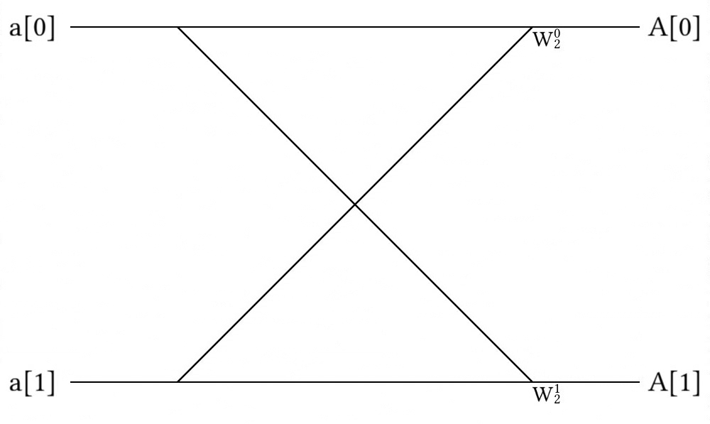
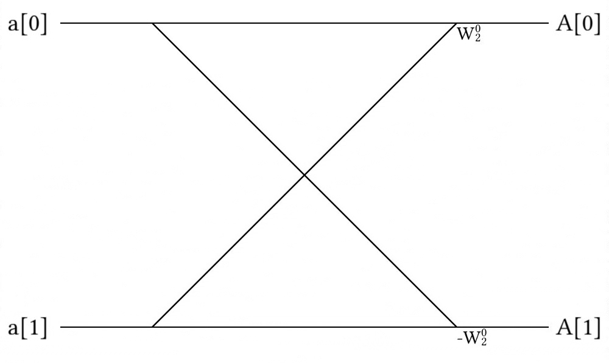
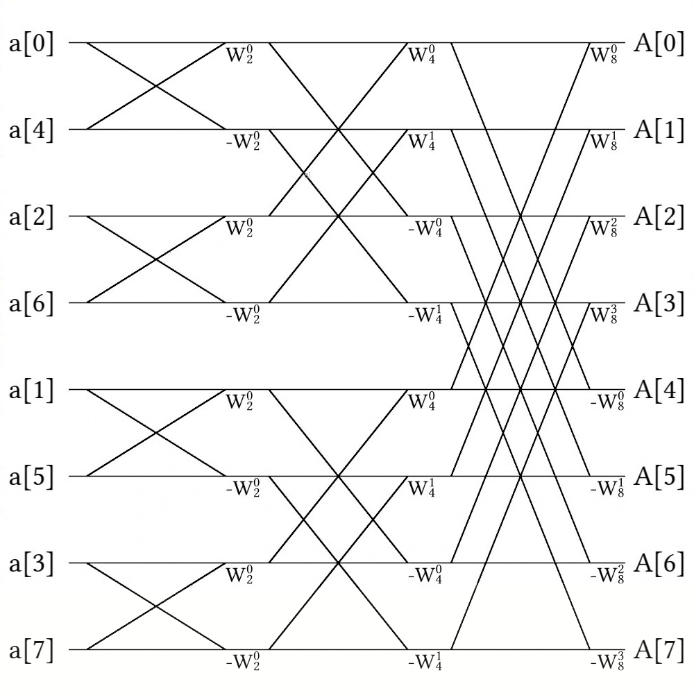

## What Makes a Fourier Transform Fast?

If there were ever an algorithm to radically change the landscape of computer science and engineering by making seemingly impossible problems possible, it would be the Fast Fourier Transform (FFT).
On the surface, the algorithm seems like a simple application of recursion, and in principle, that is exactly what it is; however, the Fourier Transform is no ordinary transform -- it allows researchers and engineers to easily bounce back and forth between real space and frequency space and is the heart of many physics and engineering applications.
From calculating superfluid vortex positions to super-resolution imaging, Fourier Transforms lay at the heart of many scientific disciplines and are essential to many algorithms we will cover later in this book.

Simply put, the Fourier Transform is a beautiful application of complex number systems; however, it would rarely be used today if not for the ability to quickly perform the operation with Fast Fourier Transform, first introduced by the great Frederick Gauss in 1805 and later independently discovered by James Cooley and John Tukey in 1965 {{ "ct1965" | cite }}.
Gauss (of course) already had too many things named after him and Cooley and Tukey both had cooler names, so the most common algorithm for FFT's today is known as the Cooley-Tukey algorithm.

### What is a Fourier Transform?

To an outsider, the Fourier Transform looks like a mathematical mess -- certainly a far cry from the heroic portal between two domains I have depicted it to be; however, like most things, it's not as bad as it initially appears to be.
So, here it is in all it's glory!

$$F(\xi) = \int_{-\infty} ^\infty f(x) e^{-2 \pi i x \xi} dx$$

and

$$f(x) = \int_{-\infty} ^\infty F(\xi) e^{2 \pi i \xi x} d\xi$$

Where $$F(\xi)$$ represents a function in frequency space, $$\xi$$ represents a value in frequency space, $$f(x)$$ represents a function in real space, and $$x$$ represents a value in the real space.
Note here that the only difference between the two exponential terms is a minus sign in the transformation to frequency space.
As I mentioned, this is not intuitive syntax, so please allow me to explain a bit.

Firstly, **what does the Fourier Transform do?**

If we take a sum sinusoidal functions (like $$\sin(\omega t)$$ or $$\cos(\omega t)$$), we might find a complicated mess of waves between $$\pm 1$$.
Each constituent wave can be described by only one value: $$\omega$$.
So, instead of representing these curves as seen above, we could instead describe them as peaks in frequency space, as shown below.

<p>
    
</p>

This is what the Fourier Transform does!
After performing the transform, it is now much, much easier to understand precisely which frequencies are in our waveform, which is essential to most areas of signal processing.

Now, how does this relate to the transformations above?
Well, the easiest way is to substitute in the Euler's formula:

$$e^{2 \pi i \theta} = \cos(2 \pi \theta) + i \sin(2 \pi \theta)$$

This clearly turns our function in frequency space into:

$$F(\xi) = \int_{-\infty} ^\infty f(x) (\cos(-2 \pi x \xi) + i \sin(-2 \pi x \xi))dx$$

and our function in real space into:

$$f(x) = \int_{-\infty} ^\infty F(\xi) (\cos(2 \pi \xi x) + i \sin(2 \pi \xi x)) d\xi$$

Here, the $$\sin$$ and $$\cos$$ functions are clearly written in the formulas, so it looks much friendlier, right?
This means that a point in real space is defined by the integral over all space of it's corresponding frequency function multiplied by sinusoidal oscillations.

Truth be told, even after seeing this math, I still didn't understand Fourier Transforms.
Truth be told, I didn't understand it fully until I discretized real and frequency space to create the Discrete Fourier Transform (DFT), which is the only way to implement Fourier Transforms in code.

### What is a Discrete Fourier Transform?

In principle, the Discrete Fourier Transform (DFT) is simply the Fourier transform with summations instead of integrals:

$$X_k = \sum_{n=0}^{N-1} x_n \cdot e^{-2 \pi i k n / N}$$

and

$$x_n = \frac{1}{N} \sum_{k=0}^{N-1} X_k \cdot e^{2 \pi i k n / N}$$

Where $$X_n$$ and $$x_n$$ are sequences of $$N$$ numbers in frequency and real space, respectively.
In principle, this is no easier to understand than the previous case!
For some reason, though, putting code to this transformation really helped me figure out what was actually going on.



[import:4-13, lang:"julia"](code/julia/fft.jl)

[import:25-35, lang:"c"](code/c/fft.c)

[import:15-30, lang:"clojure"](code/clojure/fft.clj)

[import:23-33, lang:"cpp"](code/c++/fft.cpp)

[import:7-13, lang:"haskell"](code/haskell/fft.hs)

[import:5-11, lang:"python"](code/python/fft.py)

[import:4-13, lang:"julia"](code/julia/fft.jl)

[import:15-74, lang:"asm-x64"](code/asm-x64/fft.s)


In this function, we define `n` to be a set of integers from $$0 \rightarrow N-1$$ and arrange them to be a column.
We then set `k` to be the same thing, but in a row.
This means that when we multiply them together, we get a matrix, but not just any matrix!
This matrix is the heart to the transformation itself!

```
M = [1.0+0.0im  1.0+0.0im           1.0+0.0im          1.0+0.0im;
     1.0+0.0im  6.12323e-17-1.0im  -1.0-1.22465e-16im -1.83697e-16+1.0im;
     1.0+0.0im -1.0-1.22465e-16im   1.0+2.44929e-16im -1.0-3.67394e-16im;
     1.0+0.0im -1.83697e-16+1.0im  -1.0-3.67394e-16im  5.51091e-16-1.0im]
```

It was amazing to me when I saw the transform for what it truly was: an actual transformation matrix!
That said, the Discrete Fourier Transform is slow -- primarily because matrix multiplication is slow, and as mentioned before, slow code is not particularly useful.
So what was the trick that everyone used to go from a Discrete Fourier Transform to a *Fast* Fourier Transform?

Recursion!

### The Cooley-Tukey Algorithm

The problem with using a standard DFT is that it requires a large matrix multiplications and sums over all elements, which are prohibitively complex operations.
The Cooley-Tukey algorithm calculates the DFT directly with fewer summations and without matrix multiplications.
If necessary, DFT's can still be calculated directly at the early stages of the FFT calculation.
The trick to the Cooley-Tukey algorithm is recursion.
In particular, we split the matrix we wish to perform the FFT on into two parts: one for all elements with even indices and another for all odd indices.
We then proceed to split the array again and again until we have a manageable array size to perform a DFT (or similar FFT) on.
We can also perform a similar re-ordering by using a bit reversal scheme, where we output each array index's integer value in binary and flip it to find the new location of that element.
With recursion, we can reduce the complexity to $$\sim \mathcal{O}(n \log n)$$, which is a feasible operation.

In the end, the code looks like:


[import:16-32, lang:"julia"](code/julia/fft.jl)

[import:37-56, lang:"c"](code/c/fft.c)

[import:31-58, lang:"clojure"](code/clojure/fft.clj)

[import:36-66, lang:"cpp"](code/c++/fft.cpp)

[import:15-28, lang:"haskell"](code/haskell/fft.hs)

[import:13-24, lang:"python"](code/python/fft.py)

[import:16-32, lang:"julia"](code/julia/fft.jl)

[import:76-165, lang:"asm-x64"](code/asm-x64/fft.s)


As a side note, we are enforcing that the array must be a power of 2 for the operation to work.
This is a limitation of the fact that we are using recursion and dividing the array in 2 every time; however, if your array is not a power of 2, you can simply pad the leftover space with 0's until your array is a power of 2.

The above method is a perfectly valid FFT; however, it is missing the pictorial heart and soul of the Cooley-Tukey algorithm: Butterfly Diagrams.

### Butterfly Diagrams
Butterfly Diagrams show where each element in the array goes before, during, and after the FFT.
As mentioned, the FFT must perform a DFT.
This means that even though we need to be careful about how we add elements together, we are still ultimately performing the following operation:

$$X_k = \sum_{n=0}^{N-1} x_n \cdot e^{-2 \pi i k n / N}$$

However, after shuffling the initial array (by bit reversing or recursive subdivision), we perform the matrix multiplication of the $$e^{-2 \pi k n / N}$$ terms in pieces.
Basically, we split the array into a series of omega values:

$$\omega_N^k = e^{-2 \pi i k / N}$$

And at each step, we use the appropriate term.
For example, imagine we need to perform an FFT of an array of only 2 elements.
We can represent this addition with the following (radix-2) butterfly:

<p>
    
</p>

Here, the diagram means the following:

$$
b_0 = a_0 + \omega_2^0 a_1 \\

b_1 = a_0 + \omega_2^1 a_1
$$

However, it turns out that the second half of our array of $$\omega$$ values is always the negative of the first half, so $$\omega_2^0 = -\omega_2^1$$, so we can use the following butterfly diagram:

<p>
    
</p>

With the following equations:

$$
b_0 = a_0 + \omega_2^0 a_1 \\

b_1 = a_0 - \omega_2^0 a_1
$$

By swapping out the second $$\omega$$ value in this way, we can save a good amount of space.
Now imagine we need to combine more elements.
In this case, we start with simple butterflies, as shown above, and then sum butterflies of butterflies.
For example, if we have 8 elements, this might look like this:

<p>
    
</p>

Note that we can perform a DFT directly before using any butterflies, if we so desire, but we need to be careful with how we shuffle our array if that's the case.
In the code snippet provided in the previous section, the subdivision was performed in the same function as the concatenation, so the ordering was always correct; however, if we were to re-order with bit-reversal, this might not be the case.

For example, take a look at the ordering of FFT ([found on wikipedia](https://en.wikipedia.org/wiki/Butterfly_diagram)) that performs the DFT shortcut:

<p>
    
</p>

Here, the ordering of the array was simply divided into even and odd elements once, but they did not recursively divide the arrays of even and odd elements again because they knew they would perform a DFT soon thereafter.

Ultimately, that's all I want to say about Fourier Transforms for now, but this chapter still needs a good amount of work!
I'll definitely come back to this at some point, so let me know what you liked and didn't like and we can go from there!

### Bibliography

 

## Example Code

To be clear, the example code this time will be complicated and requires the following functions:

* An FFT library (either in-built or something like FFTW)
* An approximation function to tell if two arrays are similar

As mentioned in the text, the Cooley-Tukey algorithm may be implemented either recursively or non-recursively, with the recursive method being much easier to implement.
I would ask that you implement either the recursive or non-recursive methods (or both, if you feel so inclined).
If the language you want to write your implementation in is already used, please append your code to the already existing codebase.
As before, pull requests are favoured.

Note: I implemented this in Julia because the code seems more straightforward in Julia; however, if you wish to write better Julia code or better code in your own language, please feel free to do so!
**I do not claim that this is the most efficient way to implement the Cooley-Tukey method, so if you have a better way to do it, feel free to implement it that way!**



[import, lang:"julia"](code/julia/fft.jl)

[import, lang:"c"](code/c/fft.c)

[import, lang:"clojure"](code/clojure/fft.clj)

[import, lang:"cpp"](code/c++/fft.cpp)

[import, lang:"haskell"](code/haskell/fft.hs)

[import, lang:"python"](code/python/fft.py)

Some rather impressive scratch code was submitted by Jie and can be found here: https://scratch.mit.edu/projects/37759604/#editor

[import, lang:"asm-x64"](code/asm-x64/fft.s)



<script>
MathJax.Hub.Queue(["Typeset",MathJax.Hub]);
</script>

## License

##### Code Examples

The code examples are licensed under the MIT license (found in [LICENSE.md](https://github.com/algorithm-archivists/algorithm-archive/blob/master/LICENSE.md)).

##### Text

The text of this chapter was written by [James Schloss](https://github.com/leios) and is licensed under the [Creative Commons Attribution-ShareAlike 4.0 International License](https://creativecommons.org/licenses/by-sa/4.0/legalcode).

[<p></p>](https://creativecommons.org/licenses/by-sa/4.0/)

##### Images/Graphics
- The image "[FTexample](res/FT_example.png)" was created by [James Schloss](https://github.com/leios) and is licenced under the [Creative Commons Attribution-ShareAlike 4.0 International License](https://creativecommons.org/licenses/by-sa/4.0/legalcode).
- The image "[radix2positive](res/radix-2screen_positive.jpg)" was created by [James Schloss](https://github.com/leios) and is licenced under the [Creative Commons Attribution-ShareAlike 4.0 International License](https://creativecommons.org/licenses/by-sa/4.0/legalcode).
- The image "[radix2](res/radix-2screen.jpg)" was created by [James Schloss](https://github.com/leios) and is licenced under the [Creative Commons Attribution-ShareAlike 4.0 International License](https://creativecommons.org/licenses/by-sa/4.0/legalcode).
- The image "[radix8](res/radix-8screen.jpg)" was created by [James Schloss](https://github.com/leios) and is licenced under the [Creative Commons Attribution-ShareAlike 4.0 International License](https://creativecommons.org/licenses/by-sa/4.0/legalcode).
- The image "[DIT-FFT-butterfly](https://en.wikipedia.org/wiki/Butterfly_diagram#/media/File:DIT-FFT-butterfly.png)" was created by Virens and is licenced under the [Creative Commons Attribution 3.0 Unported License](https://creativecommons.org/licenses/by/3.0/).

##### Pull Requests

After initial licensing ([#560](https://github.com/algorithm-archivists/algorithm-archive/pull/560)), the following pull requests have modified the text or graphics of this chapter:
- none
