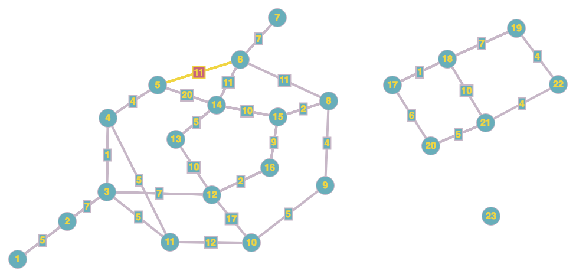

# Dijkstra's Algorithm
Edsger Dijkstra was one of the foremost computer scientists of the 20th century.  He pioneered a large body of work that is integral to modern theoretical computer science and software engineering.  A graph algorithm bearing his name is but one of his major contributions, but it is one to which he is most often associated.  The algorithm is used to efficiently find shortest paths between vertices in a weighted graph, with the condition that the graph satisfies the [Triangle Inequality](https://en.wikipedia.org/wiki/Triangle_inequality).  The edge weights of the graph may be any positive numbers.

The algorithm is fairly simple and uses the assumption about the triangle inequality to ignore potential paths that can't be shorter than ones already known.  Two variations of the algorithm exist: one which finds the shortest path between two particular vertices `x` and `y`, terminating once one such path is found, and one which finds the shortest path between a start vertex `x` and all other vertices in the same connected component of the graph.  These two variations are functionally the same, but the former is able to terminate once its narrower goal is met.  We will focus on the latter variant, but the code for the former is very similar.

To begin, start at the first vertex `x` and make a set of all the other "unvisited" vertices in the graph.  Initialize a structure to store the shortest known path to all vertices, with a path of zero weight to the start vertex and infinity (or a suitably large constant) to all others.  Next, look at all the neighbors of `x`.  By the triangle inequality, we know that following each adjacent edge to `x` will yield a shortest path to each of the neighbors of `x`.  Thus, we have found shortest paths to each of these.  Record these shortest paths (both the vertices crossed and the total path weight) in the auxilary data structure(s).

Now, step to the vertex `z` whose path weight is the lowest.  Remove that vertex from the unvisited set.  Repeat the above process from this vertex, noting that a shortest path to each of `z`'s neighbors must go through `z` and will have a total path weight of the `x`-`z` path plus the weight of the edge being traversed.  Repeat this process of improving shortest known paths, choosing vertices from the unvisited set whose known paths are the shortest, and checking neighbors until one of two terminating conditions is met.  Either the unvisted set of vertices is exhausted (meaning we have traversed the entire graph), or no remaining unvisted vertices have known paths to them.  This latter condition is met when the graph is disconnected, leaving us with vertices that cannot be reached from a start vertex via any path.  Once either of these conditions is met, then we have found the shortest paths from `x` to all connected vertices.

The below example uses the following graph as a sample.



[import:1-69, lang:"python"](code/python/dijkstra.py)


