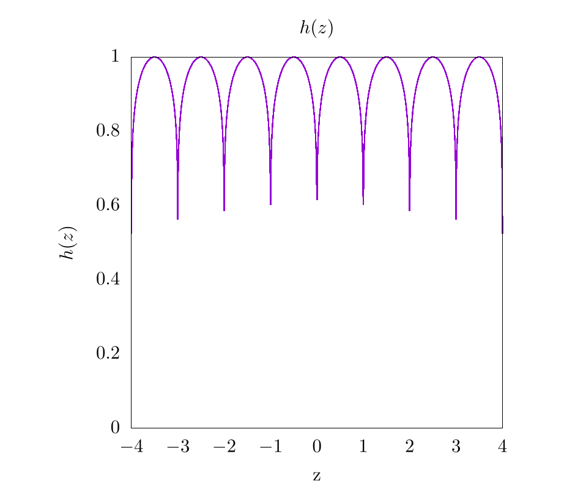
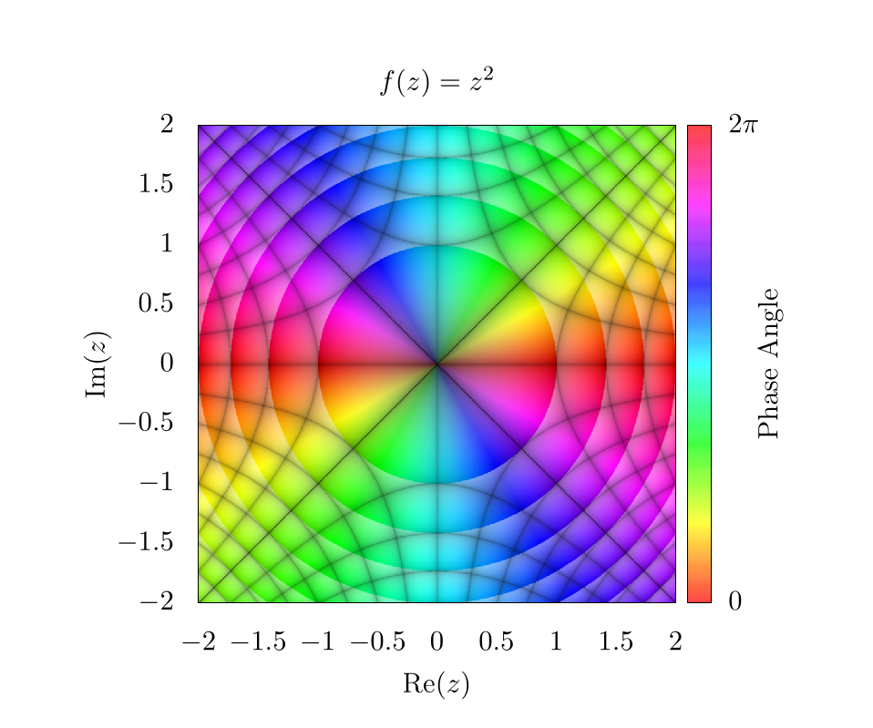

# Domain coloring

Domain coloring is a much more complicated plotting technique than those outlined in the [plotting chapter](../plotting/plotting.md) and is used to plot complex functions where both the input and output have imaginary and real components.
For the code in this chapter, we will focus on languages that are easily able to plot two-dimensional images or heat maps, instead of languages meant for number-crunching.
That is to say that this chapter will certainly have a code implementation in gnuplot, but it will not likely have an implementation in C, Fortran, or Java because these languages do not have plotting capabilities in-built.

To start, imagine the following function: $$f(z) = z^2$$.
In this case, we could create a plot that looks like this:

    

This indicates that for various input values along $$z$$, we have different function outputs from $$f(z)$$.
For this function, $$z\in\mathbb{R}$$ is purely in real space and because of this, the output is also in real space.
Now let's imagine another function with complex input $$(z \in \mathbb{C})$$, but a purely real output $$(f(z) \in \mathbb{R})$$:

$$
f(z) = |z|
$$

In this case, this can be plotted as a two-dimensional dataset like so:

    

Here, the $$x$$-axis and $$y$$-axis represent the imaginary and real components of the input variable, respectively.
The color bar represents the output of $$f(z)$$.

At this point, we can start to see the problem.
If the output of $$f(z)$$ also requires plotting of real and imaginary components, then we would need four dimensions to appropriately represent the full function space, one axis for the real component and another for the imaginary component of both the input ($$z$$) and the output of $$f(z)$$!
Unfortunately, feeble human minds are incapable of understanding four spatial dimensions without projecting onto lower dimensionality, so we need to improvise.

We do this by assuming the complex output can be represented in the following form:

$$
z = re^{i \theta} = r(\cos(\theta) + i\sin(\theta))
$$

where, $$r$$ is a complex magnitude and $$\theta$$ is a complex phase.
This is the formula for a circle in the complex plane and we can easily find $$r$$ and $$\theta$$ like so:

$$
\begin{align}
    r &= \sqrt{\text{Re}(z)^2 + \text{Im}(z)^2} \\ 
    \theta &= \text{atan}\left(\frac{\text{Im}(z)}{\text{Re}(z)}\right)
\end{align}
$$

Once we have our complex function output in this form, we then color the output domain according to a color space with at least 2 independent dimensions, like RGB (Red, Green, Blue), or HSV (Hue, Saturation, Value) {{ "hsv" | cite }}.
The choice of color space is completely dependent on what the users feel is most visually intuitive.
In any case, one dimension of the color system will be used to represent the complex magnitude and another dimension of the color system will be used to represent the complex phase of the output.
The $$xy$$ grid will be representing the real and imaginary inputs to these functions.
That is to say, we plug every value in the 2D complex plane into the function and then color each pixel based on the function output.

As an example, let's look at the simplest function we can $$f(z) = z$$, but in this case $$z \in \mathbb{C}$$.
If we use an RGB color scheme, where red represents $$\theta$$ and blue represents $$r$$, we can generate the following image:

    

As a note here, there is a clear phase discontinuity along the horizontal axis, which is a consequence of the fact that
the complex phase wraps around the origin, ranging from 0 (clear) to $$2\pi$$ (red).
In addition, the edges of the plot are blue because the function's magnitude increases linearly as we move from the origin.

If we instead look at the function $$f(z) = z^2$$, we can generate a similar plot:

    

Here, it is clear that the complex phase wraps around the origin twice, creating two separate phase discontinuities on top of each other.
This indicates a $$4\pi$$ phase winding.
For some purposes, such as vortex tracking for inviscid fluids, this visualization is ideal, because a vortex is located precisely at the center of the phase discontinuity {{ "schloss2019" | cite }} {{ "pethick2008" | cite }}.
For other purposes, the discontinuity is visually distracting, and for this reason, many people use an HSV scheme for plotting complex functions {{ "wegert2012" | cite }} {{ "poelkedomain" | cite }} {{ "lundmark2004" | cite }}.
So here is the same function $$\left(f(z)=z^2\right)$$, but using hue to represent the complex phase and saturation to represent the magnitude:

    

In this plot, the Value for HSV was always set to 1.
When looking at the edges of the plot, the hue changes rapidly, but each color is mirrored on the opposite edge.
This indicates the $$4\pi$$ phase winding we saw in the RGB plot.
Also, because the complex magnitude increases as we move further from the center of the plot, the saturation also increases.
Thus the center of the plot is completely washed out!
We need to fix this in subsequent plots to make them more representative of the actual data.

One easy way to show the increasing complex magnitude without sacrificing phase information is by using contours.
Essentially, at ever integer value of the magnitude, we want to draw some kind of line.
There are a number of ways to generate these lines, and one simple way is by using an alternative shading function like so:

$$
g(r) = r-\lfloor r \rfloor.
$$

This will create the following image:

    

This function will essentially create a smooth gradient, but because of the floor operation $$\left(\lfloor \cdot \rfloor \right)$$, the saturation will go from 0 to 1 between each integer value of the magnitude.
Here, it is clear that the magnitude is increasing as $$z^2$$ from the origin; however, because the saturation is fluctuating so much, it is difficult to see the phase pattern next to each contour.
This can be fixed simply by adding an offset to the shading function such that,

$$
g(r) = \frac{1}{2} + \frac{1}{2}\left(r-\lfloor r \rfloor \right).
$$

Which will produce the following image:

    

This means that the saturation will fluctuate from $$\frac12$$ to 1 instead of from 0 to 1, which makes it way easier to see phase information next to contours.
Again, there are a lot of different ways to play with these equations, so feel free to use whatever function you want!
As long as some sort of rounding operation is used to establish some form of integer value for the magnitude, it should be possible to create contours of various types.

At this point, changing the saturation shows changes in the complex magnitude, and changing the hue shows changes in the complex phase.
Unfortunately, neither the magnitude nor the phase directly show what is happening in real or imaginary space with the output.
To show this, we might want to draw grid lines that color our pixels black whenever the imaginary or real components of the output function are integer values.

For example, let's go back to a simpler function $$f(z) = z$$.
If we draw lines on this plot, corresponding to integer values in the output, we get a simple grid

    

Like before, the choice of which function to use in order to create the grid lines is somewhat arbitrary.
It is important to choose a function that sharply drops to 0 or peaks at 1 for all integer values, and then we simply plug values of $$f(z)$$ into this function.
For the purposes of this chapter, we chose the following function

$$
h(z) = |\sin(\pi\times\text{Re}(f(z)))^t|\times|\sin(\pi\times\text{Im}(f(z)))^t|,
$$

where $$t$$ is some threshold value, and was set to be 0.1 in our plot.
A plot of $$h(z)$$ for $$f(z) = z$$ where $$z\in\mathbb{R}$$ is shown below:

    

So, putting it all together and returning to the function of $$f(z) = z^2$$, we find the following image.

    

Here, the diagonal lines through the center represent integer values along the imaginary axis for $$f(z)$$ and the vertical and horizontal lines represent integer values of the real axis for $$f(z)$$.
An easy way to determine which lines correspond to which integer values is by plugging in certain values for $$z$$ into $$f(z)$$.
For example, there is a black line at $$z = 1 + 1i$$ where $$f(z) = 2i$$, this means that all values along that contour correspond to values that are constrained to having an imaginary component of precisely 2.

Overall, there are plenty of interesting ways to plot complex functions and make really compelling and beautiful images!
We will be using domain coloring in other contexts throughout this text when describing methods that heavily use complex space.

## Video Explanation

Here is a video describing domain coloring:

<iframe width="560" height="315" src="https://www.youtube-nocookie.com/embed/EbanExb75mc" frameborder="0" allow="accelerometer; autoplay; encrypted-media; gyroscope; picture-in-picture" allowfullscreen></iframe>

## Example Code

Here is the full script to generate a domain colored output of $$f(z)=z^2$$.



[import, lang:"gnuplot"](code/gnuplot/domain_coloring.gp)

[import, lang:"python"](code/python/domain_coloring.py)


### Bibliography

 

## License

##### Code Examples

The code examples are licensed under the MIT license (found in [LICENSE.md](https://github.com/algorithm-archivists/algorithm-archive/blob/main/LICENSE.md)).

##### Text

The text of this chapter was written by [James Schloss](https://github.com/leios) and is licensed under the [Creative Commons Attribution-ShareAlike 4.0 International License](https://creativecommons.org/licenses/by-sa/4.0/legalcode).

[

](https://creativecommons.org/licenses/by-sa/4.0/)

##### Images/Graphics

- The image "[z2](res/z2.png)" was created by [James Schloss](https://github.com/leios) and is licensed under the [Creative Commons Attribution-ShareAlike 4.0 International License](https://creativecommons.org/licenses/by-sa/4.0/legalcode).
- The image "[absz](res/absz.png)" was created by [James Schloss](https://github.com/leios) and is licensed under the [Creative Commons Attribution-ShareAlike 4.0 International License](https://creativecommons.org/licenses/by-sa/4.0/legalcode).
- The image "[rgb1](res/rgb1.png)" was created by [James Schloss](https://github.com/leios) and is licensed under the [Creative Commons Attribution-ShareAlike 4.0 International License](https://creativecommons.org/licenses/by-sa/4.0/legalcode).
- The image "[rgb2](res/rgb2.png)" was created by [James Schloss](https://github.com/leios) and is licensed under the [Creative Commons Attribution-ShareAlike 4.0 International License](https://creativecommons.org/licenses/by-sa/4.0/legalcode).
- The image "[hsv1](res/hsv.png)" was created by [James Schloss](https://github.com/leios) and is licensed under the [Creative Commons Attribution-ShareAlike 4.0 International License](https://creativecommons.org/licenses/by-sa/4.0/legalcode).
- The image "[hsv2](res/hsv2.png)" was created by [James Schloss](https://github.com/leios) and is licensed under the [Creative Commons Attribution-ShareAlike 4.0 International License](https://creativecommons.org/licenses/by-sa/4.0/legalcode).
- The image "[hsv3](res/hsv3.png)" was created by [James Schloss](https://github.com/leios) and is licensed under the [Creative Commons Attribution-ShareAlike 4.0 International License](https://creativecommons.org/licenses/by-sa/4.0/legalcode).
- The image "[hsv4](res/hsv4.png)" was created by [James Schloss](https://github.com/leios) and is licensed under the [Creative Commons Attribution-ShareAlike 4.0 International License](https://creativecommons.org/licenses/by-sa/4.0/legalcode).
- The image "[shade](res/shade.png)" was created by [James Schloss](https://github.com/leios) and is licensed under the [Creative Commons Attribution-ShareAlike 4.0 International License](https://creativecommons.org/licenses/by-sa/4.0/legalcode).
- The image "[hsv5](res/hsv5.png)" was created by [James Schloss](https://github.com/leios) and is licensed under the [Creative Commons Attribution-ShareAlike 4.0 International License](https://creativecommons.org/licenses/by-sa/4.0/legalcode).

##### Pull Requests

The following pull requests have modified the text or graphics of this chapter:
- none
