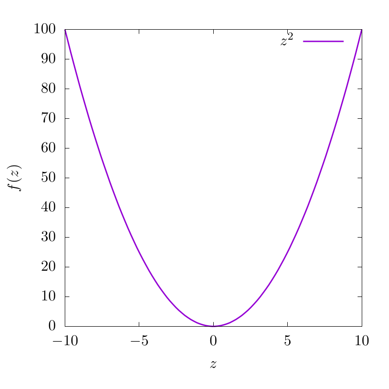
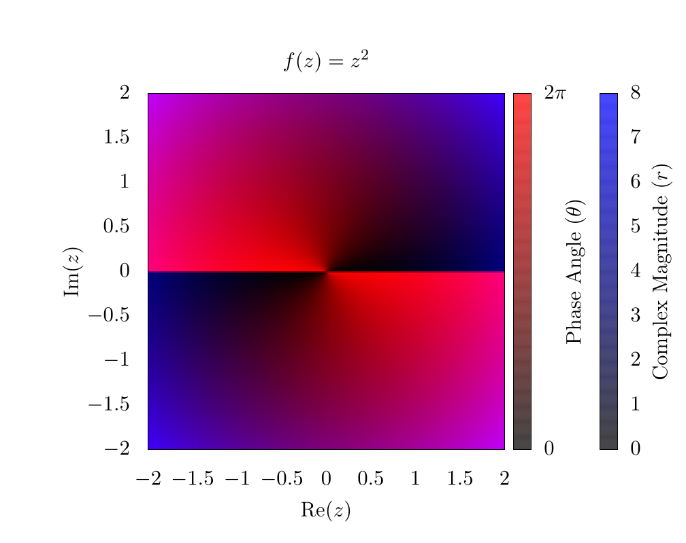

# Domain coloring

Domain coloring is a much more complicated plotting technique than those outlined in the [plotting chapter](../plotting/plotting.md) and is used to plot complex functions where both the input and output have imaginary and real components.
For the code in this chapter, we will focus on languages that are easily able to plot two-dimensional images or heatmaps, instead of languages meant for number-crunching.
That is to say that this chapter will certainly have a code implementation in gnuplot, but it will not likely have an implementation in C, Fortran, or Java because these languages do not have plotting capabilities in-built.

Imagine the following function: $$f(z) = z^2$$.
In this case, we could create a plot that looks like this:

    

This indicates that for various input values along $$z$$, we have different function outputs from $$f(z)$$.
Now let's imagine another function with complex input $$(z \in \mathbb{C})$$, but a purely real output $$(f(z) \in \mathbb{R})$$:

$$
f(z) = |z|
$$

In this case, each complex input has a real output.
This can be plotted as a two-dimensional dataset like so:

    

Here, the $$x$$-axis and $$y$$-axis represent the real and imaginary components of the input variable, respectively.
The colorbar represents the output of $$f(z)$$.

At this point, we can start to see the problem.
If the output of $$f(z)$$ also requires plotting of the real and imaginary components, then we would need four dimensions to appropriately represent the function space, one axis for the real component and another for the imaginary component of both the input ($$z$$) and the output of $$f(z)$$!
Unfortunately, feeble human minds are incapable of understanding four spatial dimensions without projecting onto lower dimensionality, so we need to improvise.

We do this by assuming the complex output can be represented in the following form:

$$
z = re^{i \theta} = r(\cos(\theta) + i\sin(\theta))
$$

where, $$r$$ is a complex magnitude and $$\theta$$ is a complex phase.
This is the formula for a circle in the complex plane and we can easily find $$r$$ and $$\theta$$ like so:

$$
\begin{align}
    r &= \sqrt{\text{Re}(z)^2 + \text{Im}(z)^2} \\ 
    \theta &= \text{atan}\left(\frac{\text{Im}(z)}{\text{Re}(z)}\right)
\end{align}
$$

Once we have our complex function output in this form, we then color the output domain according to a color space with at least 2 independent dimensions, like RGB (Red, Green, Blue), or HSV (Hue, Saturation, Value) [CITE].
The choice of color space is completely dependent on what the users feel is most visually intuitive.
In any case, one dimension of the color system will be used to represent the complex magnitude of the output and another dimension of the color system will be used to represent the complex phase.
The $$xy$$ grid will be representing the real and imaginary inputs to these functions.
That is to say, we plug every value in the 2D complex plane into the function and then color each pixel based on the function output.

As an example, let's look at the simplest function we can $$f(z) = z$$, but in this case $$z \in \mathbb{C}$$.
If we use an RGB color scheme, where red represents $$\theta$$ and blue represents $$r$$, we can generate the following image:

    

As a note here, there is a clear phase discontinuity along the vertical axis.
That is to say that the complex phase wraps around the origin, ranging from 0 (clear) to $$2\pi$$ (red).
In addition, the edges of the plot are blue because the function value increases linearly as we move from the origin.

If we instead look at the function $$f(z) = z^2$$, we can generate a similar plot:

    

Here, it is clear that the complex phase wraps around the origin twice, creating two separate phase discontinuities on top of each other.
This indicates a $$4\pi$$ phase winding, and for some purposes, such as vortex tracking for inviscid fluids, this visualizaton is ideal, because a vortex is located precisely at the phase discontinuity [CITE].
For other purposes, the discontinuity is visually distracting, and for this reason, many people use an HSV scheme for plotting complex functions.
So here is the same function $$\left(f(z)=z^2\right)$$, but using hue to represent the complex phase and saturation to represent the magnitude.

    

Here, the value for HSV was always set to 1.
When looking at the edges of the plot, the hue changes rapidly, but each color is mirrored on the oposite edge.
This indicated the $$4\pi$$ phase winding we saw in the RGB plots.
Also, because the complex magnitude increases as we move further from the center of the plot, the saturation also increases.
Thus the very center of the plot is completely washed out!
We need to fix this in subsequent plots to make them representative of the actual data.

## Example Code

Here is the full script to generate a domain colored output of $$f(z)=z^2$$.

## License

##### Code Examples

The code examples are licensed under the MIT license (found in [LICENSE.md](https://github.com/algorithm-archivists/algorithm-archive/blob/master/LICENSE.md)).

##### Text

The text of this chapter was written by [James Schloss](https://github.com/leios) and is licensed under the [Creative Commons Attribution-ShareAlike 4.0 International License](https://creativecommons.org/licenses/by-sa/4.0/legalcode).

[

](https://creativecommons.org/licenses/by-sa/4.0/)

##### Images/Graphics

##### Pull Requests

The following pull requests have modified the text or graphics of this chapter:
- none
