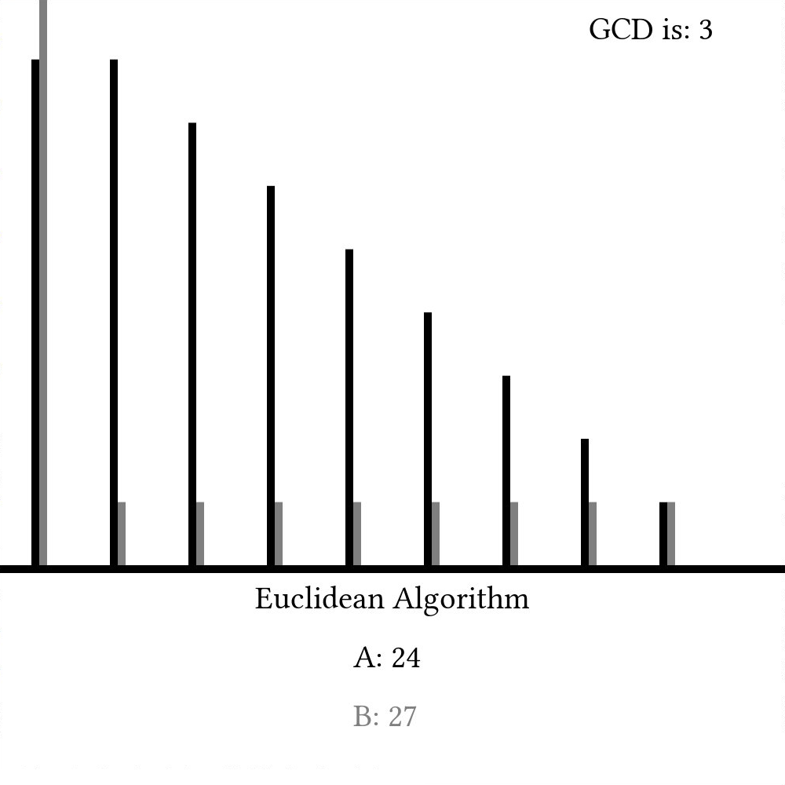

# Euclidean Algorithm

Computer science is (almost by definition) a science about computers -- a device first conceptualized in the 1800's. Computers have become so revolutionary, that it is difficult to think of our lives today without them. That said, *algorithms* are much older and have existed in the world for millennia. Incredibly, a few of the algorithms created before the Common Era (AD) are still in use today. One such algorithm was first described in Euclid's *Elements* (~ 300 BC) and has come to be known as the *Euclidean Algorithm*.

The algorithm is a simple way to find the *greatest common divisor* (GCD) of two numbers, which is useful for a number of different applications (like reducing fractions). The first method (envisioned by Euclid) uses simple subtraction:



[import:17-30, lang="c_cpp"](code/c/euclidean_example.c)

[import:8-23, lang="csharp"](code/csharp/EuclideanAlgorithm.cs)

[import:2-8, lang="clojure"](code/clojure/euclidean_example.clj)

[import:18-31, lang="c_cpp"](code/c++/euclidean.cpp)

[import:3-16, lang="java"](code/java/EuclideanAlgo.java)

[import:3-13, lang="kotlin"](code/kotlin/Euclidean.kt)

[import:15-29, lang="javascript"](code/javascript/euclidean_example.js)

[import:3-12, lang="lisp"](code/clisp/euclidean_algorithm.lisp)

[import:11-22, lang="python"](code/python/euclidean_example.py)

[import:2-8, lang="haskell"](code/haskell/euclidean_example.hs)

[import:3-15, lang="rust"](code/rust/euclidean_example.rs)

[import:9-17, lang="ocaml"](code/ocaml/euclidean_example.ml)

[import:25-38, lang="go"](code/go/euclidean.go)

[import:1-14, lang="swift"](code/swift/euclidean_algorithm.swift)

[import:3-17, lang="matlab"](code/matlab/euclidean.m)

[import:1-14, lang="lua"](code/lua/euclidean.lua)

[import:12-25, lang="julia"](code/julia/euclidean.jl)

[import:13-24, lang="nim"](code/nim/euclid_algorithm.nim)

[import:35-56, lang="asm-x64"](code/asm-x64/euclidean_example.s)

[import:1-19, lang="fortran"](code/fortran/euclidean.f90)

[import:4-18, lang="php"](code/php/euclidean.php)

[import:1-13, lang="factor"](code/factor/euclid.factor)

[import, lang="whitespace"](code/whitespace/euclidian_sub.ws)

[import:3-8, lang="scala"](code/scala/euclidean.scala)

[import:3-14, lang="lisp"](code/racket/euclidean_algorithm.rkt)

[import:8-19, lang="ruby"](code/ruby/euclidean.rb)

[import:1-13, lang="smalltalk"](code/smalltalk/euclid.st)

[import:2-17, lang:"emojicode"](code/emojicode/euclidean_algorithm.emojic)

[import:25-40, lang="LOLCODE"](code/lolcode/euclid.lol)

[import:24-38, lang="bash"](code/bash/euclid.bash)

[import:19-33, lang="d"](code/d/euclidean_algorithm.d)

>  

[import:1-7, lang="scheme"](code/scheme/euclidalg.ss)


Here, we simply line the two numbers up every step and subtract the lower value from the higher one every timestep. Once the two values are equal, we call that value the greatest common divisor. A graph of `a` and `b` as they change every step would look something like this:

    

Modern implementations, though, often use the modulus operator (%) like so



[import:4-16, lang="c_cpp"](code/c/euclidean_example.c)

[import:25-39, lang="csharp"](code/csharp/EuclideanAlgorithm.cs)

[import:9-13, lang="clojure"](code/clojure/euclidean_example.clj)

[import:5-15, lang="c_cpp"](code/c++/euclidean.cpp)

[import:18-26, lang="java"](code/java/EuclideanAlgo.java)

[import:15-26, lang="kotlin"](code/kotlin/Euclidean.kt)

[import:1-13, lang="javascript"](code/javascript/euclidean_example.js)

[import:13-17, lang="lisp"](code/clisp/euclidean_algorithm.lisp)

[import:1-9, lang="python"](code/python/euclidean_example.py)

[import:10-14, lang="haskell"](code/haskell/euclidean_example.hs)

[import:17-27, lang="rust"](code/rust/euclidean_example.rs)

[import:3-7, lang="ocaml"](code/ocaml/euclidean_example.ml)

[import:14-23, lang="go"](code/go/euclidean.go)

[import:16-27, lang="swift"](code/swift/euclidean_algorithm.swift)

[import:19-31, lang="matlab"](code/matlab/euclidean.m)

[import:16-25, lang="lua"](code/lua/euclidean.lua)

[import:1-10, lang="julia"](code/julia/euclidean.jl)

[import:1-11, lang="nim"](code/nim/euclid_algorithm.nim)

[import:10-33, lang="asm-x64"](code/asm-x64/euclidean_example.s)

[import:21-34, lang="fortran"](code/fortran/euclidean.f90)

[import:20-30, lang="php"](code/php/euclidean.php)

[import:15-25, lang="factor"](code/factor/euclid.factor)

[import, lang="whitespace"](code/whitespace/euclidian_mod.ws)

[import:10-14, lang="scala"](code/scala/euclidean.scala)

[import:16-24, lang="lisp"](code/racket/euclidean_algorithm.rkt)

[import:1-6, lang="ruby"](code/ruby/euclidean.rb)

[import:15-25, lang="smalltalk"](code/smalltalk/euclid.st)

[import:19-31, lang:"emojicode"](code/emojicode/euclidean_algorithm.emojic)

[import:9-23, lang="LOLCODE"](code/lolcode/euclid.lol)

[import:10-22, lang="bash"](code/bash/euclid.bash)

[import:4-17, lang="d"](code/d/euclidean_algorithm.d)

>  

[import:9-12, lang="scheme"](code/scheme/euclidalg.ss)


Here, we set `b` to be the remainder of `a%b` and `a` to be whatever `b` was last timestep. Because of how the modulus operator works, this will provide the same information as the subtraction-based implementation, but when we show `a` and `b` as they change with time, we can see that it might take many fewer steps:

    

The Euclidean Algorithm is truly fundamental to many other algorithms throughout the history of computer science and will definitely be used again later. At least to me, it's amazing how such an ancient algorithm can still have modern use and appeal. That said, there are still other algorithms out there that can find the greatest common divisor of two numbers that are arguably better in certain cases than the Euclidean algorithm, but the fact that we are discussing Euclid two millennia after his death shows how timeless and universal mathematics truly is. I think that's pretty cool.

## Video Explanation

Here's a video on the Euclidean algorithm:

<iframe width="560" height="315" src="https://www.youtube.com/embed/h86RzlyHfUE" frameborder="0" allow="accelerometer; autoplay; encrypted-media; gyroscope; picture-in-picture" allowfullscreen></iframe>

## Example Code



[import, lang="c_cpp"](code/c/euclidean_example.c)

##### EuclideanAlgorithm.cs
[import, lang="csharp"](code/csharp/EuclideanAlgorithm.cs)
##### Program.cs
[import, lang="csharp"](code/csharp/Program.cs)

[import, lang="clojure"](code/clojure/euclidean_example.clj)

[import, lang="c_cpp"](code/c++/euclidean.cpp)

[import, lang="java"](code/java/EuclideanAlgo.java)

[import, lang="javascript"](code/javascript/euclidean_example.js)

[import, lang="lisp"](code/clisp/euclidean_algorithm.lisp)

[import, lang="python"](code/python/euclidean_example.py)

[import, lang="haskell"](code/haskell/euclidean_example.hs)

[import, lang="rust"](code/rust/euclidean_example.rs)

[import, lang="ocaml"](code/ocaml/euclidean_example.ml)

[import, lang="go"](code/go/euclidean.go)

[import, lang="swift"](code/swift/euclidean_algorithm.swift)

[import, lang="matlab"](code/matlab/euclidean.m)

[import, lang="lua"](code/lua/euclidean.lua)

[import, lang="julia"](code/julia/euclidean.jl)

[import, lang="nim" %](code/nim/euclid_algorithm.nim)

[import, lang="asm-x64"](code/asm-x64/euclidean_example.s)

[import, lang="fortran"](code/fortran/euclidean.f90)

[import, lang="php"](code/php/euclidean.php)

[import, lang="factor"](code/factor/euclid.factor)

Here is a readable version of the algorithms with comments. First, subtraction method:
[import, lang="whitespace"](code/whitespace/euclidian_sub_comments.ws)
and modulo method:
[import, lang="whitespace"](code/whitespace/euclidian_mod_comments.ws)

[import, lang="scala"](code/scala/euclidean.scala)

[import, lang="lisp"](code/racket/euclidean_algorithm.rkt)

[import, lang="ruby"](code/ruby/euclidean.rb)

[import, lang="smalltalk"](code/smalltalk/euclid.st)

[import, lang:"emojicode"](code/emojicode/euclidean_algorithm.emojic)

[import, lang="LOLCODE"](code/lolcode/euclid.lol)

[import, lang="bash"](code/bash/euclid.bash)

[import, lang="d"](code/d/euclidean_algorithm.d)

A text version of the program is provided for both versions.
#### Subtraction
>  

[import:23-107](code/piet/euclidian_algorithm.piet)

#### Modulo
>  

[import:126-146](code/piet/euclidian_algorithm.piet)

[import:, lang="scheme"](code/scheme/euclidalg.ss)


## License

##### Code Examples

The code examples are licensed under the MIT license (found in [LICENSE.md](https://github.com/algorithm-archivists/algorithm-archive/blob/master/LICENSE.md)).

##### Text

The text of this chapter was written by [James Schloss](https://github.com/leios) and is licensed under the [Creative Commons Attribution-ShareAlike 4.0 International License](https://creativecommons.org/licenses/by-sa/4.0/legalcode).

[

](https://creativecommons.org/licenses/by-sa/4.0/)

##### Images/Graphics
- The image "[Euclidsub](res/subtraction.png)" was created by [James Schloss](https://github.com/leios) and is licenced under the [Creative Commons Attribution-ShareAlike 4.0 International License](https://creativecommons.org/licenses/by-sa/4.0/legalcode).
- The image "[Euclidmod](res/modulus.png)" was created by [James Schloss](https://github.com/leios) and is licenced under the [Creative Commons Attribution-ShareAlike 4.0 International License](https://creativecommons.org/licenses/by-sa/4.0/legalcode).

##### Pull Requests

After initial licensing ([#560](https://github.com/algorithm-archivists/algorithm-archive/pull/560)), the following pull requests have modified the text or graphics of this chapter:
- none
