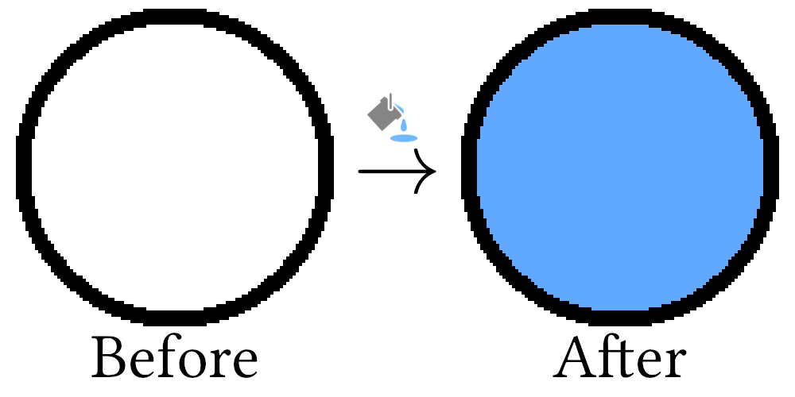
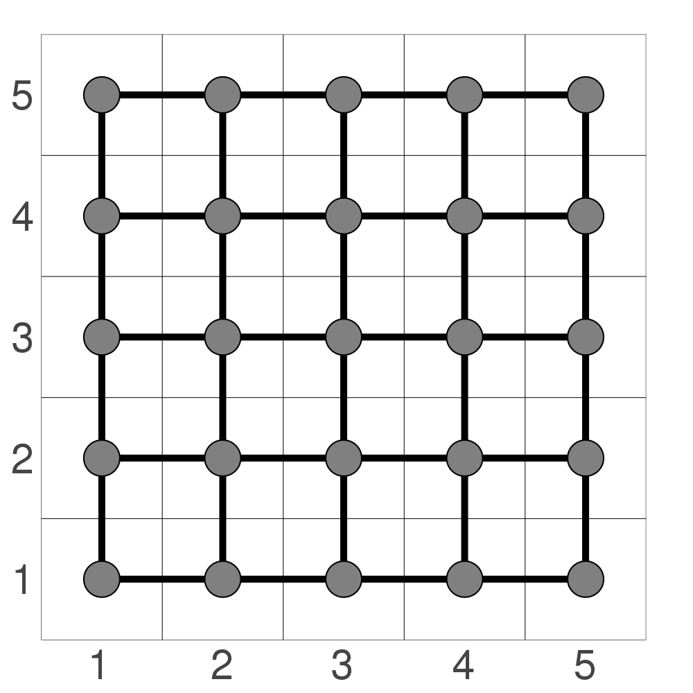
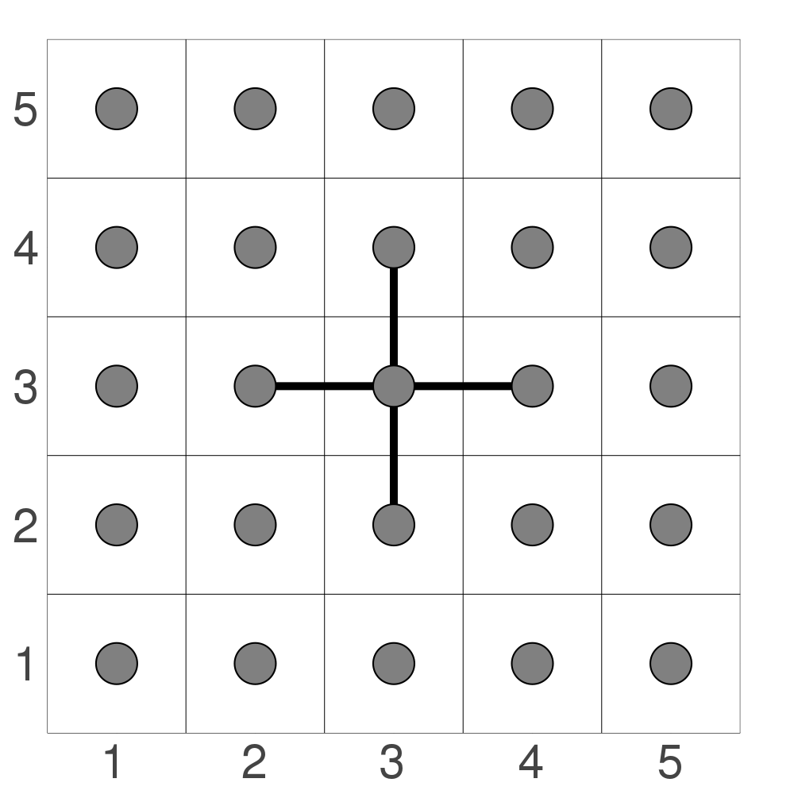
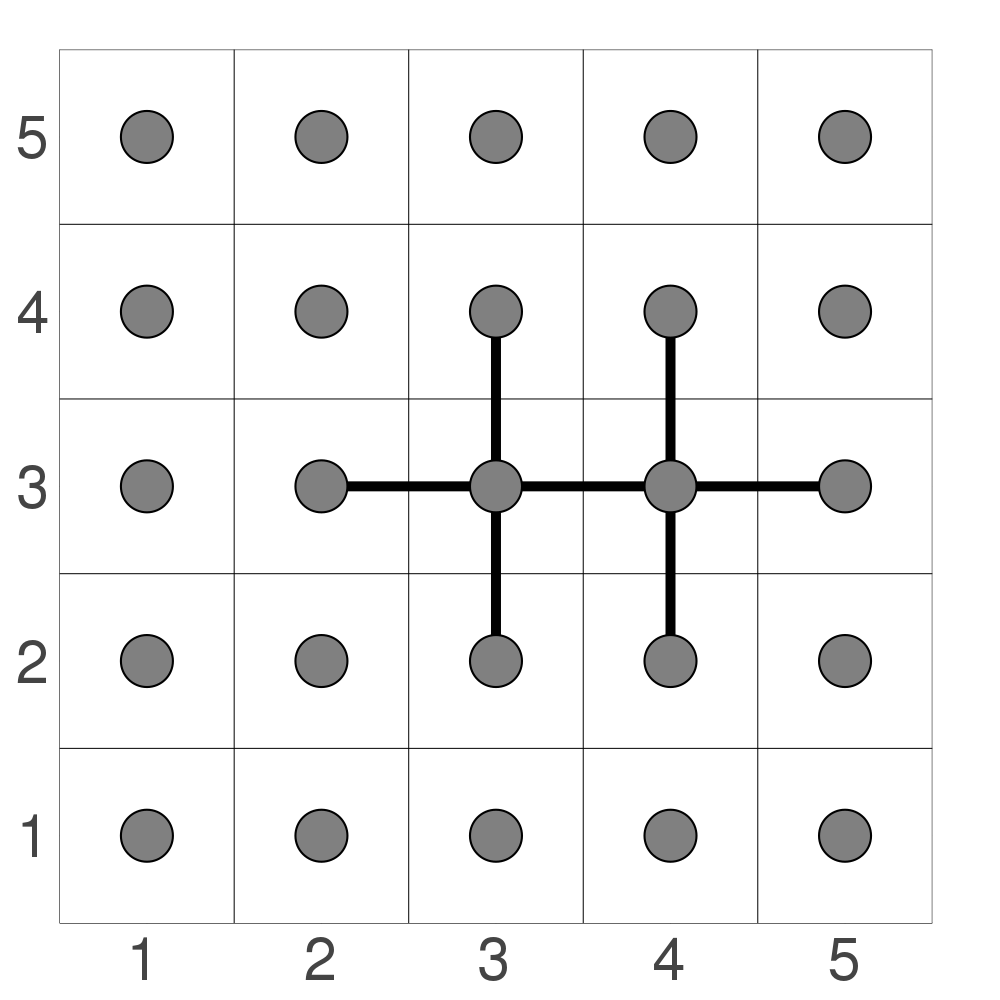

# Flood Fill

Flood fill is a method that is surprisingly useful in a large number of different situations and keeps finding me wherever I go.
When I was completing my PhD, I had an idea to track superfluid vortices by using flood fill as a way to help mask out unnecessary features of the simulation.
When I was making a terminal game, I thought of creating an animation that was just flood fill in disguise.
When I decided to play minesweeper or Go with my girlfriend, flood fill was used in both!

Flood fill is probably most commonly known as the "Bucket Fill" application in most art programs {{ "gimp_bucket" | cite }}.
It's usually indicated by an icon that looks like a bucket and is known to fill in any enclosed area, as shown below:

    

Because flood fill is incredibly common, there are a large number of variations to the method, some of which are more optimal than others.
For this chapter, we will cover the basics: how to fill a domain in a quick and dirty way.
In subsequent chapters, we will continue our journey by creating more and more efficient flood fill methods, including scanline-based and fixed memory methods {{ "torbert2016" | cite }}.

I have decided to split the chapter up for a few important reasons:
1. I did not want to flood the Algorithm Archive with flood fill methods all at the same time.
I feel it's worth letting each chapter sit for a bit while we savor it's unique flavor.
2. Many users are implementing versions of each algorithm in their own languages and it is difficult to review and submit code for chapters with a lot of code chunks.
Several sub-chapters with less code is easier for everyone.
3. I am kinda under a time-constraint right now and wanted to make sure we regularly get content into the Algorithm Archive.

So, without further a-do, let's hop right into it!

## What does flood fill do?

Flood fill is essentially composed of 2 parts:
1. Determining the extents of the domain to fill
2. Walking through all elements within a domain and changing some property

For the purposes of this chapter, we will be using a set of floating-point values that range from 0 to 1 instead of a color-space like RGB.
Though bucket fill is always used in art programs in some sort of color space, flood fill is more general and can be used in a space with any type of element.
As such, it makes sense to use a simpler element type so we can better understand the method.

So how do we go about finding the extents of the domain to fill?

Here, a domain will be defined as any connected set of elements in an $$n$$-dimensional space whose values do not vary beyond a predefined threshold.
As an example, if we take a circle embedded into a 2-dimensional grid, we have 3 separate domains:
1. Inside the circle where all elements are 0.
2. The circle, itself, where the elements are set to 0.75.
3. Outside the circle where all elements are similarly 0.

    

Though there are some more complicated ways to determine the extents of the domain, we will not focus on this aspect of the flood fill method for the remainder of this chapter and instead leave it for subsequent chapters.
So now we will focus on the process of walking through each element in the domain and changing some property.

## Domain traversal

As before, the simplest example to work with is that of an image, where each element in our domain is a single pixel.
Here, we can connect each pixel to all other pixels in its vicinity, like so:

    

In this image, a border is shown between each individual pixel and a grid is superimposed to show how each pixel is connected to its neighbors.
This means that each element has 4 neighbors: north, south, east, and west.
We could also include northeast, southeast, southwest, and northwest if we wanted to do an 8-way fill, but we will restrict the discussion to the 4-way fill for now, as the method is essentially the same and slightly easier to understand with fewer elements to worry about.

By connecting each pixel to its neighbors in this way, the flood fill operation becomes a process of graph traversal, not too dissimilar from the [tree traversal](../tree_traversal/tree_traversal.md) methods described before.
This means that after selecting our initial location, we can then traverse through all elements in either a depth-first or breadth-first fashion.
We will be covering the following this chapter:

1. Finding all neighbors
2. Depth-first node traversal
3. Breadth-first node traversal and small-scale optimizations

So let's start by discussing how we might go about finding the neighbors to fill.

### Finding all neighbors

The first step of this method is to query the location of all possible neighbors.
At first glance, this seems rather straightforward.
One simply needs to look up, down, left, and right of the current location and add those elements to the list of neighbors if they are:

1. On the canvas
2. Have a value *close enough* to the old value we would like to replace

In code, this might look like this:



[import:23-41, lang:"julia"](code/julia/flood_fill.jl)

[import:28-46, lang:"c"](code/c/flood_fill.c)

[import:19-44, lang:"cpp"](code/cpp/flood_fill.cpp)

[import:10-25, lang="python"](code/python/flood_fill.py)

[import:15-20, lang="coconut"](code/coconut/flood_fill.coco)


This code is set up to return a vector of elements to then use for subsequent sections.

### Depth-first node traversal

Now that we have the ability to find all neighboring elements, we can proceed to traverse through those nodes in the most straightforward way: recursion.

In code, it might look like this:



[import:92-104, lang:"julia"](code/julia/flood_fill.jl)

[import:174-189, lang:"c"](code/c/flood_fill.c)

[import:46-64, lang:"cpp"](code/cpp/flood_fill.cpp)

[import:55-63, lang="python"](code/python/flood_fill.py)

[import:52-61, lang:"coconut"](code/coconut/flood_fill.coco)


The above code continues recursing through available neighbors as long as neighbors exist, and this should work so long as we are adding the correct set of neighbors.

Additionally, it is possible to do the same type of traversal by managing a stack, like so:



[import:43-63, lang:"julia"](code/julia/flood_fill.jl)

[import:79-102, lang:"c"](code/c/flood_fill.c)

[import:95-123, lang:"cpp"](code/cpp/flood_fill.cpp)

[import:27-36, lang="python"](code/python/flood_fill.py)

[import:23-34, lang:"coconut"](code/coconut/flood_fill.coco)


This is ultimately the same method of traversal as before; however, because we are managing our own data structure, there are a few distinct differences:
1. The manually managed stack could be slightly slower and potentially more memory-intensive
2. It is easy to reach the maximum recursion depth on certain hardware with the recursive method, so it is best to use the stack-based implementation in those cases.

If we were to use either of these methods to fill a circle embedded in a two dimensional domain, we would see the following

<video style="width:70%" controls loop>
  <source src="res/recurse_animation.mp4" type="video/mp4">
Your browser does not support the video tag.
</video>

Here, we see that these methods will traverse through one direction first before filling from there.
This is potentially the easiest method to write, but it is not the most intuitive fill pattern.
I suspect that if someone was asked to fill the contents of the circle on their own, they would fill it more evenly from the center, like so:

<video style="width:70%" controls loop>
  <source src="res/queue_animation.mp4" type="video/mp4">
Your browser does not support the video tag.
</video>

This is simply another traversal strategy known as breadth-first traversal and comes with its own set of caveats.
We will discuss this further in the next subsection

### Breadth-first node traversal and small-scale optimizations

Breadth-first node traversal is as simple as switching the stack in the depth-first strategy with a queue.
The code would look something like this:



[import:66-90, lang:"julia"](code/julia/flood_fill.jl)

[import:149-172, lang:"c"](code/c/flood_fill.c)

[import:66-93, lang:"cpp"](code/cpp/flood_fill.cpp)

[import:38-53, lang="python"](code/python/flood_fill.py)

[import:36-49, lang:"coconut"](code/coconut/flood_fill.coco)


Now, there is a small trick in this code that must be considered to make sure it runs optimally.
Namely, the nodes must be colored *when they are being enqueued*, not when visiting the node.
At least for me, it was not immediately obvious why this would be the case, but let me try to explain.

Let's imagine that we decided to write code that colored all neighboring nodes only when visiting them.
When querying all possible neighbors, we will add 4 elements to the queue for the north, south, east, and west neighbors of the initial node, as shown below:

    

Now let's imagine we travel east first.
It then enqueues three more nodes: north, south, and east again.
This is shown below:

    

It does not enqueue its west neighbor because this has already been colored.
At this stage, we will have six nodes ready to be colored and 2 that are already colored.
Now let's say we travel north next.
This node will enqueue three more nodes: west, north, and east, as shown below:

    

The problem is that the east element has *already been enqueued for coloring by the previous node*!.
This shared element is colored in red.
As we progress through all four initial neighbors, we will find 4 nodes that are doubly enqueued: all directions diagonal to the initial location!
This is again shown below:

    

As the number of nodes increases, so does the number of duplicate nodes.
A quick fix is to color the nodes *when they are being enqueued* like in the example code above.
When doing this, duplicates will not be enqueued with a breadth-first scheme because they will already be colored when other nodes are trying to find their neighbors.
This created a node connection pattern like so:

    

As some final food for thought: why wasn't this a problem with the depth-first strategy?
The simple answer is that it actually was an issue, but it was way less prevalent.
With the depth-first strategy, a number of unnecessary nodes are still pushed to the stack, but because we consistently push one direction before spreading out to other directions, it is more likely that the nodes have filled neighbors when they are looking for what to fill around them.

Simply put: depth-first traversal is slightly more efficient in this case unless you can color as querying for neighbors, in which case breadth-first is more efficient.

## Conclusions

As stated before, the method discussed in this chapter is just the tip of the iceberg and many other flood fill methods exist that are likely to be more efficient for most purposes.
These will all be covered in subsequent chapters which will come out somewhat regularly throughout the next few months, lest we flood that archive with flood fill methods.

## Video Explanation

Here is a video describing tree traversal:

<iframe width="560" height="315" src="https://www.youtube-nocookie.com/embed/ldqAmkdthHY" frameborder="0" allow="accelerometer; autoplay; encrypted-media; gyroscope; picture-in-picture" allowfullscreen></iframe>

## Example Code

The example code for this chapter will be the simplest application of flood fill that still adequately tests the code to ensure it is stopping at boundaries appropriately.
For this, we will create a two dimensional array of floats, all starting at 0.0, and then set a single vertical line of elements at the center to be 1.0.
After, we will fill in the left-hand side of the array to be all ones by choosing any point within the left domain to fill.



[import, lang:"julia"](code/julia/flood_fill.jl)

[import, lang:"c"](code/c/flood_fill.c)

[import, lang:"cpp"](code/cpp/flood_fill.cpp)

[import:, lang="python"](code/python/flood_fill.py)

[import, lang="coconut"](code/coconut/flood_fill.coco)


### Bibliography

 

## License

##### Code Examples

The code examples are licensed under the MIT license (found in [LICENSE.md](https://github.com/algorithm-archivists/algorithm-archive/blob/main/LICENSE.md)).

##### Text

The text of this chapter was written by [James Schloss](https://github.com/leios) and is licensed under the [Creative Commons Attribution-ShareAlike 4.0 International License](https://creativecommons.org/licenses/by-sa/4.0/legalcode).

[

](https://creativecommons.org/licenses/by-sa/4.0/)

##### Images/Graphics
- The image "[Example Bucket Fill](res/example.png)" was created by [James Schloss](https://github.com/leios) and is licensed under the [Creative Commons Attribution-ShareAlike 4.0 International License](https://creativecommons.org/licenses/by-sa/4.0/legalcode).
- The image "[Circle Domains](res/simple_circle.png)" was created by [James Schloss](https://github.com/leios) and is licensed under the [Creative Commons Attribution-ShareAlike 4.0 International License](https://creativecommons.org/licenses/by-sa/4.0/legalcode).
- The image "[Grid 1](res/grid_1.png)" was created by [James Schloss](https://github.com/leios) and is licensed under the [Creative Commons Attribution-ShareAlike 4.0 International License](https://creativecommons.org/licenses/by-sa/4.0/legalcode).
- The image "[Grid 2](res/grid_2.png)" was created by [James Schloss](https://github.com/leios) and is licensed under the [Creative Commons Attribution-ShareAlike 4.0 International License](https://creativecommons.org/licenses/by-sa/4.0/legalcode).
- The image "[Grid 3](res/grid_3.png)" was created by [James Schloss](https://github.com/leios) and is licensed under the [Creative Commons Attribution-ShareAlike 4.0 International License](https://creativecommons.org/licenses/by-sa/4.0/legalcode).
- The image "[Grid 4](res/grid_4.png)" was created by [James Schloss](https://github.com/leios) and is licensed under the [Creative Commons Attribution-ShareAlike 4.0 International License](https://creativecommons.org/licenses/by-sa/4.0/legalcode).
- The image "[Grid 5](res/grid_5.png)" was created by [James Schloss](https://github.com/leios) and is licensed under the [Creative Commons Attribution-ShareAlike 4.0 International License](https://creativecommons.org/licenses/by-sa/4.0/legalcode).
- The image "[Grid 6](res/grid_6.png)" was created by [James Schloss](https://github.com/leios) and is licensed under the [Creative Commons Attribution-ShareAlike 4.0 International License](https://creativecommons.org/licenses/by-sa/4.0/legalcode).
- The video "[Stack Fill](res/recurse_animation.mp4)" was created by [James Schloss](https://github.com/leios) and is licensed under the [Creative Commons Attribution-ShareAlike 4.0 International License](https://creativecommons.org/licenses/by-sa/4.0/legalcode).
- The video "[Queue Fill](res/queue_animation.mp4)" was created by [James Schloss](https://github.com/leios) and is licensed under the [Creative Commons Attribution-ShareAlike 4.0 International License](https://creativecommons.org/licenses/by-sa/4.0/legalcode).
