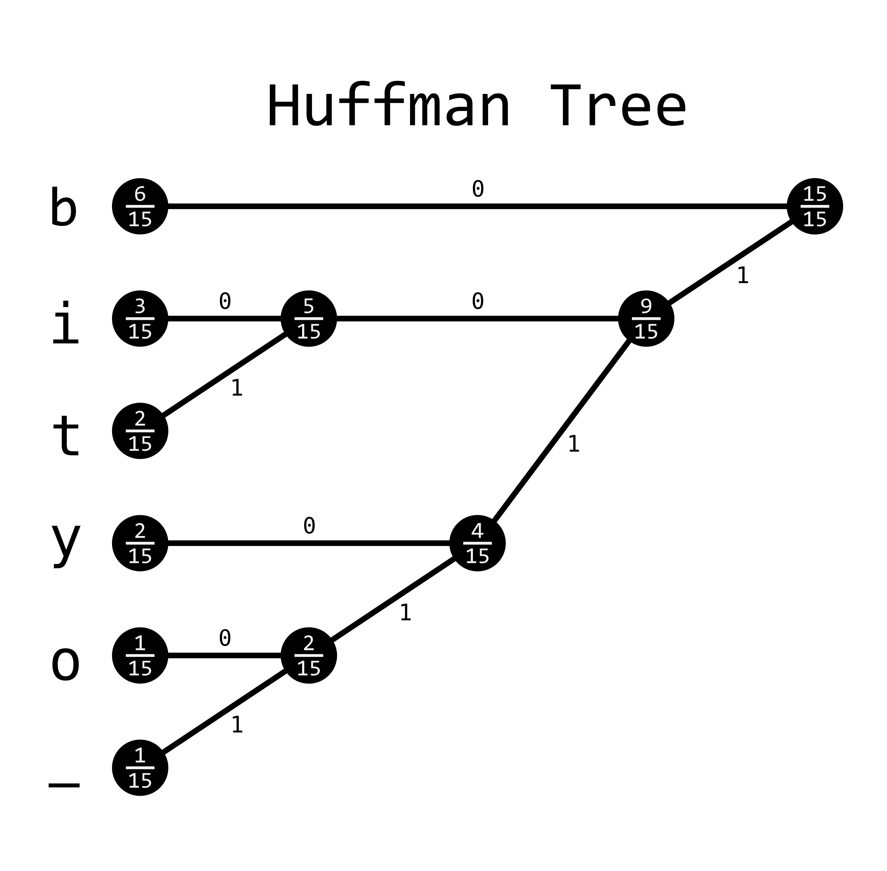

# Huffman Encoding

If there were ever a data compression method to take the world by storm, it would be Huffman encoding.
In fact, this was the method that got me into computational methods to begin with.
I distinctly remember sitting in my data compression class and talking about the great information theorist Claude Shannon and Robert Fano, when suddenly my professor introduced a new kid to the mix: David Huffman.
He managed to rip the heart out of the methods described by leaders of the field and create a data compression method that was easier to understand and implement, while also providing more robust results, and apparently this was all done for a school project!

It was in that moment, I knew I would never amount to anything.
I have since accepted that fact and moved on.

Huffman encoding follows from the problem described in the [Data Compression](../data_compression/data_compression.md) section.
We have a string that we want to encode into bits.
Huffman encoding ensures that our encoded bitstring is as small as possible without losing any information.
Because it is both lossless and guarantees the smallest possible bit length, it outright replaces both Shannon and Shannon-Fano encoding in most cases, which is a little weird because the method was devised while Huffman was taking a course from Fano, himself!

The idea is somewhat straightforward in principle, but a little difficult to code in practice.
By creating a binary tree of the input alphabet, every branch can be provided a unique bit representation simply by assigning a binary value to each child and reading to a character in a leaf node if starting from the root node.

So now the question is: how do we create a binary tree?
Well, here we build it from the bottom up like so:

1. Order all characters according to the frequency they appear in the input bitstring, with the most frequent character at the top of the list. Be sure to keep track of the frequencies, too!
2. Add the smallest two values together to create a new node with a new frequency.
3. Keep doing step 2 until the tree is complete.
4. Read the tree backwards from the root node and concatenate the final bitstring codeword. Keep all codewords and put them into your final set of codewords (sometimes called a codebook)
5. Encode your phrase with the codebook.

And that's it.
Here's an image of what this might look like for the phrase `bibbity_bobbity`:

    

This will create a codebook that looks like this:

| Character | Bit Representation |
| --------- | ------------------ |
| _b_       | 0                  |
| _i_       | 100                |
| _t_       | 101                |
| _y_       | 110                |
| _o_       | 1110               |
| ___       | 1111               |

and `bibbity_bobbity` becomes `01000010010111011110111000100101110`.
As mentioned this uses the minimum number of bits possible for encoding.
The fact that this algorithm is both conceptually simple and provably useful is rather extraordinary to me and is why Huffman encoding will always hold a special place in my heart.

## Video Explanation

Here is a quick video explanation for Huffman encoding:

<iframe width="560" height="315" src="https://www.youtube.com/embed/wHyUxTc2Ohk" frameborder="0" allow="accelerometer; autoplay; encrypted-media; gyroscope; picture-in-picture" allowfullscreen></iframe>

## Example Code
In code, this can be a little tricky. It requires a method to continually sort the nodes as you add more and more nodes to the system.
The most straightforward way to do this in some languages is with a priority queue, but depending on the language, this might be more or less appropriate.
In addition, to read the tree backwards, some sort of [Depth First Search](../tree_traversal/tree_traversal.md) needs to be implemented.
Whether you use a stack or straight-up recursion also depends on the language, but the recursive method is a little easier to understand in most cases.



[import, lang:"julia"](code/julia/huffman.jl)

[import, lang:"rust"](code/rust/huffman.rs)

[import, lang:"c"](code/c/huffman.c)

[import, lang:"haskell"](code/haskell/huffman.hs)

##### HuffmanCoding.cs
[import, lang:"csharp"](code/csharp/HuffmanCoding.cs)
##### Program.cs
[import, lang:"csharp"](code/csharp/Program.cs)

[import, lang="lua"](code/lua/huffman.lua)

[import, lang:"cpp"](code/c++/huffman.cpp)

[import, lang:"clojure"](code/clojure/huffman.clj)

[import, lang:"python"](code/python/huffman.py)

[import, lang:"javascript"](code/javascript/huffman.js)

[import, lang:"java"](code/java/huffman.java)

[import, lang:"go"](code/golang/huffman.go)

[import, lang:"asm-x64"](code/asm-x64/huffman.s)

[import, lang:"scala"](code/scala/huffman_encoding.scala)


## License

##### Code Examples

The code examples are licensed under the MIT license (found in [LICENSE.md](https://github.com/algorithm-archivists/algorithm-archive/blob/master/LICENSE.md)).

##### Text

The text of this chapter was written by [James Schloss](https://github.com/leios) and is licensed under the [Creative Commons Attribution-ShareAlike 4.0 International License](https://creativecommons.org/licenses/by-sa/4.0/legalcode).

[

](https://creativecommons.org/licenses/by-sa/4.0/)

##### Images/Graphics
- The image "[huffman_tree](res/huffman_tree.png)" was created by [Julian Schacher](https://github.com/julianschacher) and is licenced under the [Creative Commons Attribution-ShareAlike 4.0 International License](https://creativecommons.org/licenses/by-sa/4.0/legalcode).

##### Pull Requests

After initial licensing ([#560](https://github.com/algorithm-archivists/algorithm-archive/pull/560)), the following pull requests have modified the text or graphics of this chapter:
- none
