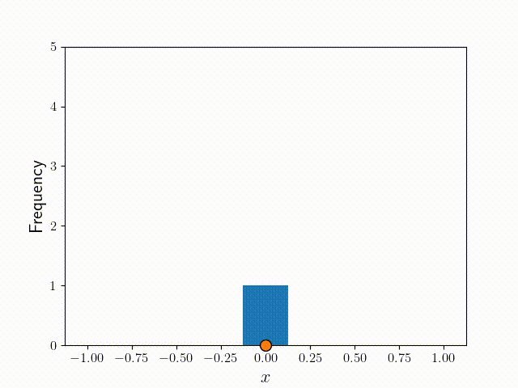
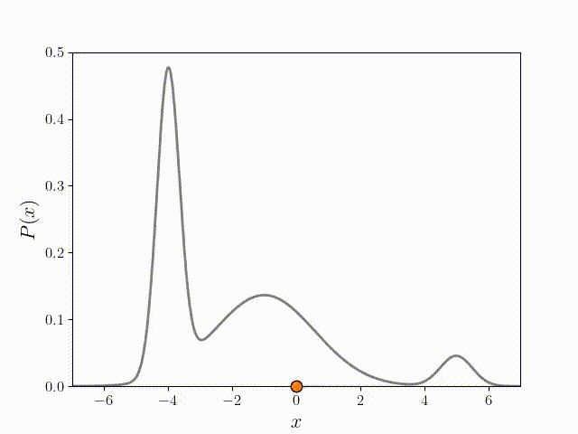

# Metropolis-Hastings Algorithm

We saw how [Monte Carlo Integration](../monte_carlo_integration/monte_carlo_integration.html) uses random numbers to approximate the area of pretty much any shape we choose. The Metropolis-Hastings algorithm is a slightly more advanced Monte Carlo method which uses random numbers to approximate a probability distribution. What's really powerful about this approach is that you don't need to know the probability function itself - you just need a function which is _proportional_ to it. 

Why is this helpful? Well, we often have probability functions of the following form:

$$
P(\mathbf{x}) = \frac{f(\mathbf{x})}{\int_D f(\mathbf{x})d\mathbf{x}}
$$

where $$D$$ is the domain, i.e., all possible values of the coordinates $$\mathbf{x}$$. 

It's often easy for us to know $$f(x)$$. But the integral in the denominator can be quite difficult to calculate, even numerically.
This is especially true when the coordinates ($$\mathbf{x}$$) are multidimensional, and $$f(\mathbf{x})$$ is an expensive calculation. One example of a use case is the Boltzmann distribution, for which $$f(x) = e^{-E(\mathbf{x})}$$, where $$E(\mathbf{x})$$ is some complicated high-dimensional energy function for a system. 

## Random walk in 1D

The Metropolis-Hastings Algorithm is very similar to a random walk, so let's first see how we can get a distribution from a random walk.

	 Random Walk in 1D" style="width:100%"/>

The dot above is a "walker", whose initial position is $$x=0$$. The step size, $$g$$, is a random number in the interval $$(-1, 1)$$. To get the next positions, we simply add $$g$$ to the current position. To get a distribution of $$x$$ from this walk, we can divide the domain into discrete locations or "bins" and count how often the walker visits each bin. Each time it visits a bin, the frequency for that bin goes up by one. Over many iterations, we get a distribution of $$x$$, in this case a random one. 

## Random walk, but with an acceptance criteria

The Metropolis-Hastings algorithm works in a similar way to the Random Walk, but differs crucially in one way - after choosing a random step for the walker, a decision is made about whether to __accept__  or __reject__ the step based on $$f(x)$$. Let's call $$x_t$$ the position before the step, and $$x'$$ the position after it. Then the probability of __accepting the step__ is given by

$$
A = \min \left(\frac{f(x')}{f(x_t)}, 1\right)
$$

The $$\min$$ function above implies that $$A$$ will be $$1$$ if $$f(x') \gt f(x_t)$$, which means that the move will __always__ be accepted if it is toward a higher probability position. Otherwise, it will be accepted with a probability of $$f(x') / f(x_t)$$. If we create a histogram of this walk for some arbitrary target function $$P(x)$$, we can see from the figure below that the frequency starts to look very much like it after many iterations! 

	 Metropolis Walk in 1D" style="width:100%"/>

## The full algorithm for a 1D example function

### Initialize

Let our target distribution be:
$$
P(x) = \frac{f(x)}{\int_{-10}^{10} f(x)}
$$

where $$f(x)$$ is the function proportional to it,
$$
f(x) = 10e^{-4(x+4)^2} + 3e^{-0.2(x+1)^2} + e^{-2(x-5)^2}
$$



[import:4-13, lang:"python"](code/python/metropolis.py)


We chose a sum of three Guassians because it is easy to verify - we know what the integral of it will be. The plot of $$P(x)$$ in the figure below shows three different peaks of varying width and height, with some overlap as well.

	 Plot of P(x)" style="width:60%"/>

Next, we choose some symmetric step generating function. Here we will use a random number in the interval $$(-1,1)$$



[import:15-17, lang:"python"](code/python/metropolis.py)


Choose the domain of $$x$$, and an initial point for $$ x_0 $$ ($$x_t$$ at $$t = 0$$) chosen randomly from the domain of $$x$$.



[import:34-35, lang:"python"](code/python/metropolis.py)


Then iterate:

1. Generate new position $$x' = x_t + g()$$
2. Calculate the acceptance probability, $$A = \min\left(1, \frac{f(x_{t+1})}{f(x)}\right)$$
3. Choose a random real number, $$u$$, between $$0$$ and $$1$$
4. Accept or reject:
    * If $$ u \leq A $$, then __accept__ move, and set new position, $$x_{t+1} = x' $$
    * Otherwise, __reject__ move, and set new position to current, $$x_{t+1} = x_t $$
5. Increment $$t \rightarrow t + 1$$ and repeat from step 1.

The code for steps 1 to 4 is:



[import:19-31, lang:"python"](code/python/metropolis.py)


The following plot shows the result of running the algorithm for different numbers of iterations ($$N$$), with the same initial position. The histograms are normalized so that they integrate to 1. We can see the convergence toward $$P(x)$$ as we increase $$N$$.

	 multiple histograms" style="width:100%"/>

## Full Example Code
The following code puts everything discussed together, and runs Metropolis-Hastings algorithm for $$N$$ steps. All the positions visited by the algorithm are then written to a file, which can be later read and fed into a histogram or other density calculating scheme. 



[import, lang:"python"](code/python/metropolis.py)


## Things to consider 

### The function for generating a random step

So far the function $$g$$ we used for  generating the next step is a random number in the interval $$(-1,1)$$. However, this can be any function symmetric about $$0$$ for the above algorithm to work. For example, it can be a number randomly from a list of numbers like $$[ -3, -1, -1, +1, +1, +3]$$. In higher dimensions, the function should be symmetric in all directions, such as multidimensional Gaussian function. All of these will work, but the exact choice of $$g$$ does affect how quickly the distribution will converge __and__ the resolution of the distribution. If the steps are too large, the resolution will be poor, but it will cover a broader range in a short time. Too small, and it will only sample a small region accurately. 

### A runaway walker

In the example above, the probability decays very quickly as $$x$$ goes far from the 3 peaks. But sometimes, the function can flatten out so that the acceptance probability is always close to 1. This means it will behave a lot like a random walker in those regions, and may drift away into infinity! So it is a good idea to apply some boundaries beyond which $$f(x)$$ will simply drop to zero.

## License

##### Code Examples

The code examples are licensed under the MIT license (found in [LICENSE.md](https://github.com/algorithm-archivists/algorithm-archive/blob/master/LICENSE.md)).

##### Text

The text of this chapter was written by [K. Shudipto Amin](https://github.com/shudipto-amin) and is licensed under the [Creative Commons Attribution-ShareAlike 4.0 International License](https://creativecommons.org/licenses/by-sa/4.0/legalcode).

[

](https://creativecommons.org/licenses/by-sa/4.0/)

##### Images/Graphics
- The image "[squarecircle](res/square_circle.png)" was created by [James Schloss](https://github.com/leios) and is licensed under the [Creative Commons Attribution-ShareAlike 4.0 International License](https://creativecommons.org/licenses/by-sa/4.0/legalcode).
- The animation "[simplemontecarlo](res/monte_carlo.gif)" was created by [James Schloss](https://github.com/leios) and is licensed under the [Creative Commons Attribution-ShareAlike 4.0 International License](https://creativecommons.org/licenses/by-sa/4.0/legalcode).

##### Pull Requests

After initial licensing ([#560](https://github.com/algorithm-archivists/algorithm-archive/pull/560)), the following pull requests have modified the text or graphics of this chapter:
- none
