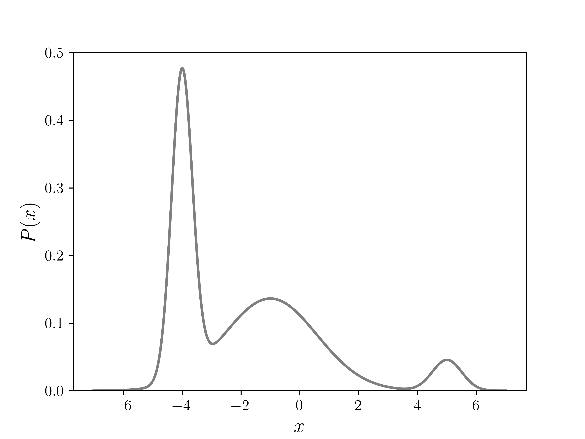

# Metropolis-Hastings Algorithm

We saw how [Monte Carlo Integration](../monte_carlo_integration/monte_carlo_integration.html) uses random numbers to approximate the area of pretty much any shape we choose. 
The Metropolis-Hastings algorithm is a slightly more advanced Monte Carlo method which uses random numbers to approximate a probability distribution.
What's really powerful about this approach is that you don't need to know the probability function itself - you just need a function which is _proportional_ to it. 

Why is this helpful? Well, we often have probability functions of the following form:

$$
P(\mathbf{x}) = \frac{f(\mathbf{x})}{\int_D f(\mathbf{x})d\mathbf{x}}
$$
where $$D$$ is the domain, i.e., all possible values of the coordinates $$\mathbf{x}$$. 
It's often easy for us to know $$f(x)$$ (eg. for a Gaussian distribution, it is $$e^{-x^2}$$). 
But the integral at the bottom can be quite difficult to calculate, even numerically.
This is especially true when the coordinates ($$\mathbf{x}$$) are multidimensional, and $$f(\mathbf{x})$$ is an expensive calculation. 

## Random walk in 1D

The Metropolis-Hastings Algorithm is very similar to a random walk, so let's first see how we can get a distribution from a random walk.

	 Random Walk in 1D" style="width:40%"/>

The dot above is a "walker", whose initial position is randomly chosen. We also divide the domain into discrete locations or "bins" and set the visit counter to be zero for each bin. Then at each iteration, the walker randomly choses to go either to the right ($$x \rightarrow x+1$$) or left ($$x \rightarrow x-1$$). Each time it visits a bin, the visit count for that bin goes up by one. Over time, we get a distribution of visits, in this case a random one. 

## Random walk, but with an acceptance criteria

The Metropolis-Hastings algorithm works in a similar way, but differs crucially in one way - after choosing a random step for the walker (left or right), a decision is made about whether to __reject__ or __accept__ the step. This decision is guided by $$f(x)$$, or any function that is proportional to the target probability function. 

	 Metropolis Walk in 1D" style="width:40%"/>

## The function for generating a random step

So far we used a very simple function for generating the next step: it will be either +1 or -1 to the current location. For the simple version of the algorithm to work, this can actually be any symmetric function. For example, it can be any real number between $$-a$$ and $$+a$$, or it can be sampled from some symmetric distribution, $$g$$, such as a Gaussian. 

## The full algorithm for a 1D example function

### Initialize

Let our target distribution be:
$$
P(x) = \frac{f(x)}{\int_{-10}^{10} f(x)}
$$

where $$f(x)$$ is the function proportional to it,
$$
f(x) = 10e^{-4(x+4)^2} + 3e^{-0.2(x+1)^2} + e^{-2(x-5)^2}
$$



[import:4-13, lang:"python"](code/python/metropolis.py)


We chose a sum of three Guassians because it is easy to verify - we know what the integral of it will be. The plot of $$P(x)$$ in the figure below shows three different peaks of varying width and height, with some overlap as well.

	 Plot of P(x)" style="width:40%"/>

Next, we choose some symmetric step generating function. Here we will use a random number in the interval $$(-1,1)$$


[import:15-17, lang:"python"](code/python/metropolis.py)


Choose the domain of $$x$$, and an initial point for $$ x_0 $$ ($$x_t$$ at $$t = 0$$) chosen randomly from the domain of $$x$$.



[import:34-35, lang:"python"](code/python/metropolis.py)


Then iterate:

1. Generate new position $$x' = x_t + g()$$
2. Calculate the acceptance probability, $$A = \min\left(1, \frac{f(x_{t+1})}{f(x)}\right)$$
3. Choose a random real number, $$u$$, between $$0$$ and $$1$$
4. Accept or reject:
    * If $$ u \leq A $$, then __accept__ move, and set new position, $$x_{t+1} = x' $$
    * Otherwise, __reject__ move, and set new position to current, $$x_{t+1} = x_t $$
5. Increment $$t \rightarrow t + 1$$ and repeat from step 1.

The code for steps 1 to 4 is:


[import:19-31, lang:"python"](code/python/metropolis.py)


The following plot shows the result of running the algorithm for different numbers of iterations ($$N$$), with the same initial position. The histograms are normalized so that they integrate to 1. We can see the convergence toward $$P(x)$$ as we increase $$N$$.

	 multiple histograms" style="width:100%"/>

## Full Example Code
The following code puts everything discussed together, and runs Metropolis-Hastings algorithm for $$N$$ steps. All the positions visited by the algorithm are then written to a file, which can be later read and fed into a histogram or other density calculating scheme. 


[import, lang:"python"](code/python/metropolis.py)


# === Monte Carlo ===

## License

##### Code Examples

The code examples are licensed under the MIT license (found in [LICENSE.md](https://github.com/algorithm-archivists/algorithm-archive/blob/master/LICENSE.md)).

##### Text

The text of this chapter was written by [K. Shudipto Amin](https://github.com/shudipto-amin) and is licensed under the [Creative Commons Attribution-ShareAlike 4.0 International License](https://creativecommons.org/licenses/by-sa/4.0/legalcode).

[

](https://creativecommons.org/licenses/by-sa/4.0/)

##### Images/Graphics
- The image "[squarecircle](res/square_circle.png)" was created by [James Schloss](https://github.com/leios) and is licensed under the [Creative Commons Attribution-ShareAlike 4.0 International License](https://creativecommons.org/licenses/by-sa/4.0/legalcode).
- The animation "[simplemontecarlo](res/monte_carlo.gif)" was created by [James Schloss](https://github.com/leios) and is licensed under the [Creative Commons Attribution-ShareAlike 4.0 International License](https://creativecommons.org/licenses/by-sa/4.0/legalcode).

##### Pull Requests

After initial licensing ([#560](https://github.com/algorithm-archivists/algorithm-archive/pull/560)), the following pull requests have modified the text or graphics of this chapter:
- none
