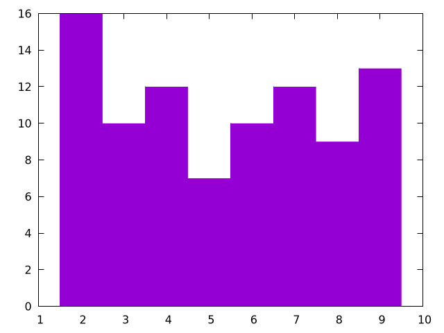

# Plotting

Plotting is an essential tool for visualizing and understanding important details of several algorithms and methods and is necessary for studies in various areas of computational science.
For many languages, such as python, julia, and matlab, it is relatively straightforward to create simple plots for various types of data; however, for several other languages, like Fortran, C/C++, and java, plotting can be a chore.
Because the Algorithm Archive strives to be language agnostic, we do not want to favor any particular set of languages and have decided instead to output all data that needs plotting into a file format that can easily be read in by various plotting scripts separate from the algorithm implementations.

If you are implementing any algorithm in a language found on this page, you should be able to modify your existing code to allow for on-the-fly plotting.
Otherwise, please use the language of your choice to write the initial implementation and output the data to a file before using one of the scripts available here for plotting.

This chapter aims to explain how to plot several different types of data and will be updated as more algorithms require more complex plotting schemes.
Though many complex file formats exist, we will be mainly storing data for plotting in simple ASCII text.
If you wish to use these plotting scripts for other file formats or projects unrelated to the Algorithm Archive, some modification will be necessary.
In addition, each plotting language used in this chapter will likely have many features we are not currently using, so there may be methods to create stunning visualizations that we are ignoring here.

## Plotting a series of functions

To begin, let's write a simple script that allows for plotting a sine wave



[import:1-1, lang:"gnuplot"](code/gnuplot/sine.gp)

Where `x` is a range from negative to positive 10.
To plot from the terminal, you can either:
* enter the gnuplot REPL (Read, Evaluate, Print, Loop -- the gnuplot shell) by using the `gnuplot` command and type the above command manually.
* write the command in an external script (let's call it `script.gp`) and run it with `gnuplot script.gp -`. The `-` will keep the terminal open in the background so the image stays up. If your plotting script outputs a `.png` file, the `-` is unnecessary.

This command will create a plot that looks like this:

<p>
    
</p>

For most gnuplot scripts, this command is written in short-hand.
The phrase `with lines` is abbreviated to simply `w l` and `plot` is sometimes written as simply `p`, so the following command would also work:
```
p sin(x) w l
```


From here, it is rather straightforward to add more plots.
For example, let's add in a cosine function.



In this case, we need to add the following line to our script:
[import:2, lang:"gnuplot"](code/gnuplot/sine.gp)

Which will create an image that looks like this:

<p>
    
</p>

If you would prefer to plot everything on a single line (which will become more relevant when plotting directly to an image file), then you can use the following command:

```
p sin(x) w l, cos(x) w l
```



In some sense, this chapter is meant as a guide so users can better understand plotting in their language of choice.
As such, it is important to first understand how to perform a few basic tasks:

1. Changing auxiliary features of the plot such as: title, axis, labels, x/ytic values, and plot dimensions
2. Plotting multiple functions at the same time
3. Outputting the plot to file

At the end of this chapter, we will discuss the scatter plot; however, additional plotting techniques may be covered in the near future for specific algorithms and methods.

### Changing auxiliary features

Beauty is in the eye of the beholder, but it is rare for people to call plots "beautiful."
That said, there are plenty of things you can do to more clearly represent your data, and if your data is beautiful, so be it!
In this section, we'll show you some small-scale modifications you can make to the plot we have already generated to make it little cleaner, but there are plenty of other ways to spruce up your plot that we are not covering here.
Be sure to look at the documentation {{ "gnuplot" | cite }}  for plotting in your language of choice if you want to do anything more complicated.

#### x and y range

All data that can be plotted has a scope at which the important features are more clear.
It is sometimes important to zoom in or zoom out to highlight particular facets of the data available.
This can be simply done by modifying the $$x$$ and $$y$$ ranges in your plotter of choice, like so:



```
set xrange [0:10]
set yrange [0:1]
plot sin(x) w l, cos(x) w l
```

Here, the keywords `xrange` and `yrange` are known by gnuplot and take a range from `[n:m]`, where `n` and `m` are real units in the plot, itself.
For this script, we generate a plot that looks like this:

<p>
    
</p>



#### x and y tics

In addition to changing the plot scales, it is also important to notify your audience of what these scales actually mean.
To help guide the reader's eye and better understand what the plot represents, plotters provide _tics_ (little notches) on the $$x$$ and $$y$$ axes.
As such, it is important to update the $$x$$ and $$y$$ tics with appropriate scales and labels.




Firstly, to remove x and y tics, use

```
unset xtics
unset ytics
```

This will create a plot that looks like this:

<p>
    
</p>

If you want to set particular x or y tic values, use

```
set xtics 0, 5, 10
set ytics ("bottom" 0 , "top" 1)
```

which creates a plot that looks like this:

<p>
    
</p>

Here, we are selecting 3 values to use for the x-axis and using words or phrases for the "bottom" and "top" of the y-axis.
To be clear: we are not condoning the behavior of having mismatched x and y tic values by using words or phrases along the y axis and numbers along the x axis.
This is simply meant as a showcase for using gnuplot in this way.

As a note: there is a lot of information here we missed, specifically format specifiers, which allow users to modify the format of the numbers in their plots (to be in floating point, scientific notation, or something else).
This can be found in [the documentation](http://gnuplot.sourceforge.net/docs_4.2/node184.html), along with anything else that is missed here.



#### logscale

In addition to changing the values of the x and y tics, we can also change the axes to plot in log-scale by using the following command:




```
set logscale x
set logscale y
```



As a simple example, let's take the `exp(x)` function.




In gnuplot, we can plot this by using `p exp(x) w l`, which will create the following:

<p>
    
</p>



Now let's plot the same function with log-scale along the $$y$$ axis:




<p>
    
</p>



Here, we see what we expect: `exp(x)` is a straight line when the $$y$$ axis is in log-scale.
When we use log-scale on the sine and cosine waves from before, we get the following:



<p>
    
</p>



This is an awful plot, so it is only fitting that we use it as out example for the a few more plots in this chapter.

#### labels, titles, and legends

Many researchers are very particular about labels.
Labels need to be in the right spot, say the right stuff, and be interpreted in the right way.
As such, most plotters have a lot of options for labels, including LaTeX-like formatting for academic journals and such.

There are also multiple labels associated with each plot.
Every line has a label, often held in a box called a _legend_, and the plot, itself, has a title.

##### labels

First, let's change the labels associated with each data set or function.




```
p sin(x) w l title "sine wave", cos(x) w l title "cos(x)"
```

<p>
    
</p>



Here, we show that we can modify the data labels to be whatever we want.
Note that for LaTeX-like math in the label, we might need to change the output to TeX, which will be shown later.

For now, let's move on to discuss what we can to with all of the labels in the legend

#### legend

First things first, you should probably use a legend, unless you are a legend yourself and don't need one... In which case you can use the following:




```
set nokey
```

which will produce a plot that looks like this:

<p>
    
</p>



Admittedly, you are probably not important enough to remove the legend and doing so will prevent readers from understanding the data you are plotting, so this should be used sparingly.
Instead, you should probably try to move the legend out of the way of the data, which can be done in a number of ways.




In gnuplot, it is possible to specify where we place the legend by using certain keywords, like `top`, `bottom`, `left`, `right`, and `center`, like so:

```
set key top left
```

which will produce a plot that looks like this:

<p>
    
</p>

In addition, we can specify exact coordinates in the plot to place the legend.
For example, if we wanted the legend to be at the position (1,0.5), then we would use the following command:

```
set key at 1, 0.5
```

which will produce a plot that looks like this:

<p>
    
</p>

This is certainly an awful place to put a legend for this plot, but this command could be useful for other plots.



##### titles

Obviously, in addition to labels, we can also provide a title for the entire plot, like so:




```
set title "Gnuplot Test"
```

<p>
    
</p>



#### square output

Many times, plotting data in a 6:9 (or worse, 16:9) aspect ratio can feel like a misrepresentation of the data.
For whatever reason, I was told time and time again as a fledgling researcher that there is no need for widescreen plots and that I should set the output to square whenever possible.

That can be done by using




```
set size square
```

which will output the following plot:

<p>
    
</p>



#### line and point types

Finally, it's important to show your individuality by choosing your own point and line types.



To find all the point or line types available in gnuplot, simply open the REPL and run the `test` command, which outputs something that looks like this:

<p>
    
</p>

As a note, changing the line color is not mentioned in the test image above, this can be done with the `linecolor` command, which takes an argument in a color space like `rgb`.

If we would like to use a dashed black line for the sine function and purple crosses for cosine, we would use something like this:

```
p sin(x) with lines dashtype 2 linecolor rgb "black" title "sin(x)"
rep cos(x) w p pt 17 lc rgb "purple" t "cos(x)"
```

This will create a plot that looks like this:

<p>
    
</p>

With this script, we are using a bunch of aliases, which can be found in the following section.
For now, it is clear that you can make your plot look however you like without too much trouble.
There are also a bunch of cool features that you can learn by looking up examples on the [gnuplot site](http://gnuplot.sourceforge.net/).




#### gnuplot aliases

As we have seen in this chapter, it is common to use several aliases with gnuplot, and I have tried to introduce these slowly in the above text.
Here are all the aliases stated explicitly:

| command       | alias     |
| :-----------: | :-------: |
| `plot`        | `p`       |
| `replot`      | `rep`     |
| `with lines`  | `w l`     |
| `with points` | `w p`     |
| `linecolor`   | `lc`      |
| `pointtype`   | `pt`      |
| `title`       | `t`       |

We will add more aliases to this table as they are used in the Algorithm Archive.



### Outputting the plot to file

At this point, all the scripts have shown so far will output an image directly to your computer screen; however, it is important to note that you can use any of the above methods when outputting to a file as well.




For the most part, if you want to output any of the above scripts to a file, you simply need to run the following commands:

```
set terminal pngcairo
set output "check.png"
```

In this case, we are changing the REPL type to work with png images with the Cairo back-end, which is a vector drawing library in C.
We are also setting the output to "check.png".

If we would like to set the resolution of the output image, we could do the following:

```
set terminal pngcairo size 640, 480
```

As an example, here is the script for the image we generated above:

[import, lang:"gnuplot"](code/gnuplot/sine_to_file.gp)

As mentioned above, for a lot of scientific papers and articles, it is worth outputting images into a format that is used commonly for typesetting, such as LaTeX.
There are multiple ways to create TeX output with gnuplot by using different REPL modes like `epslatex`.

The easiest method to generate a pdf output with gnuplot that uses LaTeX would be to create a `standalone` TeX file, like so

```
set terminal epslatex standalone size 10cm, 10cm
set output "check.tex"
```

This can be quickly turned into a pdf with the `pdflatex check.tex` command.

For example, if we run the following script:

[import, lang:"gnuplot"](code/gnuplot/example_tex.gp)

and then run

```
gnuplot file.gp
pdflatex out.tex
```

We will have a standalone pdf that uses LaTeX features in the file `out.pdf`.
This file should look like this:

<p>
    
</p>

Note that in this process, we create auxiliary files like `*.eps` and `*.aux`, which are expected with LaTeX.

If you would like to directly read the output `.tex` file from gnuplot into another LaTeX document, you can use the same command as above without the `standalone` option, like so:

```
set terminal epslatex size 10cm, 10cm
set output "check.tex"
```
This will output another "check.tex" file that can be used by other LaTeX documents, and here is an example tex file to do that:

[import, lang:"gnuplot"](code/gnuplot/latex_import.tex)

As a note, the units for the `epslatex` terminal are real units in terms of cm, inches, or whatever other measurement LaTeX takes.
As such, you will probably want to make sure the size of the output image from gnuplot actually fits in the document you want to create.



## Plotting data from a file 

Each algorithm in the Algorithm Archive that requires plotting will also output a data file to use for this purpose.
Even though there are plenty of complex data formats to write to and read from, for the purposes of this text, we will focus on simple ASCII data.
This is not preferred for any data-intensive task and there are a large number of different storage formats and file types available to choose from for your specific purposes; however, the Algorithm Archive intends to provide the simplest explanation of algorithms and methods and we do not want to over-complicate the process with file input and output.

If multiple data sets are required to be plotted, they will also be provided a new file, usually with a zero-padded name such as `file_0000.dat`, `file_0001.dat`, `file_0002.dat`, and so on.
We will assume that your plotter of choice has limited  three dimensional capabilities and will instead focus on the data format for one and two-dimensional data here

### One-dimensional output
In the case of one-dimensional output, the data file will have all numbers separated by a newline, such as in this case:

[import](data/1d_sample_low_res.dat)

For the purposes of the Algorithm Archive, we will call these data files `.dat` files; however, the file extension does not matter and you can just as well name the files `.tsv` or `.csv` depending on your tastes.




Gnuplot can read in this file in the same way it can plot functions above.
So we can use the following command:

```
plot "sample_data.dat" with lines
```

Which will provide the following output:

<p>
    
</p>




### Two-dimensional image output
In the case of two-dimensional image output, the data file be similar, but this time, each number will be separated by a tab for different column entries and a newline for rows, as shown here:

[import](data/2d_sample_low_res.dat)

It is expected that the number of columns does not vary in each row and that we are working with an $$n \times m$$ matrix which can be simply plotted as a series of pixels that scale in color according to some defined color bar.




To create 2 dimensional plots in Gnuplot, we need to set the view to 2 dimensional and then do a 3 dimensional plot with the `splot` function that we set to a matrix image, like so:

```
set view map
splot "sample_data.dat" matrix with image
```

<p>
    
</p>



#### changing the color bar

For plotting images from data files, we will often need to specify how we color the image by setting a custom color bar




In Gnuplot, there are not many predefined themes, but it is fairly easy to set your own theme for coloring a 2 dimensional image.
This is done by setting a `palette` and there are [repositories online](https://github.com/Gnuplotting/gnuplot-palettes) that have a number of palettes to choose from.
Simply put, a palette is a number line where you can set a color to be associated with whatever value you like, like in this example:

```
set view map
set palette defined (0 0 0 1, 1 'red', 2 '#00FF00')
splot "2d_sample_low_res.dat" matrix with image
```
The integer value corresponds to the location of the color on the color bar and the color can be set as either a recognized word (`blue`, `red`, `green`, etc.), HTML notation (`'#FF0000'`, `'#00FF00'`, `'#0000FF'`, etc.), or RGB colors (`1 0 0`, `0 1 0`, `0 0 1`, etc.).
This example will output the following plot:

<p>
    
</p>





### Scatter Plots

The scatter plot is another useful method for visualizing data that plots each point in an $$n$$ -dimensional space.
For the purposes of the Algorithm Archive, this space is mainly two-dimensional; however, scatter plots in three-dimensions may also be used for visualizing three-dimensional datasets.
We will update this section if three-dimensional scatter plots are required.

For the purposes of the Algorithm Archive, scatter plot data will be output as a series of $$x$$ and $$y$$ pairs, where each row has an $$x$$ and a $$y$$ value, separated by a tab character.
For example, a data file might look like this:

[import:1-10](data/scatterplot_data.dat)

For three-dimensional scatter plots, there might be a third, $$z$$ dimension.



In gnuplot, scatter plots are easy to generate with the provided data format, for example, you could use the following command:

```
p "scatterplot_data.dat" pt 7
```

Which will create the following image

<p>
    
</p>

Here, we have chosen `pointtype 7`, simply because it is easier to see when compared to the default crosses.



# Histograms

Many different algorithms will output data as a series of points that must be organized into separate bins before anyone can make sense of the data.
For example, here are 10 values from a set of 100 randomly generated integers between 1 and 9:

[import:50-60](data/rand.dat)

Someone might ask, "How many 1s show up in this string of numbers?"
Similarly, someone might want to know how many 1s we have *in comparison* to the number of 2s (or 3s or 4s, etc).
To do this, we would create a set of bins and then iterate through the data, adding one to a bin every time we find a corresponding number.
Note that the bins do not necessarily need to be sequential integer values and that for floating point numbers, the input might need to be rounded.
You can even histograms objects or anything that else that can be categorized.

For the data that we have shown above, we might create a histogram that looks like this:

<p>
    
</p>

And here is a plotting script to generate it:


[import](code/gnuplot/histogram.gp)


For this, we are using a fill style to use with `fillsteps` so the histogram is colored, but if you just want a line, you could remove the fill style and use `histeps` instead.
As another note, we are using `t 'data' smooth frequency`, which essentially turns the input numbers into a small, binned array to plot.


Note that this code rounds the input in the case of floating point numbers.

If you are interested in seeing this type of plot generate fractal patterns, please look at the chapter on [iterated function systems](../IFS/IFS.md).

## Conclusions

Plotting is a powerful tool that is essential for most of computational science.
Here, we have provided all of the essential skills to plot any data that comes from the Algorithm Archive, and we will strive to provide the plotting scripts we used whenever possible.

### Bibliography

 

##### Code Examples

The code examples are licensed under the MIT license (found in [LICENSE.md](https://github.com/algorithm-archivists/algorithm-archive/blob/main/LICENSE.md)).

##### Text

The text of this chapter was written by [James Schloss](https://github.com/leios) and is licensed under the [Creative Commons Attribution-ShareAlike 4.0 International License](https://creativecommons.org/licenses/by-sa/4.0/legalcode).

[<p></p>](https://creativecommons.org/licenses/by-sa/4.0/)

##### Images/Graphics



- The image "[gnuplot_sine_wave](res/gnuplot/sine.png)" was created by [James Schloss](https://github.com/leios) and is licensed under the [Creative Commons Attribution-ShareAlike 4.0 International License](https://creativecommons.org/licenses/by-sa/4.0/legalcode).
- The image "[gnuplot_sine_cosine_wave](res/gnuplot/sincos.png)" was created by [James Schloss](https://github.com/leios) and is licensed under the [Creative Commons Attribution-ShareAlike 4.0 International License](https://creativecommons.org/licenses/by-sa/4.0/legalcode).
- The image "[gnuplot_sine_cosine_wave_range](res/gnuplot/sincos_range.png)" was created by [James Schloss](https://github.com/leios) and is licensed under the [Creative Commons Attribution-ShareAlike 4.0 International License](https://creativecommons.org/licenses/by-sa/4.0/legalcode).
- The image "[gnuplot_sine_cosine_notics](res/gnuplot/sincos_notics.png)" was created by [James Schloss](https://github.com/leios) and is licensed under the [Creative Commons Attribution-ShareAlike 4.0 International License](https://creativecommons.org/licenses/by-sa/4.0/legalcode).
- The image "[gnuplot_sine_cosine_customtics](res/gnuplot/sincos_customtics.png)" was created by [James Schloss](https://github.com/leios) and is licensed under the [Creative Commons Attribution-ShareAlike 4.0 International License](https://creativecommons.org/licenses/by-sa/4.0/legalcode).
- The image "[exp_fn](res/gnuplot/exp.png)" was created by [James Schloss](https://github.com/leios) and is licensed under the [Creative Commons Attribution-ShareAlike 4.0 International License](https://creativecommons.org/licenses/by-sa/4.0/legalcode).
- The image "[exp_fn_log](res/gnuplot/explog.png)" was created by [James Schloss](https://github.com/leios) and is licensed under the [Creative Commons Attribution-ShareAlike 4.0 International License](https://creativecommons.org/licenses/by-sa/4.0/legalcode).
- The image "[gnuplot_sine_cosine_log](res/gnuplot/sincos_log.png)" was created by [James Schloss](https://github.com/leios) and is licensed under the [Creative Commons Attribution-ShareAlike 4.0 International License](https://creativecommons.org/licenses/by-sa/4.0/legalcode).
- The image "[gnuplot_sine_cosine_label](res/gnuplot/sincos_label.png)" was created by [James Schloss](https://github.com/leios) and is licensed under the [Creative Commons Attribution-ShareAlike 4.0 International License](https://creativecommons.org/licenses/by-sa/4.0/legalcode).
- The image "[gnuplot_sine_cosine_nokey](res/gnuplot/sincos_nokey.png)" was created by [James Schloss](https://github.com/leios) and is licensed under the [Creative Commons Attribution-ShareAlike 4.0 International License](https://creativecommons.org/licenses/by-sa/4.0/legalcode).
- The image "[gnuplot_sine_cosine_movekey](res/gnuplot/sincos_movekey.png)" was created by [James Schloss](https://github.com/leios) and is licensed under the [Creative Commons Attribution-ShareAlike 4.0 International License](https://creativecommons.org/licenses/by-sa/4.0/legalcode).
- The image "[gnuplot_sine_cosine_movekey2](res/gnuplot/sincos_movekey2.png)" was created by [James Schloss](https://github.com/leios) and is licensed under the [Creative Commons Attribution-ShareAlike 4.0 International License](https://creativecommons.org/licenses/by-sa/4.0/legalcode).
- The image "[gnuplot_sine_cosine_title](res/gnuplot/sincos_title.png)" was created by [James Schloss](https://github.com/leios) and is licensed under the [Creative Commons Attribution-ShareAlike 4.0 International License](https://creativecommons.org/licenses/by-sa/4.0/legalcode).
- The image "[gnuplot_sine_cosine_square](res/gnuplot/sincos_square.png)" was created by [James Schloss](https://github.com/leios) and is licensed under the [Creative Commons Attribution-ShareAlike 4.0 International License](https://creativecommons.org/licenses/by-sa/4.0/legalcode).
- The image "[gnuplot_test](res/gnuplot/test.png)" was created by the `gnuplot test` command, and gnuplot has [this copyright](https://sourceforge.net/p/gnuplot/gnuplot-main/ci/master/tree/Copyright).
- The image "[gnuplot_sine_cosine_linetype](res/gnuplot/sincos_lt.png)" was created by [James Schloss](https://github.com/leios) and is licensed under the [Creative Commons Attribution-ShareAlike 4.0 International License](https://creativecommons.org/licenses/by-sa/4.0/legalcode).
- The image "[gnuplot_exp_tex](res/gnuplot/exponential_tex.png)" was created by [James Schloss](https://github.com/leios) and is licensed under the [Creative Commons Attribution-ShareAlike 4.0 International License](https://creativecommons.org/licenses/by-sa/4.0/legalcode).
- The image "[gnuplot_1d_sample](res/gnuplot/1d_sample.png)" was created by [James Schloss](https://github.com/leios) and is licensed under the [Creative Commons Attribution-ShareAlike 4.0 International License](https://creativecommons.org/licenses/by-sa/4.0/legalcode).
- The image "[gnuplot_2d_sample](res/gnuplot/2d_sample.png)" was created by [James Schloss](https://github.com/leios) and is licensed under the [Creative Commons Attribution-ShareAlike 4.0 International License](https://creativecommons.org/licenses/by-sa/4.0/legalcode).
- The image "[gnuplot_2d_sample_colorbar](res/gnuplot/2d_sample_cb.png)" was created by [James Schloss](https://github.com/leios) and is licensed under the [Creative Commons Attribution-ShareAlike 4.0 International License](https://creativecommons.org/licenses/by-sa/4.0/legalcode).
- The image "[gnuplot_scatterplot](res/gnuplot/scatterplot.png)" was created by [James Schloss](https://github.com/leios) and is licensed under the [Creative Commons Attribution-ShareAlike 4.0 International License](https://creativecommons.org/licenses/by-sa/4.0/legalcode).
- The image "[gnuplot_histogram](res/gnuplot/histogram.png)" was created by [James Schloss](https://github.com/leios) and is licensed under the [Creative Commons Attribution-ShareAlike 4.0 International License](https://creativecommons.org/licenses/by-sa/4.0/legalcode).



##### Pull Requests

The following pull requests have modified the text or graphics of this chapter:
- 622: Initial PR for chapter
