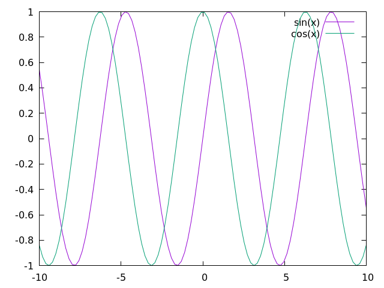
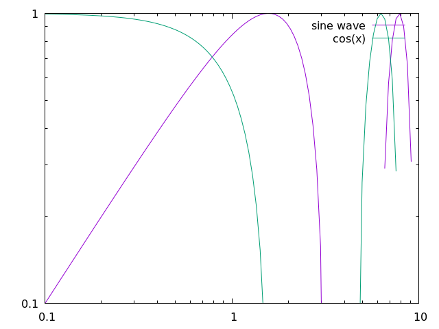
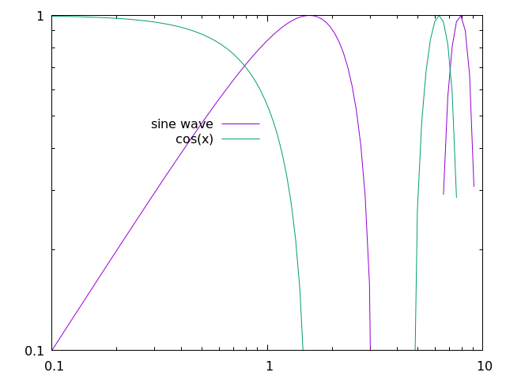

# Plotting

Plotting is an essential tool for visualizing and understanding important details of several algorithms and methods and is necessary for studies in various areas of computational science.
For many languages, such as python, julia, and matlab, it is relatively straightforward to create simple plots for various types of data; however, for several other languages, like fortran, C/C++, and java, plotting can be a chore.
Because the Algorithm Archive strives to be language agnostic, we do not want to favor any particular set of languages and have decided instead to output all data that needs plotting into a file format that cen easily be read in my various plotting scripts separate from the algorithm implementations.

If you are implementing any algorithm in a language found on this page, you should be able to modify your existing code to allow for on-the-fly plotting.
Otherwise, please use the language of your choice to write the initial language implementation and output the data to a file before using one of the scripts available here for plotting.

This chapter aims to explain how to plot several different types of data and will be updated as more algorithms require more complex plotting schemes.
Though many complex file formats exist, we will be mainly storing data for plotting in simple ASCII text.
If you wish to use these plotting scripts for other file formats or projects unrelated to the Algorithm Archive, some modification will be necessary.
In addition, each plotting language used in this chapter will likely have many features we are not currently using, so there may be methods to create stunning visualizations that we are ignoring here.

## Plotting a series of functions

To begin, let's write a simple script that allows for plotting a sine wave



[import:1, lang:"gnuplot"](code/gnuplot/sine.gp)

Here, `x` is a range from negative to positive 10.
To plot from the terminal, you can either:
* enter the gnuplot REPL by using the `gnuplot` command and type the command manually.
* write the command in an external script (let's call it `script.gp`) and run it with `gnuplot script.gp -`. The `-` will keep the terminal open in the background so the image stays up. If your plotting script outputs a `.png` file, the `-` is unnecessary.

This command will create a plot that looks like this:

<p>
    
</p>

For most gnuplot scripts, this command is written in short-hand.
The phrase `with lines` is abbreviated to simply `w l` and `plot` is sometimes written as simply `p`, so the following command would also work:
```
p sin(x) w l
```


From here, it is rather straightforward to add more plots.


In this case, we need to add the following line to our script:
[import:2, lang:"gnuplot"](code/gnuplot/sine.gp)

Which will create an image that looks like this:

<p>
    
</p>

If you would prefer to plot everything on a single line (which will become more relevant later), then you can use the following command:

```
p sin(x) w l, cos(x) w l
```



In some sense, this chapter is meant as a guide to help better understand plotting with your language of choice.
As such, it is important to first understand how to perform a few basic tasks:

1. Changing the plot title, axis, labels, x/ytic values, and plot dimensions
2. Plotting multiple functions at the same time
3. Outputting the plot to file

### Changing auxiliary features

Beauty is in the eye of the beholder, but it is rare for people to call plots "beautiful."
That said, there are plenty of things you can do to more clearly represent your data, and if your data is beautiful, so be it!
In this section, we'll show you some smallscale modifications you can make to the plot we have already generated to make it little cleaner, but there are plenty of other ways to spruce up your plot that we are not covering here.
Be sure to look at the documentation for plotting in your language of choice if you want to do anything more complicated.

#### x and y range

All data that can be plotted has a scope at which the important features are more clear.
It is sometimes important to zoom in or zoom out to highlight particular facets of the data available.
This can be simply done by modifying the $$x$$ and $$y$$ ranges in your plotter of choice, like so:



```
set xrange [0:10]
set yrange [0:1]
plot sin(x) w l, cos(x) w l
```

Here, the keywords `xrange` and `yrange` are known by gnuplot and take a range from `[n:m]`, where `n` and `m` are real units in the plot, itself.
For this script, we generate a plot that looks like this:

<p>
    
</p>



#### x and y tics

In addition to changing the plot scales, it is also important to notify your audience of what these scales actually mean.
To help guide the reader's eye and better understand what the plot represents, plotters provide _tics_ (little notches) on the $$x$$ and $$y$$ axes.
As such, it is important to update the $$x$$ and $$y$$ tics with appropriate scales and lables.




Firstly, to remove x and y tics, use

```
unset xtics
unset ytics
```

This will create a plot that looks like this:

<p>
    
</p>

If you want to set particular x or y tic values, use

```
set xtics 0, 5, 10
set ytics ("bottom" 0 , "top" 1)
```

which creates a plot that looks like this:

<p>
    
</p>

Here, we are selecting 3 values to use for the x-axis and using words or phrases for the "bottom" and "top" of the y-axis.
To be clear: we are not condoning the behaviour of having mismatched x and y tic values by using words or phrases along the y axis and numbers along the x axis.
This is simply meant as a showcase for using gnuplot in this way.



#### logscale

In addition to changing the values of the x and y tics, we can also change the axis to plot in logscale by using the following command:




```
set logscale x
set logscale y
```

which creates the following plot:

<p>
    
</p>



Admittedly, this is not the most beautiful picture.
Because of the way we cropped the image, it doesn't really accurately represent the data; however, if we were instead trying to plot an exponential function (or if we were to look at small changes in a dataset), this type of plot could be incredibly useful.

#### labels, titles, and legends

Many researchers are very particular about labels.
They need to be in the right spot, say the right stuff, and be interpreted in the right way.
As such, most plotters have a lot of options for labels, including LaTeX-like formating for academic journals and such.

There are also multiple labels associated with each plot.
Every line has a label, often held in a box called a _legend_, and the plot, itself, has a title.

##### labels

First, let's change the labels associated with each dataset or function.




```
p sin(x) w l title "sine wave", cos(x) w l title "cos(x)"
```

<p>
    
</p>



Here, we show that we can modify the data labels to be whatever we want.
Note that for LaTeX-like math in the label, we might neet to change the output to TeX, which will be shown later.

For now, let's move on to discuss what we can to with all of the labels in the legend

#### legend

First things first, you should probably use a legend, unless you are a legend yourself and don't need one and can use the following:




```
set nokey
```

which will produce a plot that looks like this:

<p>
    
</p>



Admittedly, you are probably not important enough to remove the legend and doing so will prevent readers from understanding the data you are plotting, so this should be used sparingly.
Instead, you should probably try to move the legend out of the way of the data, which can be done in a number of ways.




In gnuplot, it is possible to specify where we place the legend by using certain keywords, like `top`, `bottom`, `left`, `right`, and `center`, like so:

```
set key top left
```

which will produce a plot that looks like this:

<p>
    
</p>

In addition, we can specify exact coordinates in the plot to place the legend.
For example, if we wanted the legend to be at the position (1,0.5), then we would use the following command:

```
set key at 1, 0.5
```

which will produce a plot that looks like this:

<p>
    
</p>

This is certainly an awful place to put a legend for this plot, but this command could be useful for other plots.



##### titles

Obviously, in addition to labels, we can also provide a title for the entire plot, like so:




```
set title "Gnuplot Test"
```

<p>
    
</p>



#### square output

Many times, plotting data in a 6:9 (or worse, 16:9) aspect ratio can feel like a misrepresentation of the data.
For whatever reason, I was told time and time again as a fledgling researcher that there is no need for widescreen plots and that I should set the output to square when possible.

That can be done by using




```
set size square
```

which will output the following plot:

<p>
    
</p>



#### line and point types

Finally, it's important to show your individuality by choosing your own point and line types.



To find all the point or line types available in gnuplot, simply open the REPL and run the `test` command, which outputs something that looks like this:

<p>
    
</p>

As a note, changing the linecolor is not mentioned in the test image above, this can be done with the `linecolor` command, which takes an argument in a colorspace like `rgb`.

If we would like to use a dashed black line for the sine function and purple crosses for cosine, we would use something like this:

```
p sin(x) with lines dashtype 2 linecolor rgb "black" title "sin(x)"
rep cos(x) w p pt 17 lc rgb "purple" t "cos(x)"
```

This will create a plot that looks like this:

<p>
    
</p>

With this script, we are using a bunch of aliases, which can be found in the following section.
For now, it is clear that you can make your plot look however you like without too much trouble.
There are also a bunch of cool features that you can learn by looking up examples on the [gnuplot site](http://gnuplot.sourceforge.net/).




#### gnuplot aliases

As we have seen in this chapter, it is common to use several aliases with gnuplot, and I have tried to introduce these slowly in the above text.
Here are all the aliases stated explicitly:

| command       | alias     |
| :-----------: | :-------: |
| `plot`        | `p`       |
| `replot`      | `rep`     |
| `with lines`  | `w l`     |
| `with points` | `w p`     |
| `linecolor`   | `lc`      |
| `pointtype`   | `pt`      |
| `title`       | `t`       |

We will add more aliases to this table as they are used in the archive.



### Outputting the plot to file

At this point, all scripts will output an image directly to your computer; however, it is important to note that you can use any of the above methods when output to a file as well.




For the most part, if you want to output any of the above scripts to a file, you simply need to run the following commands:

```
set terminal pngcairo
set output "check.png"
```

In this case, we are changing the REPL type to work with png images with the cairo backend, which is a vector drawing library in C.
We are also setting the output to "check.png".

If we would like to set the resolution of the output image, we could do the following:

```
set terminal pngcairo size 640, 480
```

As an example, here is the script for the image we generated above:

[import, lang:"gnuplot"](code/gnuplot/sine_to_file.gp)



As mentioned above, for a lot of scientific papers and articles, it is worth outputting images into a format that is used commonly for typesetting, such as LaTeX.
There are multiple ways to create tex output with gnuplot by using different REPL modes like `epslatex`.

The easiest method to generate a pdf output with gnuplot that uses LaTeX would be to create a `standalone` tex file, like so

```
set terminal epslatex standalone size 10cm, 10cm
set output "check.tex"
```

This can be quickly turned into a pdf with the `pdflatex check.tex` command.

For example, if we run the following script:

[import, lang:"gnuplot"](code/gnuplot/example_tex.gp)

and then run

```
gnuplot file.gp
pdflatex out.tex
```

We will have a standalone pdf that uses LaTeX features in the file `out.pdf`.
This file should look like this:

ADD IMAGE

Note that in this process, we create auxiliary files like `*.eps` and `*.aux`, which are expected with LaTeX.

SIMPLE TEX DOCUMENT

## Plotting data from a file 

Each algorithm in the Algorithm Archive that requires plotting will also output a data file to use for this purpose.
Even though there are plenty of complex data formats to write to and read from, for the purposes of this text, we will focus on simple ASCII data.
This is not preferred for any data-intensive task and there are a large number of different storage formats and filetypes available to choose from for your specific purposes; however, the Algorithm Archive intends to provide the simplest explanation of algorithms and methods and we do not want to overcomplicate the process with file input and output.

If multiple data sets are required to be plotted, they will also be provided a new file, usually with a zero-padded name such as `file_0000.dat`, `file_0001.dat`, `file_0002.dat`, and so on.
We will assume that your plotter of choice has limited  three dimensional capabilities and will instead focus on the data format for one and two-dimensional data here

### One-dimensional output
In the case of one-dimensional output, the data file is a `.csv` file with numbers separated by a newline.

### Two-dimensional output
In the case of two-dimensional output, the data file will again be a `.csv`, but this time, each number will be separated by a comma for different columns entries and a newline for rows.
It is expected that the numbers of columns does not vary in each row and that we are working with an $$n \times m$$ matrix which can be simply plotted as a series of pixels that scale in color according to some defined colorbar.

#### changing the colorbar

### Algorithms using this method:

##### Code Examples

The code examples are licensed under the MIT license (found in [LICENSE.md](https://github.com/algorithm-archivists/algorithm-archive/blob/master/LICENSE.md)).

##### Text

The text of this chapter was written by [James Schloss](https://github.com/leios) and is licensed under the [Creative Commons Attribution-ShareAlike 4.0 International License](https://creativecommons.org/licenses/by-sa/4.0/legalcode).

[<p></p>](https://creativecommons.org/licenses/by-sa/4.0/)

##### Images/Graphics

##### Pull Requests

The following pull requests have modified the text or graphics of this chapter:
- none
