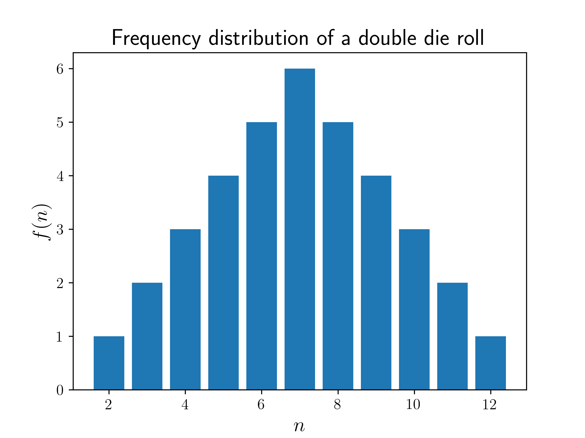
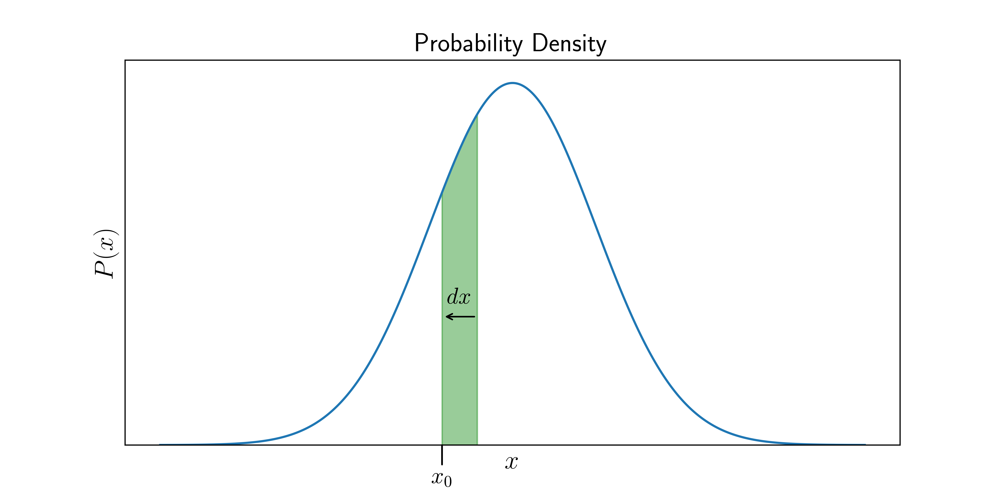

# What's a probability distribution?

## Discrete Probability Distributions

It's intuitive for us to understand what a __discrete__ probability distribution is - for example, we understand the outcomes of a coin toss very well, and also that of a dice roll. For a single coin toss, the probability distribution can be formally written as,

$$
P(n) = \begin{cases}
			\frac 1 2 & n \in [H,T] \\
			0         & n \notin [H,T] 
		\end{cases}.
$$

This means that the first line of the equation is saying that the probability of the outcome $$n$$ taking on the value of either heads (H) or tails (T) value is $$\frac{1}{2}$$. The second line states that the probability of any other possibility is zero. We can usually ignore this line, because anything outside of heads or tails (such as landing on an edge) is incredibly unlikely and even impossible depending on how we toss our coin.

For a probability distribution, it's important to take not of the set of possibilities, or the __domain__ of the distribution. Here, $$[H,T]$$ is the domain of $$P(n)$$, telling us that $$n$$ can only be $$H$$ or $$T$$.

If we use a different system, the outcome $$n$$ could also be a number. For example, the outcome of a __dice roll__ has the probability distribution,

$$
P(n) = \begin{matrix}
		\displaystyle\frac 1 6 &;& n \in [1..6] 
		\end{matrix}
$$
which is saying that the probability of $$n$$ being a whole number between 1 and 6 is $$1/6$$, and we assume that the probability of getting any other $$n$$ is 0. This is a discrete probability function because $$n$$ is an integer, and thus only takes discrete values. 

Both of the above examples are rather boring, because the value of $$P(n)$$ is the same for all $$n$$. An example of a discrete probability function where the probability actually depends on $$n$$, is when $$n$$ is the sum of numbers on a __roll of two die__. In this case, $$P(n)$$  is different for each $$n$$ as some possibilities like $$n=2$$ can happen in only one possible way (by getting a 1 on both die), whereas $$n=4$$ can happen in 3 ways (1 and 3; or 2 and 2; or 3 and 1). 

The rolling two die is a great case study for how we can construct a probability distribution, since the probability varies and it is not immediately obvious how it varies. So let's go ahead and construct it! 

Let's first define the domain of our target $$P(n)$$. We know that the lowest sum of two die is 2 (a 1 on both die), so $$n \geq 2$$ for sure. Similarly, the maximum is sum of two sixes, or 12, so $$n \leq 12$$ also. 

So now we the domain of possibilites, i.e., $$n \in [2..12]$$. Next, we take a very common approach - we count up the number of different ways each of the possbile values of $$n$$ can occur. Let's call this the frequency, $$f(n)$$ of each possible $$n$$. We already know that $$f(2)=1$$, as there is only one way to get a pair of 1s. For $$n=3$$, we see that there are two possible ways: a $$1$$ and $$2$$, or a $$2$$ and $$1$$, so $$f(3)=2$$. If you continue doing this for all $$n$$, you may see a pattern (homework for the reader!). Once you have all the $$f(n)$$, we can visualize it in a plot,

	 Die Roll" style="width:80%"/>

So the most common sum of two die is a $$7$$, and the further away from $$7$$ you get, the less likely the outcome. Good to know, for a prospective gambler!

### Normalization 

The $$f(n)$$ plotted above is technically NOT the probability $$P(n)$$ - because we know that the sum of all probabilities should be 1, which clearly isn't the case for $$f(n)$$. But we can just get that by dividing $$f(n)$$ by the _total_ number of possibilities, $$N$$. For two die, that is $$N = 6 \times 6 = 36$$, but we could also express it as the _sum of all frequencies_,

$$
N = \sum_n f(n)
$$

which would also equal to 36 in this case. So, by dividing $$f(n)$$ by $$\sum_n f(n)$$ we get our target probability distribution, $$P(n)$$. This process is called __normalization__ and is crucial for determining almost any probability distribution. So in general, if we have the function $$f(n)$$, we can get the probability as

$$
P(n) = \frac{f(n)}{\displaystyle\sum_{n} f(n)}
$$

Note that $$f(n)$$ does not necessarily have to be the frequency of $$n$$ - it could be any function which is _proportional_ to $$P(n)$$, and the above definition of $$P(n)$$ would still hold. And it's easy to check that the sum is now equal to 1, since

$$
\sum_n P(n) = \frac{\displaystyle\sum_{n}f(n)}{\displaystyle\sum_{n} f(n)} = 1
$$

Once we have the probability function $$P(n)$$, we can calculate all sorts of probabilites. For example, let's say we want to find the probability that $$n$$ will be between two integers $$a$$ and $$b$$, inclusively (also including $$a$$ and $$b$$). For brevity, we will use the notation $$\mathbb{P}(a \leq n \leq b)$$ to denote this probability. And to calculate it, we simply have to sum up all the probabilities for each value of $$n$$ in that range, i.e.,

$$
\mathbb{P}(a \leq n \leq b) = \sum_{n=a}^{b} P(n)
$$

## Probability Density Functions

What if instead of a discrete variable $$n$$, we had a continuous variable $$x$$, like temperature or weight? In that case, it doesn't make sense to ask what the probability is of $$x$$ being _exactly_ a particular number - there are infinite possible real numbers, after all, so the probability of $$x$$ being exactly any one of them is essentially zero! But it _does_ make sense to ask what the probability is that $$x$$ will be _between_ a certain range of values. For example, one might say that there is 50% chance that the temperature tomorrow at noon will be between 5 and 15, or 5% chance that it will be between 16 and 16.5. But how do we put all that information, for every possible range, in a single function? The answer is to use a __probability density function__. 

 What does that mean? Well, suppose $$x$$ is a continous quantity, and we have a probability density function, $$P(x)$$ which looks like

	 probability density" style="width:100%"/>

Now, if we are interested in the probability of the range of values that lie between $$x_0$$ and $$x_0 + dx$$, all we have to do is calculate the _area_ of the green sliver above. This is the defining feature of a  probability density function: 

> the probability of a range of values is the _area_ of the region under the probability density curve which is within that range. 

But how do we quantify this area? Imagine that the green sliver in the diagram is really, really thin - infinitesimally thin, to be precise, with the width $$dx$$ almost vanishing to zero. In that case, the area of the green sliver is approximated by a rectangle of height $$P(x)$$ and width $$dx$$. So the area will be $$P(x)dx$$, and thus

$$
\mathbb{P}(x_0 \leq x \leq x_0 + dx) = P(x)dx
$$

So strictly speaking, $$P(x)$$ itself is NOT a probability, but rather the probability is the quantity $$P(x)dx$$, or any area under the curve. That is why we call $$P(x)$$ the probability _density_ at $$x$$, while the actual probability is only defined for ranges of $$x$$. 

But what about large ranges of $$x$$, which are not infinitesimally thin? We do exactly what we did for the discrete case - sum up the probabilities of each and every distinct range of values, each with an infinitesimal width $$dx$$. And what do we call such a sum over a continuous variable? Why, an integral, of course! Who knew calculus would come in handy one day? And so we have,

$$
\mathbb{P}(a \leq x \leq b ) = \int_a^b P(x)dx
$$

And the fact that all probabilities must sum to 1 translates to

$$
\int_D P(x)dx = 1
$$

where $$D$$ denotes the __domain__ of $$P(x)$$, i.e., the entire range of possible values of $$x$$ for which $$P(x)$$ is defined. 
 
### Normalization of a Density Function

Just like in the discrete case, we often first calculate some density or frequency function $$f(x)$$, which is NOT $$P(x)$$, but proportional to it. We can get the probability density function by normalizing it in a similar way, except that we integrate instead of sum:

$$
P(\mathbf{x}) = \frac{f(\mathbf{x})}{\int_D f(\mathbf{x})d\mathbf{x}}
$$

For example, consider the __normal distribution function__, 

$$
f(x) = e^{-x^2}
$$

which is defined for all real numbers $$x$$. We first integrate it (or do a quick google search, as it is rather tricky) to get

$$
N = \int_{-\infty}^{\infty} e^{-x^2} dx = \sqrt{\pi}
$$

(yes, we get $$\pi$$ out of nowhere, which is an interesting topic for another chapter!) and so we have

$$
P(x) = \frac{1}{N} e^{-x^2} = \frac{1}{\sqrt{\pi}} e^{-x^2}
$$

In general, normalization can allow us to create a probability distribution out of almost any function $$f(x)$$. There are really only two rules that $$f(\mathbf{x})$$ must satisfy to be a candidate for a probability density distribution:
1. $$\int_{S\in D}f(\mathbf{x})d\mathbf{x}$$ is non-negative for any subdomain $$S$$ of $$D$$.
2. $$\int_D f(\mathbf{x})d\mathbf{x}$$ must be finite.

## License

##### Images/Graphics

- The image "[Frequency distribution of a double die roll](res/double_die_frequencies.png)" was created by [K. Shudipto Amin](https://github.com/shudipto-amin) and is licensed under the [Creative Commons Attribution-ShareAlike 4.0 International License](https://creativecommons.org/licenses/by-sa/4.0/legalcode).

- The image "[Probability Density](res/normal_distribution.png)" was created by [K. Shudipto Amin](https://github.com/shudipto-amin) and is licensed under the [Creative Commons Attribution-ShareAlike 4.0 International License](https://creativecommons.org/licenses/by-sa/4.0/legalcode).

##### Text

The text of this chapter was written by [K. Shudipto Amin](https://github.com/shudipto-amin) and is licensed under the [Creative Commons Attribution-ShareAlike 4.0 International License](https://creativecommons.org/licenses/by-sa/4.0/legalcode).

[

](https://creativecommons.org/licenses/by-sa/4.0/)

##### Pull Requests

After initial licensing ([#560](https://github.com/algorithm-archivists/algorithm-archive/pull/560)), the following pull requests have modified the text or graphics of this chapter:
- none

