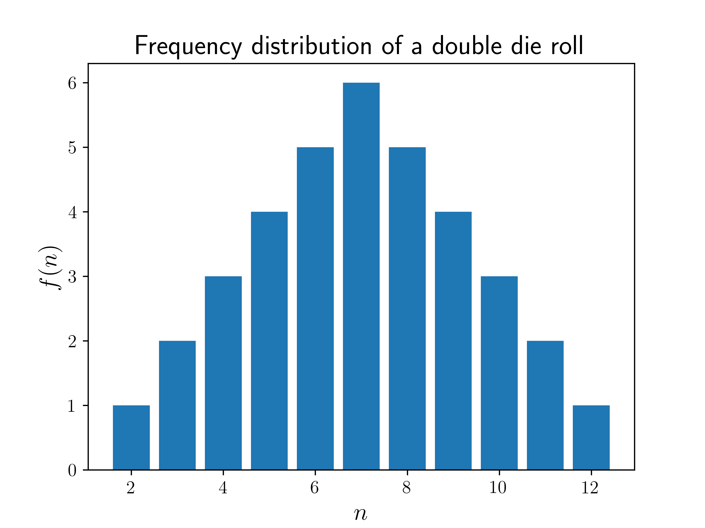
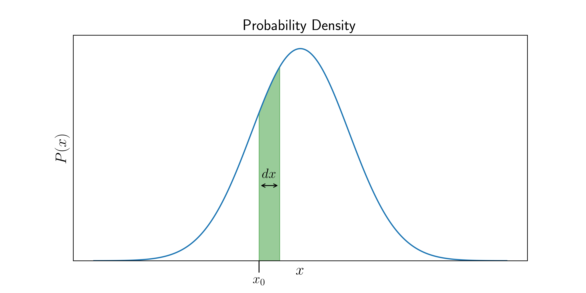

# What's a probability distribution?

Probability distributions are mathematical functions that give the probabilities of a range or set of outcomes. 
These outcomes can be the result of an experiment or procedure, such as tossing a coin or rolling dice. 
They can also be the result of a physical measurement, such as measuring the temperature of an object, counting how many electrons are spin up, etc.
Broadly speaking, we can classify probability distributions into two categories - __discrete probability distributions__ and __continuous probability distributions__.

## Discrete Probability Distributions

It's intuitive for us to understand what a __discrete__ probability distribution is. 
For example, we understand the outcomes of a coin toss very well, and also that of a dice roll. 
For a single coin toss, we know that the probability of getting heads $$(H)$$ is half, or $$P(H) = \frac{1}{2}$$. 
Similarly, the probability of getting tails $$(T)$$ is $$P(T) = \frac{1}{2}$$. 
Formally, we can write the probability distribution for such a coin toss as,

$$
P(n) =	\begin{matrix}
        \displaystyle \frac 1 2 &;& n \in \left\{H,T\right\}. 
        \end{matrix}
$$

Here, $$n$$ denotes the outcome, and we used the "set notation", $$n \in\left\{H,T\right\}$$, which means "$$n$$ belongs to a set containing $$H$$ and $$T$$". 
From the above equation, we can also assume that any other outcome for $$n$$ (such as landing on an edge) is incredibly unlikely, impossible, or simply "not allowed" (for example, just toss again if it _does_ land on its edge!).

For a probability distribution, it's important to take note of the set of possibilities, or the __domain__ of the distribution. 
Here, $$\left\{H,T\right\}$$ is the domain of $$P(n)$$, telling us that $$n$$ can only be either $$H$$ or $$T$$.

If we use a different system, the outcome $$n$$ could mean other things.
For example, it could be a number like the outcome of a __die roll__ which has the probability distribution,

$$
P(n) = \begin{matrix}
		\displaystyle\frac 1 6 &;& n \in [\![1,6]\!] 
		\end{matrix}.
$$
This is saying that the probability of $$n$$ being a whole number between $$1$$ and $$6$$ is $$1/6$$, and we assume that the probability of getting any other $$n$$ is $$0$$. 
This is a discrete probability function because $$n$$ is an integer, and thus only takes discrete values. 

Both of the above examples are rather boring, because the value of $$P(n)$$ is the same for all $$n$$. 
An example of a discrete probability function where the probability actually depends on $$n$$, is when $$n$$ is the sum of numbers on a __roll of two dice__. 
In this case, $$P(n)$$  is different for each $$n$$ as some possibilities like $$n=2$$ can happen in only one possible way (by getting a $$1$$ on both dice), whereas $$n=4$$ can happen in $$3$$ ways ($$1$$ and $$3$$; or $$2$$ and $$2$$; or $$3$$ and $$1$$). 

The example of rolling two dice is a great case study for how we can construct a probability distribution, since the probability varies and it is not immediately obvious how it varies. 
So let's go ahead and construct it! 

Let's first define the domain of our target $$P(n)$$. 
We know that the lowest sum of two dice is $$2$$ (a $$1$$ on both dice), so $$n \geq 2$$ for sure. Similarly, the maximum is the sum of two sixes, or $$12$$, so $$n \leq 12$$ also. 

So now we know the domain of possibilities, i.e., $$n \in [\![2,12]\!]$$. 
Next, we take a very common approach - for each outcome $$n$$, we count up the number of different ways it can occur. 
Let's call this number the __frequency of__ $$n$$, $$f(n)$$. 
We already mentioned that there is only one way to get $$n=2$$, by getting a pair of $$1$$s. 
By our definition of the function $$f$$, this means that $$f(2)=1$$. 
For $$n=3$$, we see that there are two possible ways of getting this outcome: the first die shows a $$1$$ and the second a  $$2$$, or the first die shows a  $$2$$ and the second a $$1$$. 
Thus, $$f(3)=2$$. 
If you continue doing this for all $$n$$, you may see a pattern (homework for the reader!). 
Once you have all the $$f(n)$$, we can visualize it by plotting $$f(n)$$ vs $$n$$, as shown below.

	 Die Roll" style="width:80%"/>

We can see from the plot that the most common outcome for the sum of two dice is a $$n=7$$, and the further away from $$n=7$$ you get, the less likely the outcome. 
Good to know, for a prospective gambler!

### Normalization 

The $$f(n)$$ plotted above is technically NOT the probability $$P(n)$$ &ndash; because we know that the sum of all probabilities should be $$1$$, which clearly isn't the case for $$f(n)$$. 
But we can get the probability by dividing $$f(n)$$ by the _total_ number of possibilities, $$N$$. 
For two dice, that is $$N = 6 \times 6 = 36$$, but we could also express it as the _sum of all frequencies_,

$$
N = \sum_n f(n),
$$

which would also equal to $$36$$ in this case. 
So, by dividing $$f(n)$$ by $$\sum_n f(n)$$ we get our target probability distribution, $$P(n)$$. 
This process is called __normalization__ and is crucial for determining almost any probability distribution. 
So in general, if we have the function $$f(n)$$, we can get the probability as

$$
P(n) = \frac{f(n)}{\displaystyle\sum_{n} f(n)}.
$$

Note that $$f(n)$$ does not necessarily have to be the frequency of $$n$$ &ndash; it could be any function which is _proportional_ to $$P(n)$$, and the above definition of $$P(n)$$ would still hold. 
It's easy to check that the sum is now equal to $$1$$, since

$$
\sum_n P(n) = \frac{\displaystyle\sum_{n}f(n)}{\displaystyle\sum_{n} f(n)} = 1.
$$

Once we have the probability function $$P(n)$$, we can calculate all sorts of probabilites. 
For example, let's say we want to find the probability that $$n$$ will be between two integers $$a$$ and $$b$$, inclusively (also including $$a$$ and $$b$$). 
For brevity, we will use the notation $$\mathbb{P}(a \leq n \leq b)$$ to denote this probability. 
And to calculate it, we simply have to sum up all the probabilities for each value of $$n$$ in that range, i.e.,

$$
\mathbb{P}(a \leq n \leq b) = \sum_{n=a}^{b} P(n).
$$

## Probability Density Functions

What if instead of a discrete variable $$n$$, we had a continuous variable $$x$$, like temperature or weight? 
In that case, it doesn't make sense to ask what the probability is of $$x$$ being _exactly_ a particular number &ndash; there are infinite possible real numbers, after all, so the probability of $$x$$ being exactly any one of them is essentially zero! 
But it _does_ make sense to ask what the probability is that $$x$$ will be _between_ a certain range of values. 
For example, one might say that there is $$50\%$$ chance that the temperature tomorrow at noon will be between $$5$$ and $$15$$, or $$5\%$$ chance that it will be between $$16$$ and $$16.5$$. 
But how do we put all that information, for every possible range, in a single function? 
The answer is to use a __probability density function__. 

 What does that mean? 
Well, suppose $$x$$ is a continous quantity, and we have a probability density function, $$P(x)$$ which looks like

	 probability density" style="width:100%"/>

Now, if we are interested in the probability of the range of values that lie between $$x_0$$ and $$x_0 + dx$$, all we have to do is calculate the _area_ of the green sliver above. 
This is the defining feature of a  probability density function: 

 __the probability of a range of values is the _area_ of the region under the probability density curve which is within that range.__ 

So if $$dx$$ is infinitesimally small, then the area of the green sliver becomes $$P(x)dx$$, and hence,

$$
\mathbb{P}(x_0 \leq x \leq x_0 + dx) = P(x)dx.
$$

So strictly speaking, $$P(x)$$ itself is NOT a probability, but rather the probability is the quantity $$P(x)dx$$, or any area under the curve. 
That is why we call $$P(x)$$ the probability _density_ at $$x$$, while the actual probability is only defined for ranges of $$x$$. 

Thus, to obtain the probability of $$x$$ lying within a range, we simply integrate $$P(x)$$ between that range, i.e.,

$$
\mathbb{P}(a \leq x \leq b ) = \int_a^b P(x)dx.
$$

This is analagous to finding the probability of a range of discrete values from the previous section:

$$
\mathbb{P}(a \leq n \leq b) = \sum_{n=a}^{b} P(n).
$$

The fact that all probabilities must sum to $$1$$ translates to

$$
\int_D P(x)dx = 1.
$$

where $$D$$ denotes the __domain__ of $$P(x)$$, i.e., the entire range of possible values of $$x$$ for which $$P(x)$$ is defined.
 
### Normalization of a Density Function

Just like in the discrete case, we often first calculate some density or frequency function $$f(x)$$, which is NOT $$P(x)$$, but proportional to it. 
We can get the probability density function by normalizing it in a similar way, except that we integrate instead of sum:

$$
P(\mathbf{x}) = \frac{f(\mathbf{x})}{\int_D f(\mathbf{x})d\mathbf{x}}.
$$

For example, consider the following  __Gaussian function__ (popularly used in  __normal distributions__), 

$$
f(x) = e^{-x^2},
$$

which is defined for all real numbers $$x$$. 
We first integrate it (or do a quick google search, as it is rather tricky) to get

$$
N = \int_{-\infty}^{\infty} e^{-x^2} dx = \sqrt{\pi}.
$$

Now we have a Gaussian probability distribution,

$$
P(x) = \frac{1}{N} e^{-x^2} = \frac{1}{\sqrt{\pi}} e^{-x^2}.
$$

In general, normalization can allow us to create a probability distribution out of almost any function $$f(\mathbf{x})$$. 
There are really only two rules that $$f(\mathbf{x})$$ must satisfy to be a candidate for a probability density distribution:
1. The integral of $$f(\mathbf{x})$$ over any subset of $$D$$ (denoted by $$S$$) has to be non-negative (it can be zero):
$$
\int_{S}f(\mathbf{x})d\mathbf{x} \geq 0.
$$ 
2. The following integral must be finite:
$$
\int_{D} f(\mathbf{x})d\mathbf{x}.
$$ 

## License

##### Images/Graphics

- The image "[Frequency distribution of a double die roll](res/double_die_frequencies.png)" was created by [K. Shudipto Amin](https://github.com/shudipto-amin) and is licensed under the [Creative Commons Attribution-ShareAlike 4.0 International License](https://creativecommons.org/licenses/by-sa/4.0/legalcode).

- The image "[Probability Density](res/normal_distribution.png)" was created by [K. Shudipto Amin](https://github.com/shudipto-amin) and is licensed under the [Creative Commons Attribution-ShareAlike 4.0 International License](https://creativecommons.org/licenses/by-sa/4.0/legalcode).

##### Text

The text of this chapter was written by [K. Shudipto Amin](https://github.com/shudipto-amin) and is licensed under the [Creative Commons Attribution-ShareAlike 4.0 International License](https://creativecommons.org/licenses/by-sa/4.0/legalcode).

[

](https://creativecommons.org/licenses/by-sa/4.0/)

##### Pull Requests

After initial licensing ([#560](https://github.com/algorithm-archivists/algorithm-archive/pull/560)), the following pull requests have modified the text or graphics of this chapter:
- none

