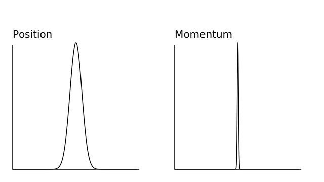

# Quantum Systems

As I am sure you have heard, the quantum world is weird.
As you deal with progressively smaller and smaller systems, at some point, it becomes less accurate to describe objects as particles.
Instead, it is better to describe objects as probability densities.
These densities are easiest to understand in terms of _wavefunctions_, which are complex functions characterizing a quantum system's behaviour.

Again, this is pretty common knowledge; however, there is a distinct lack of readable literature on how to simulate quantum systems, even though there are numerous methods for exactly that!
This section will deal with the computation of quantum states with classical machines.
Now, I know what you are thinking, "Wait. Why are we simulating quantum systems on classical computers? Why not simulate it with some sort of experiment or with quantum computers?"
Well, here's where the notation get's really sticky.

There is a clear difference between quantum computers and quantum simulators.
A _quantum computer_ is the quantum analog to a classical computer, replacing bits with qubits by using quantum information theory.
Quantum computers are usually thought of as a way to use quantum mechanics to eventually solve real-world problems with new quantum algorithms.
Both Grover's and Shor's algorithms are good examples of cases where quantum computation could greatly change the landscape of modern computation as we know it!

_Quantum simulators_ on the other hand are quantum systems used to better understand quantum mechanics.
These will often come in the form of experimental quantum systems that express quantum behaviour and allow us to better understand other areas of quantum systems.
In other words, quantum simulators are general techniques to study quantum systems on quantum hardware; however, quantum computers are quantum hardware used for the explicit purpose of quantum computation with qubits.
Because supercomputers are not great at performing quantum computations, certain quantum simulators exist as a building block for quantum computation.
A _universal quantum simulator_ is often called a quantum computer for this reason.

The truth is that quantum simulators are hard to make in laboratories, so simulating quantum systems on classical hardware is as good as we can do in most cases.
This section is devoted to all the different methods currently used to solve complex quantum systems, so let's start with the Schr&ouml;dinger Equation, which has many different formulations.
Here is the easiest one to explain:

$$
i \hbar \frac{\partial \Psi(\mathbf{r},t)}{\partial t} = \left[-\frac{\hbar^2}{2m} \nabla^2 + V(\mathbf{r},t) \right] \Psi(\mathbf{r},t)
$$

Where $$\Psi(\mathbf{r},t)$$ is a quantum wavefunction, $$V(\mathbf{r},t)$$ is a _trapping potential_, $$\nabla^2$$ is a _laplacian_, $$\mathbf{r}$$ is some sort of spatial component, and $$t$$ is time.
There is a lot to take in here; however, it's ultimately just some time derivative on the left-hand side and a spatial derivative (with some extra steps) on the right-hand side.
In this way, it isn't too different from the diffusion (heat) equation:

$$
\frac{\partial\phi(\mathbf{r},t)}{\partial t} = D \nabla^2 \phi(\mathbf{r},t)
$$

where $$D$$ is some positive definite matrix and $$\phi(\mathbf{r},t)$$ is the density (or temperature) of the system.
In fact, this is why one of the most common types of quantum simulation is sometimes called  _diffusion Monte Carlo_.
There really isn't that much of a difference between the two systems in terms of how they are simulated on classical hardware... but we are getting ahead of ourselves.
For now, let's talk about how quantum mechanics differs from classical mechanics and how we can use this to our advantage.

## Probability Density

Quantum mechanics works fundamentally differently than classical mechanics in physics.
The wavefunction can be thought of as a set of all possible states for an object to be in, where there is some probability for the particle to be found in each state.
This means that it is not possible to say that a particle is at a particular location, and instead we often say that it could be at any location with probability, as shown in the _probability density_:

$$
P(\mathbf{r}, t) = |\Psi(\mathbf{r},t)|^2 = \Psi(\mathbf{r},t)^{*}\Psi(\mathbf{r},t)
$$

Here, there are 2 things to note:

1. The absolute value squared of a complex parameter $$\Psi(\mathbf{r},t)$$ is a dot product (inner product) between a complex function and it's Hermitian conjugate. This means the value will always be real, while the wavefunction, itself, might not be.
2. As you have probably heard, once a wavefunction is observed it collapses onto a single state. This can be simply interpreted as absolute knowledge of the particle's location. A probability density doesn't make sense if we know where the particle is!

Now, to be clear: the probabilities must all sum to 1, or (more formally):

$$
\int_{-\infty}^{+\infty}|\Psi(\mathbf{r},t)|^2 d\mathbf{r} = 1
$$

This simply means that the probability of finding our quantum particle *somewhere in real space* is 1.
In other words, our particle must exist somewhere in the known universe.

As another note: Just like position space can be parameterized by a position vector $$\textbf{x}$$, wavefunctions can also be parameterized by a _wave_ vector $$\textbf{k}$$ in frequency space.
Any wavevector $$\textbf{k}$$ has the same units as reciprocal space and is thus analogous to angular frequency $$\omega$$.
Often times, the wavevector space is called _momentum_ space, which makes sense when considering the de Broglie formula:

$$
p = \frac{h}{\lambda} = \frac{2 \pi h}{2 \pi \lambda} = \hbar k
$$

where $$h$$ is Planck's constant and $$\lambda$$ is the wavelength.
This means that we can ultimately move between position and momentum space by using [Fourier Transforms](../../algorithms/cooley_tukey/cooley_tukey.md), which is incredibly useful in a number of cases!

Even though the relation between position and momentum space is an essential cornerstone of understanding modern quantum mechanics, it is difficult to understand at a fundamental level.
Position space and momentum space are related by a Fourier transform; however, the rather hand-wavey argument above might not have been convincing enough and it does not offer any intuitive description of _why_ the Fourier transform comes into this discussion at all.
The easiest way to understand this might be to look at the _Heisenberg uncertainty principle_, which is a fundamental relation between position and momentum space.

## Heisenberg Uncertainty Principle

Simply put, the Heisenberg uncertainty principle states that we cannot definitely know both the position and momentum of a quantum particle.
In particular, it says:

$$
\sigma_x \sigma_p \geq \frac{\hbar}{2}
$$

where $$\hbar$$ is Planck's constant and $$\sigma_q = \sqrt{\frac{1}{N}\sum_{i=1}^{N}(q_i-\mu)^2}$$.
In this case, $$\sigma$$ is the standard deviation, $$\mu$$ is the statistical mean of your distribution, $$N$$ is the number of points sampled, $$q_i$$ is the value for each point $$i$$, and $$q$$ stands for $$r$$ or $$p$$.
Ultimately, this means that if we have a higher precision in position space, we will have a lower precision in momentum space.
The converse is also true: a higher precision in momentum space will lead to a lower precision in position space.

This makes the most sense if we imagine having a gaussian-like probability density ($$|\Psi(x)|^2$$) in position space, which will provide a gaussian-like density when in momentum space.
Here, we see that if we have a broader distribution in one space, we must have a thinner distribution in the opposite space, as shown here:

    

Because the density can be interpreted as "the probability of finding a quantum particle at any provided location in position ($$x_i$$) or momentum ($$k_i$$) space, the interpretation is clear: the more we understand about a particle's position, the less we understand about it's momentum.
This is a powerful statement and should be given some thought.

To me, the most interesting part of this description is not the physical interpretation, but the fact that this act of transforming between larger and smaller gaussians is precisely what Fourier transforms do!
This further strengthens our argument from before.
Position and momentum space are related by the Fourier transform!

This is the heart of several algorithms for simulating quantum systems, including the [Split-operator method](../../algorithms/split-operator_method/split-operator_method).

At least for me, I found this description to be intuitive, but not complete.
There is still something missing from the picture that should be described in more depth, and to do that, we need to dive deeper into the heart of quantum mechanics and into _Hamiltonians_.

## Hamiltonian

Here is the Schr&ouml;dinger equation again:

$$
i \hbar \frac{\partial \Psi(\mathbf{r},t)}{\partial t} = \left[-\frac{\hbar^2}{2m} \nabla^2 + V(\mathbf{r},t) \right] \Psi(\mathbf{r},t)
$$

We described it in the initial section of this chapter.
For the most part, when we are trying to solve this equation the left-hand side does not change.
It's always $$i \hbar \frac{\partial \Psi(\mathbf{r},t)}{\partial t}$$.
On the other hand, the right-hand side can change a lot depending on the situation.
That is to say that we can easily simplify the Schr&ouml;dinger equation by using a mathematical formalism known as the _Hamiltonian_.

To be clear, Hamiltonian mechanics is not a quantum-specific idea.
It's everywhere in statistical physics and is often taught in classical physics courses as an analogue to another notational form known as Lagrangian mechanics.
For simplicity, we will restrict our discussion here to interpreting Hamiltonians physically.
We can basically say that the Hamiltonian is a measure of the energy of our quantum system.
More specifically, we can say that the Hamiltonian is a set of energy _operators_ that act on our wavefunction.

In the case of a 1D particle in a harmonic trap, we might use the following definitions:

$$
\begin{align}
\hat H &= \hat T + \hat V \\
\hat T &= \frac{p^2}{2m} \\
\hat V &= \frac{1}{2}\omega x^2
\end{align}
$$

where $$p = -i\hbar \nabla$$ is the _momentum operator_ and $$\omega$$ is the _trapping frequency_ indicating how confined our quantum system will be.
In this case, $$\hat T$$ is an operator that works on our wavefunction in momentum space, while $$\hat V$$ acts in position space.
Both of these are operators.
That is to say that they _operate_ on our quantum system by transforming it in some way.
Ultimately, this means that the operators are not meant to be interpreted on their own without acting on some other object, in this case, the wavefunction $$\Psi(x)$$.

In the end, we can update our Schr&ouml;dinger equation to be

$$
i \hbar \frac{\partial \Psi(\mathbf{r},t)}{\partial t} = \hat H \Psi(\mathbf{r},t)
$$

Which is a lot cleaner and more general.
Now, the Schr&ouml;dinger equation can solve any quantum system so long as it can be written in terms of Hamiltonian mechanics!

When looking at the operators, it is clear that the $$\hat V$$ operator is in position space.
We can clearly see that it operates as a function of $$x$$.
That said, it is not immediately obvious why the $$\hat T$$ is in momentum space.
This is not an easy question to answer, but it is definitely important and will be covered in more depth when we discuss spectral methods.

For now, we will blanketly say

$$
\frac{\partial f}{\partial x} = \mathcal{F}^{-1}\left( 2\pi i k \mathcal{F}\left( f \right)\right)
$$

In other words, we can derive a function by performing a Fourier transform on the function, multiplying by some momentum-space grid, and then inverse-transforming it back.
Because this operation inherently involves a transform into momentum space before transformation, it is a momentum-space operator.

This is the most intuitive reasoning I can find; however, I am sure there are more intuitive explanations of why the derivatives are always momentum-space operations.
This section will be updated further when we discuss spectral methods, but if you have better descriptions, please let me know!

## Bra Ket Notation

Unfortunately, the interpretation of quantum simulation is rather tricky and is sometimes easier to understand with slightly different notation.
This notation is called _braket_ notation, where a _ket_ looks like this:

$$
\lvert A \rangle
$$

and basically describes $$A$$ as a column vector.
The _bra_ represents the Hermitian conjugate of the ket and looks like this:

$$
\langle B \rvert
$$

The ket is often represented as a row vector for $$B$$.
Because of this, $$ \langle B \rvert A \rangle $$ represents the inner product of the two vectors and $$ \lvert A \rangle \langle B \rvert $$ represents the outer product.
Now, to this point, the braket notation does not have any particularly quantum-like features; however, it becomes useful when describing actual quantum phenomenon.
For example, if we want to indicate the probability of a wavefunction $$\psi$$ collapsing onto state $$\phi$$, we might write: $$\langle \phi \rvert \psi \rangle$$, which is precisely the same as the probability density defined above.

Now that we have a basic understanding of the notation, we should go through several other important quantum mechanical ideas and properties.

## Eigenstates
As mentioned, the wavefunction $$\Psi(x)$$ is complex and has both real and imaginary parts; however, there are certain states that are exclusively real.
These states are _eigenstates_ of the system, and are often described as the constituent states that make up all other possible wavefunctions.
In other words,

$$
\lvert \Psi(x)\rangle = \sum_i c_i \lvert \Psi_i \rangle
$$

Where $$c_i$$ is some constant describing _how much_ of a given eigenstate $$i$$ is in the full wavefunction.
As you might expect, all of the $$c_i$$'s should sum to 1.

## Energy Calculations

When it comes to quantum systems, there is no quantity more important than energy.
Basically, every eigenstate of the system has a different energy associated with it, and you can find this energy with a simple calculation:

$$
E = \langle \Psi \lvert \hat H \lvert \Psi \rangle
$$

Which can be done rather trivially in code by finding the conjugate of the wavefunction and multiplying it with another wavefunction after operation in position and momentum space.
This ultimately looks like this:



[import, lang:"julia"](code/julia/energy.jl)

[import, lang:"haskell"](code/haskell/Energy.hs)

[import:29-, lang:"c"](code/c/energy.c)

[import:26-, lang:"cpp"](code/c++/energy.cpp)

[import:4-17, lang:"python"](code/python/energy.py)


This calculation will be used in many different simulations of quantum systems to check our results.
In the end, many quantum simulations are focused on the _ground_ state, which is the lowest energy state ($$\Psi_0$$); however, sometimes higher energy states are desired.

## The Future

As we proceed to add new algorithms to simulate quantum systems, I will add more and more notation to this section; however, there are already huge textbooks out there related to understanding and studying quantum systems.
We don't want to re-invent the wheel here.
Instead, we want to focus on an area that is often not considered with too much detail: algorithms and methods researchers use to ascertain new knowledge about quantum mechanics, like the split-operator method, DMRG, quantum Monte Carlo, exact diagonalization, and many more.

Quantum mechanics is one of those areas of physics that really does push the boundary of human knowledge in a number of different areas and computing is one of those areas.
In fact, [quantum information theory](../quantum_information/quantum_information.md) is currently set to be the next innovation to radically change the landscape of modern computation as we know it!
Of course, because of the large-scale effects that this will likely have on the industry, it deserved it's own section.

As always, if there is something that you feel is missing from this section, please feel free to contact me or create an issue on GitHub and we'll get to it as soon as we can!

## License

##### Code Examples

The code examples are licensed under the MIT license (found in [LICENSE.md](https://github.com/algorithm-archivists/algorithm-archive/blob/master/LICENSE.md)).

##### Text

The text of this chapter was written by [James Schloss](https://github.com/leios) and is licensed under the [Creative Commons Attribution-ShareAlike 4.0 International License](https://creativecommons.org/licenses/by-sa/4.0/legalcode).

[

](https://creativecommons.org/licenses/by-sa/4.0/)

##### Images/Graphics
- The animation "[FTgaussian](res/gaussian.gif)" was created by [James Schloss](https://github.com/leios) and is licenced under the [Creative Commons Attribution-ShareAlike 4.0 International License](https://creativecommons.org/licenses/by-sa/4.0/legalcode).

##### Pull Requests

After initial licensing ([#560](https://github.com/algorithm-archivists/algorithm-archive/pull/560)), the following pull requests have modified the text or graphics of this chapter:
- none
