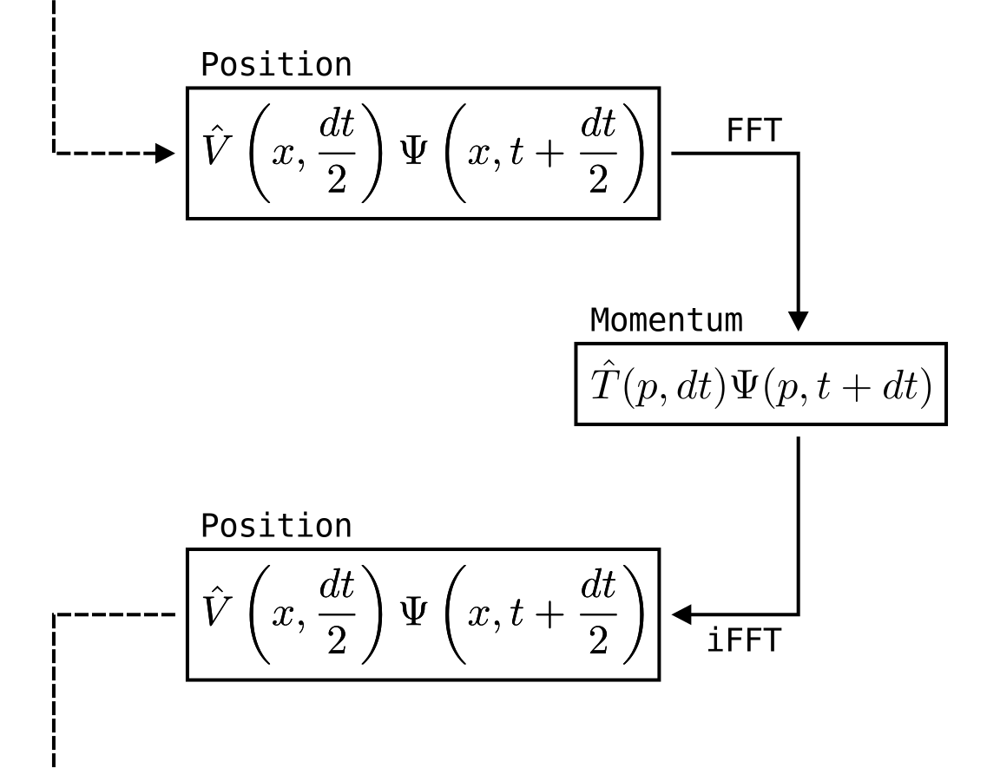
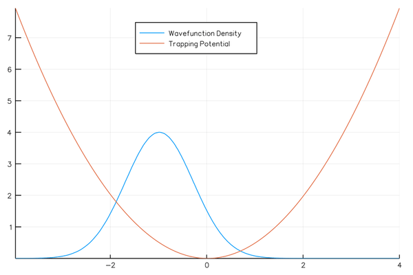
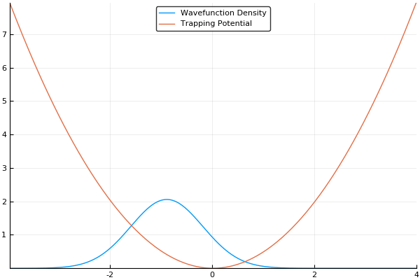

# The Split-Operator Method
The Split-Operator Method (also called the Split-Step Method), was actually the primary method I used to solve the Schr&ouml;dinger equation during my PhD.
It is one of the simplest and fastest methods for this purpose and is widely used throughout modern quantum research in the area, in particular when dealing with the Non-linear Schr&ouml;dinger Equation (NLSE):

$$
i \hbar \frac{\partial \Psi(\mathbf{r},t)}{\partial t} = \left[-\frac{\hbar^2}{2m}\nabla^2 + V(\mathbf{r}) + g|\Psi(\mathbf{r},t)|^2 \right] \Psi(\mathbf{r},t),
$$

which follows from the notation provided in the [quantum systems](../quantum_systems/quantum_systems.md) chapter: $$\Psi(\mathbf{r},t)$$ is a quantum wave-function with spatial ($$\mathbf{r}$$) and time ($$t$$) dependence, $$\nabla^2$$ is a laplacian, and $$V(\mathbf{r})$$ is a potential of some sort (like $$\omega x^2$$ or something).
In this case, we also add an interaction term $$g$$ next to a nonlinear $$|\Psi(\mathbf{r},t)|^2$$ term.
This is the system I studied for most of my PhD (granted, we played a few tricks with parallelization and such, so it was _slightly_ more complicated).

At its heart, the split-op method is nothing more than a pseudo-spectral differential equation solver... That is to say, it solves the Schr&ouml;dinger equation with [FFT's](../cooley_tukey/cooley_tukey.md).
In fact, there is a large class of spectral and pseudo-spectral methods used to solve a number of different physical systems, and we'll definitely be covering those in the future.
As mentioned in the [quantum systems](../quantum_systems/quantum_systems.md) section, we can represent a quantum wavefunction in momentum space, which is parameterized with the wavevector $$k$$.
In the Hamiltonian shown above, we can split our system into position space components, $$\hat{H}_r = \left[V(\mathbf{r}) + g|\Psi(\mathbf{r},t)|^2 \right] \Psi(\mathbf{r},t)$$, and momentum space components, $$\hat{H}_k = \left[-\frac{\hbar^2}{2m}\nabla^2 \right]\Psi(\mathbf{r},t)$$.
I'll be honest, I didn't know what notation to use for $$\hat H_r$$ because $$p$$ is used to describe momentum.
I settled on $$r$$ for _real space_, but that is somewhat notationally ambiguous.
In addition, $$k$$ will indicate momentum space because it is a sum of all wavevectors, typically notated as $$k$$.
Bad notation aside, let's continue.

If we assume a somewhat general solution to our quantum system:

$$
\Psi(\mathbf{r},t + dt) = \left[e^{-\frac{i\hat{H}dt}{\hbar}}\right]\Psi(\mathbf{r},t) = \left[e^{-\frac{i(\hat{H}_r + \hat{H}_k)dt}{\hbar}}\right]\Psi(\mathbf{r},t)
$$

and assume we are simulating our system by a series of small timesteps ($$dt$$), we can perform similar splitting by using the Baker-Campbell-Housdorff formula:

$$
\Psi(\mathbf{r},t+dt) = \left[e^{-\frac{i\hat{H}_rdt}{\hbar}}e^{-\frac{i\hat{H}_kdt}{\hbar}}e^{-\frac{[i\hat{H}_r, i\hat{H}_k]dt^2}{2}}\right]\Psi(\mathbf{r},t)
$$

This accrues a small amount of error ($$dt^2$$) related to the commutation of the real and momentum-space components of the Hamiltonian.
This is a relatively large error and that's not okay.
In order to change the $$dt^2$$ error to $$dt^3$$, we can split the system by performing a half-step in position space before doing a full-step in momentum space, through a process called _Strang Splitting_ like so:

$$
\Psi(\mathbf{r},t+dt) = \left[e^{-\frac{i\hat{H}_rdt}{2\hbar}}e^{-\frac{i\hat{H}_kdt}{\hbar}}e^{-\frac{i\hat{H}_rdt}{2\hbar}} \right]\Psi(\mathbf{r},t) + \mathcal{O}(dt^3)
$$

We can then address each part of this solution in chunks, first in position space, then in momentum space, then in position space again by using [Fourier Transforms](../cooley_tukey/cooley_tukey.md).
Which looks something like this:

$$
\Psi(\mathcal{r}, t+dt) = \left[\hat{U}_r\left(\frac{dt}{2}\right)\mathcal{F}^{-1}\left[\hat{U}_k(dt) \mathcal{F} \left[\hat{U}_r\left(\frac{dt}{2}\right) \Psi(\mathbf{r},t) \right] \right] \right] + \mathcal{O}(dt^3)
$$

where $$\hat{U}_r = e^{-\frac{i\hat{H}_rdt}{\hbar}}$$, $$\hat{U}_k = e^{-\frac{i\hat{H}_kdt}{\hbar}}$$, and $$\mathcal{F}$$ and $$\mathcal{F}^{-1}$$ indicate forward and inverse Fourier Transforms.
Here's a flowchart of what we are looking for every timestep:

    

For the most part, that's it:
1. Multiply the wavefunction in real space with the real-space operator.
2. Flip to momentum space with a Fourier transform.
3. Multiply the momentum-space wavefuntion by the momentum-space operator.
4. Flip to position space with an inverse Fourier transform.
5. Repeat 1-4 until satisfied.

If we guess that our initial wavefunction is gaussian-like and is slightly offset from the center or the trap, this should allow us to see our wavefunction "sloshing" back and forth in our trap, like so:

    

As a small concession, using this method enforces periodic boundary conditions, where the wavefunction will simply slide from one side of your simulation box to the other, but that's fine for most cases.
In fact, for many cases (such as large-scale turbulence models) it's ideal.

That said, there is more to the story.
As we mentioned in the [quantum systems](../quantum_systems/quantum_systems.md) section, many simulations of quantum systems desire to find the ground state of our system.
The split-operator method can be used for that too!
If we run this simulation in _imaginary time_, by simply setting $$\tau = it$$ and stepping through $$\tau$$ instead of $$t$$, we will no longer see an "real-world" example of how the atoms should behave, but will instead see an exponential decay of higher-energy states.
If we run the simulation for long enough with a small enough timestep, all higher energy states will vanish.
This means that we can find the ground state of our system by running the simulation in imaginary time, which is an incredibly useful feature!
If we run the same simulation as above in imaginary time, we should see our wavefunction smoothly move to the center of our trap (the lowest energy position), like so:

    

## The Algorithm

Luckily, the code in this case is pretty straightforward.
As a note before starting, we will be using normalized units in this simulation where $$\hbar = c = 1$$.
These units are often called _natural_ units.
Many of you (*cough* experimentalists *cough*) will probably think that these units are completely unphysical, and they are; however, they allow us to output fractions and whole numbers.
For example, if we are trying to find the energy of the ground state of atoms in a simple harmonic oscillator, we know it should be $$\frac{1}{2}\hbar \omega$$, where $$\omega$$ is the coefficient in front of the $$x^2$$ term known as the _frequency_ of the trap.
If we were to calculate the energy in real units, our simulation would output $$5.272859 \times 10^{-35}$$, which is hard to interpret.
By instead using natural units, we get precisely $$\frac{1}{2}$$ and we know that those are in units of $$\hbar\omega$$.
There is no doubt that it makes the simulation easier to understand (albeit a little misleading in the end).

Regardless, we first need to set all the initial parameters, including the initial grids in real and momentum space:



[import:11-34, lang:"julia"](code/julia/split_op.jl)

[import:11-21, lang:"c"](code/c/split_op.c)
[import:52-73, lang:"c"](code/c/split_op.c)

[import:14-49, lang:"cpp"](code/c++/split_op.cpp)

[import:11-30, lang:"python"](code/python/split_op.py)

[import:17-47, lang:"haskell"](code/haskell/splitOp.hs)


As a note, when we generate our grid in momentum space `k`, we need to split the grid into two lines, one that is going from `0` to `-kmax` and is then discontinuous and goes from `kmax` to `0`.
This is simply because the FFT will naturally assume that the `0` in our grid is at the left side of the simulation, so we shift k-space to match this expectation.
Also, for this code we will be using notation to what we used above: `opr.R` will be the real space operators and `opr.K` will be the momentum space operators.
There is another boolean value here called `im_time`, which is for imaginary time evolution.

Afterwards, we turn them into operators:



[import:36-62, lang:"julia"](code/julia/split_op.jl)

[import:23-29, lang:"c"](code/c/split_op.c)
[import:75-96, lang:"c"](code/c/split_op.c)

[import:51-80, lang:"cpp"](code/c++/split_op.cpp)

[import:33-54, lang:"python"](code/python/split_op.py)

[import:49-66, lang:"haskell"](code/haskell/splitOp.hs)


Here, we use a standard harmonic potential for the atoms to sit in and a gaussian distribution for an initial guess for the probability distribution.
If we give either the trap or the atoms a slight offset (so the gaussian distribution of atoms does not *quite* rest at the bottom of the $$x^2$$ potential, we can see the atoms moving back and forth in the potential as we move the simulation forward in time.
This means that we can easily see the dynamics of our quantum system!
If we run the simulation in imaginary time, we will see the gaussian distribution of atoms move towards the center of the potential, which is the location with the lowest energy.
Both of these have been shown in the figures above.

The final step is to do the iteration, itself.



[import:65-112, lang:"julia"](code/julia/split_op.jl)

[import:98-148, lang:"c"](code/c/split_op.c)

[import:99-156, lang:"cpp"](code/c++/split_op.cpp)

[import:57-95, lang:"python"](code/python/split_op.py)

[import:68-73, lang:"haskell"](code/haskell/splitOp.hs)


And that's it.

There is something a bit odd about the simulation in imaginary time, though.
Basically, in imaginary time, we see an exponential decay of all the higher energy states, which means we are technically losing a large amount of our wavefunction density every timestep!
To solve this issue, we _renormalize_ by enforcing that $$\int_{-\infty}^{+\infty}\Psi^\ast\Psi dx = 1$$.
As you can see from the code, this involves summing the density, multiplying that sum by `dx`, and then dividing each element in the wavefunction by the `sqrt()` of that value.

The Split-Operator method is one of the most commonly used quantum simulation algorithms because of how straightforward it is to code and how quickly you can start really digging into the physics of the simulation results!

## Video Explanation

Here is a video describing the split-operator method:

<iframe width="560" height="315" src="https://www.youtube.com/embed/BBt8EugN03Q" frameborder="0" allow="accelerometer; autoplay; encrypted-media; gyroscope; picture-in-picture" allowfullscreen></iframe>

## Example Code
This example code is a simulation of a gaussian distribution of atoms slightly offset in a harmonic trap in imaginary time.
So long as the code is written appropriately, this means that the atoms should move towards the center of the trap and the energy should decay to $$\frac{1}{2}\hbar\omega$$, which will be simply $$\frac{1}{2}$$ in this simulation.
Checking to make sure your code can output the correct energy for a harmonic trap is a good test to make sure it is all working under-the-hood before simulating systems with more complicated Hamiltonians.



[import, lang:"julia"](code/julia/split_op.jl)

[import, lang:"c"](code/c/split_op.c)

[import, lang:"cpp"](code/c++/split_op.cpp)

[import:5-127, lang:"python"](code/python/split_op.py)

[import, lang:"haskell"](code/haskell/splitOp.hs)


## License

##### Code Examples

The code examples are licensed under the MIT license (found in [LICENSE.md](https://github.com/algorithm-archivists/algorithm-archive/blob/master/LICENSE.md)).

##### Text

The text of this chapter was written by [James Schloss](https://github.com/leios) and is licensed under the [Creative Commons Attribution-ShareAlike 4.0 International License](https://creativecommons.org/licenses/by-sa/4.0/legalcode).

[

](https://creativecommons.org/licenses/by-sa/4.0/)

##### Images/Graphics
- The image "[split_op_method](res/split_op_method.svg)" was created by [Julian Schacher](https://github.com/julianschacher) and is licenced under the [Creative Commons Attribution-ShareAlike 4.0 International License](https://creativecommons.org/licenses/by-sa/4.0/legalcode).
- The animation "[realsplitop](res/real_time.gif)" was created by [James Schloss](https://github.com/leios) and is licenced under the [Creative Commons Attribution-ShareAlike 4.0 International License](https://creativecommons.org/licenses/by-sa/4.0/legalcode).
- The animation "[imaginarysplitop](res/imaginary_time.gif)" was created by [James Schloss](https://github.com/leios) and is licenced under the [Creative Commons Attribution-ShareAlike 4.0 International License](https://creativecommons.org/licenses/by-sa/4.0/legalcode).

##### Pull Requests

After initial licensing ([#560](https://github.com/algorithm-archivists/algorithm-archive/pull/560)), the following pull requests have modified the text or graphics of this chapter:
- none
