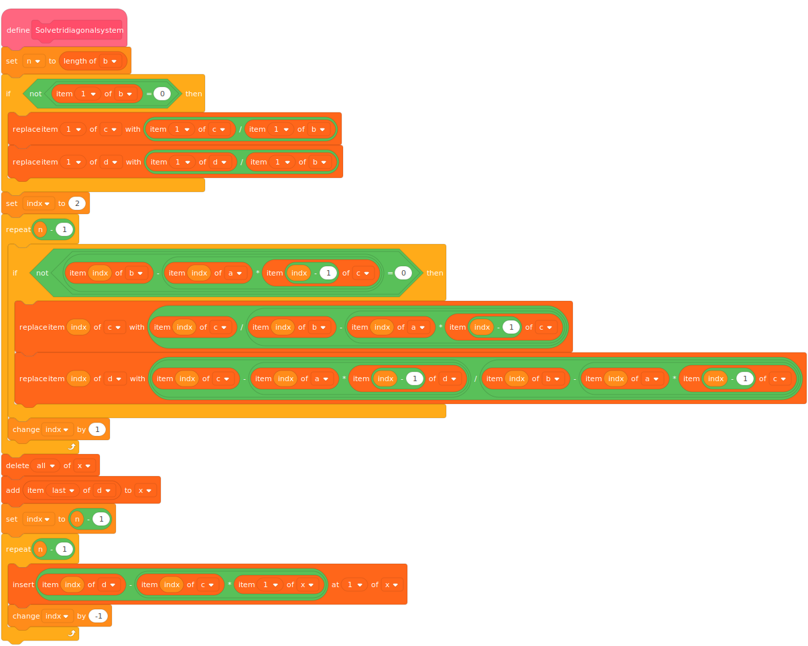

# Thomas Algorithm

As alluded to in the [Gaussian Elimination chapter](../gaussian_elimination/gaussian_elimination.md), the Thomas Algorithm (or TDMA, Tri-Diagonal Matrix Algorithm) allows for programmers to **massively** cut the computational cost of their code from $$ O(n^3)$$ to $$O(n)$$ in certain cases!
This is done by exploiting a particular case of Gaussian Elimination where the matrix looks like this:

$$
\left[
    \begin{array}{ccccc|c}
        b_0 & c_0 & & & & d_0 \\
        a_1 & b_1 & c_1 & & & d_1 \\
        & a_2 & \ddots & & & \vdots \\
        & & & & c_{n-1}& d_{n-1} \\
        & & & a_n & b_n & d_n
    \end{array}
\right]
$$

This matrix shape is called *Tri-Diagonal* (excluding the right-hand side of our system of equations, of course!).
Now, at first, it might not be obvious how this helps. Well, firstly, it makes the system easier to encode: we may divide it into four separate vectors corresponding to $$a$$, $$b$$, $$c$$, and $$d$$ (in some implementations, you will see the missing $$a_0$$ and $$c_n$$ set to zero to get four vectors of the same size).
Secondly, and most importantly, equations this short and regular are easy to solve analytically.

We'll start by applying mechanisms familiar to those who have read the [Gaussian Elimination](../gaussian_elimination/gaussian_elimination.md) chapter.
Our first goal is to eliminate the $$a_i$$ terms and set the diagonal values $$b_i$$ to $$1$$. The $$c_i$$ and $$d_i$$ terms will be transformed into $$c'_i$$ and $$d'_i$$.
The first row is particularly easy to transform since there is no $$a_0$$, we simply need to divide the row by $$b_0$$:

$$
\left\{
\begin{align}
c'_0 &= \frac{c_0}{b_0} \\
d'_0 &= \frac{d_0}{b_0}
\end{align}
\right.
$$

Let's assume that we found a way to transform the first $$i-1$$ rows. How would we transform the next one? We have

$$
\begin{array}{ccccccc|c}
    &  & \ddots & & & & &  \\
(i-1) & & 0 & 1 & c'_{i-1} & & & d'_{i-1} \\
(i)   & &   & a_i & b_i & c_i & & d_i \\
      & &   &   &   &  \ddots &  &
\end{array}
$$

Let's transform row $$(i)$$ in two steps.

**Step one**: eliminate $$a_i$$ with the transformation $$(i)^* = (i) - a_i \times (i-1)$$:

$$
\left\{
\begin{align}
a^*_i &= 0 \\
b^*_i &= b_i - a_i \times c'_{i-1} \\
c^*_i &= c_i \\
d^*_i &= d_i - a_i \times d'_{i-1}
\end{align}
\right.
$$

**Step two**: get $$b'_i=1$$ with the transformation $$(i)' = (i)^* / b^*_i $$:

$$
\left\{
\begin{align}
a'_i &= 0 \\
b'_i &= 1 \\
c'_i &= \frac{c_i}{b_i - a_i \times c'_{i-1}} \\
d'_i &= \frac{d_i - a_i \times d'_{i-1}}{b_i - a_i \times c'_{i-1}}
\end{align}
\right.
$$

Brilliant! With the last two formula, we can calculate all the $$c'_i$$ and $$d'_i$$ in a single pass, starting from row $$1$$, since we already know the values of $$c'_0$$ and $$d'_0$$.

Of course, what we really need are the solutions $$x_i$$. It's back substitution time!

If we express our system in terms of equations instead of a matrix, we get

$$
x_i + c'_i \times x_{i+1} = d'_i
$$

plus the last row that is even simpler: $$x_n = d'_n$$. One solution for free!
Maybe we can backtrack from the last solution? Let's (barely) transform the above equation:

$$
x_i = d'_i - c'_i \times x_{i+1}
$$

and that's all there is to it. We can calculate all the $$x_i$$ in a single pass starting from the end.

Overall, we only need two passes, and that's why our algorithm is $$O(n)$$!
The transformations are quite easy too, isn't that neat?

## Example Code



[import, lang:"julia"](code/julia/thomas.jl)

[import, lang:"c"](code/c/thomas.c)

[import, lang:"python"](code/python/thomas.py)

You will find this algorithm implemented [in this project](https://scratch.mit.edu/projects/169418273/).

  


[import, lang:"java"](code/java/Thomas.java)

[import, lang:"haskell"](code/haskell/thomas.hs)

[import, lang:"go"](code/golang/thomas.go)

[import, lang:"swift"](code/swift/thomas.swift)

[import, lang:"php"](code/php/thomas.php)

[import, lang:"nim"](code/nim/thomas_algorithm.nim)

[import, lang:"cpp"](code/c++/thomas.cpp)

[import, lang:"lua"](code/lua/thomas.lua)

[import, lang:"crystal"](code/crystal/thomas.cr)

[import, lang:"kotlin"](code/kotlin/thomas.kt)


## License

##### Code Examples

The code examples are licensed under the MIT license (found in [LICENSE.md](https://github.com/algorithm-archivists/algorithm-archive/blob/master/LICENSE.md)).

##### Text

The text of this chapter was written by [James Schloss](https://github.com/leios) and is licensed under the [Creative Commons Attribution-ShareAlike 4.0 International License](https://creativecommons.org/licenses/by-sa/4.0/legalcode).

[

](https://creativecommons.org/licenses/by-sa/4.0/)

##### Pull Requests

After initial licensing ([#560](https://github.com/algorithm-archivists/algorithm-archive/pull/560)), the following pull requests have modified the text or graphics of this chapter:
- none
